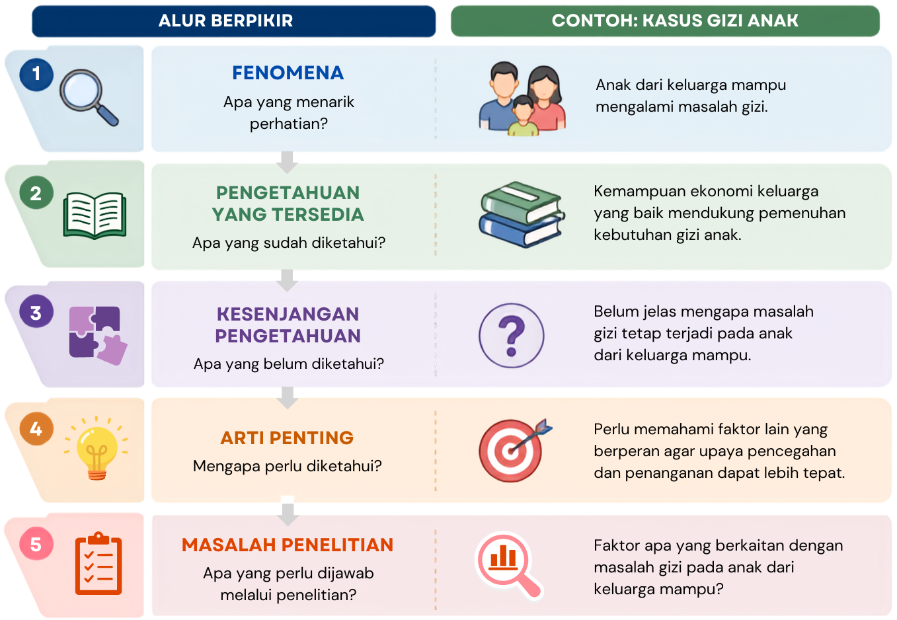

---
author:
  - name: Entin Nurhayati
filters:
  # Run Quarto's default filters first
  - quarto
  - section-bibliographies
bibliography: references.bib
reference-section-title: 
citeproc: true
---

# Masalah dan Pertanyaan Penelitian {#sec-masalah}

::: callout-note
## Capaian Pembelajaran

Setelah mempelajari bab ini, mahasiswa diharapkan mampu:

1.  Menjelaskan pengertian dan kedudukan masalah penelitian dalam proses penelitian.
2.  Mengidentifikasi masalah penelitian berdasarkan fenomena dan kesenjangan pengetahuan yang tersedia.
3.  Menilai kelayakan suatu masalah untuk diteliti berdasarkan kriteria masalah penelitian yang baik.
4.  Merumuskan masalah dan pertanyaan penelitian yang jelas, spesifik, dapat dijawab secara empiris, dan sesuai dengan tujuan penelitian.
:::

Penelitian tidak sekadar kegiatan mengumpulkan data. Sebelum menentukan data yang akan dikumpulkan, peneliti perlu mengetahui **apa yang ingin diketahui dan mengapa hal tersebut perlu diteliti**. Tanpa masalah yang jelas, penelitian akan kehilangan arah karena peneliti tidak memiliki dasar untuk menentukan data, metode, maupun analisis yang diperlukan.

Masalah penelitian dapat berawal dari fenomena yang menarik, hasil penelitian yang tidak konsisten, teori yang belum mampu menjelaskan suatu fenomena, atau sesuatu yang masih belum diketahui. Namun, tidak setiap fenomena dengan sendirinya menjadi masalah penelitian. Peneliti perlu menemukan **kesenjangan antara apa yang telah diketahui dan apa yang masih perlu diketahui**. @Kumar2018 mengibaratkan masalah penelitian sebagai tujuan sebuah perjalanan: tujuan yang jelas akan menentukan arah dan cara yang tepat untuk mencapainya.

Bab ini membahas bagaimana suatu fenomena berkembang menjadi masalah penelitian, bagaimana menilai kelayakannya, serta bagaimana merumuskannya menjadi pertanyaan penelitian yang jelas dan dapat dijawab secara empiris.

## Dari Fenomena ke Masalah Penelitian

### Fenomena dan Masalah Penelitian

Penelitian sering berawal dari fenomena yang menarik perhatian, seperti keadaan yang tidak sesuai dengan harapan atau gejala yang belum dapat dijelaskan. Namun, **fenomena tidak dengan sendirinya menjadi masalah penelitian**. Masalah penelitian menunjukkan sesuatu yang belum diketahui atau belum dapat dijelaskan secara memadai dan membutuhkan penyelidikan ilmiah untuk memperoleh jawabannya [@Kumar2018].

Sebagai contoh, keluarga dengan kemampuan ekonomi yang baik umumnya diharapkan mampu memenuhi kebutuhan gizi anak. Namun, di suatu daerah ditemukan anak-anak dari keluarga mampu yang mengalami masalah gizi. Bagi peneliti, fenomena tersebut memunculkan pertanyaan mengenai mengapa masalah gizi tetap terjadi ketika keluarga secara ekonomi mampu memenuhi kebutuhan tersebut.

Masalah penelitian juga berbeda dari **masalah praktis**. Masalah praktis membutuhkan tindakan atau solusi, sedangkan masalah penelitian membutuhkan pengetahuan atau bukti untuk menjawab sesuatu yang belum diketahui. Keduanya dapat saling berkaitan karena masalah praktis dapat menjadi titik awal munculnya masalah penelitian.

### Kesenjangan Pengetahuan sebagai Dasar Masalah Penelitian

Untuk mengembangkan suatu fenomena menjadi masalah penelitian, peneliti perlu menemukan **kesenjangan pengetahuan (*research gap*)**, yaitu keadaan ketika pengetahuan atau bukti yang tersedia belum memadai untuk menjawab suatu persoalan penelitian [@Robinson2011].

Kesenjangan dapat muncul karena suatu fenomena belum cukup dipahami, hasil penelitian tidak konsisten, teori belum memberikan penjelasan yang memadai, atau bukti yang tersedia masih terbatas. Karena itu, peneliti perlu menunjukkan **apa yang sudah diketahui, apa yang belum diketahui, dan mengapa hal tersebut penting untuk diketahui**. Proses ini ditunjukkan pada @fig-fenomena.

{#fig-fenomena}

## Mengidentifikasi Kesenjangan Pengetahuan

*Research gap* menunjukkan adanya pengetahuan atau bukti yang belum memadai untuk menjawab suatu persoalan penelitian. Kesenjangan tersebut tidak selalu berarti bahwa suatu topik sama sekali belum pernah diteliti. Kesenjangan juga dapat muncul karena bukti yang tersedia belum konsisten, teori belum memberikan penjelasan yang memadai, metode penelitian sebelumnya memiliki keterbatasan, atau pengetahuan yang tersedia belum mencakup konteks tertentu. Kesenjangan penelitian dapat diklasifikasikan dengan berbagai cara [@Robinson2011]. Untuk memudahkan pemahaman, kesenjangan pengetahuan dalam bab ini dikelompokkan ke dalam empat bentuk berikut:

1.  **Kesenjangan empiris**

    Kesenjangan ini muncul ketika pengetahuan yang tersedia belum cukup untuk memberikan jawaban yang meyakinkan. Hal ini dapat terjadi karena suatu aspek belum banyak diketahui, bukti yang tersedia masih terbatas, atau penelitian-penelitian sebelumnya menghasilkan temuan yang tidak konsisten [@Mller-Bloch2015].

    Sebagai contoh, suatu penelitian menemukan bahwa dukungan pasangan berkaitan dengan *work-family conflict* pada perempuan menikah yang bekerja, sedangkan penelitian lain tidak menemukan hubungan tersebut. Sebelum menjadikannya dasar penelitian baru, peneliti perlu memeriksa apakah perbedaan tersebut berkaitan dengan karakteristik partisipan, konteks, pengukuran, desain, atau metode analisis.

2.  **Kesenjangan teoretis**

    Kesenjangan teoretis muncul ketika teori yang tersedia belum mampu menjelaskan suatu fenomena secara memadai atau ketika beberapa perspektif teoretis memberikan penjelasan yang berbeda mengenai fenomena yang sama.

    Sebagai contoh, *work/family border theory* menjelaskan bahwa fleksibilitas kerja dapat mengaburkan batas antara kehidupan pekerjaan dan pribadi sehingga berpotensi menimbulkan konflik peran [@Clark2000]. Sementara itu, *job demands-resources theory* memandang fleksibilitas sebagai sumber daya yang dapat meningkatkan kontrol karyawan terhadap pekerjaannya dan mendukung kesejahteraan [@Bakker2007]. Perbedaan penjelasan tersebut membuka ruang untuk meneliti kondisi yang membuat fleksibilitas kerja dapat memberikan konsekuensi yang berbeda bagi karyawan.

3.  **Kesenjangan metodologis**

    Kesenjangan metodologis muncul ketika pengetahuan mengenai suatu fenomena masih dibatasi oleh metode yang digunakan dalam penelitian sebelumnya [@Mller-Bloch2015]. Keterbatasan tersebut dapat berkaitan dengan desain penelitian, teknik pengumpulan data, karakteristik sampel, maupun cara suatu variabel diukur.

    Sebagai contoh, penelitian mengenai hubungan penggunaan media sosial dan kesejahteraan psikologis mungkin sebagian besar menggunakan desain *cross-sectional*, yaitu mengukur kedua variabel pada satu waktu. Desain tersebut dapat menunjukkan hubungan antar variabel, tetapi belum dapat menggambarkan bagaimana perubahan keduanya berlangsung dari waktu ke waktu. Penggunaan desain longitudinal pada penelitian berikutnya dapat membantu mengisi keterbatasan metodologis tersebut.

4.  **Kesenjangan praktis**

    Kesenjangan praktis muncul ketika terdapat sesuatu yang diperlukan untuk memahami, mengukur, atau menangani suatu persoalan, tetapi pengetahuan, metode, instrumen, atau sumber daya yang tersedia belum memadai untuk memenuhi kebutuhan tersebut. Kesenjangan ini dapat ditemukan dalam praktik di masyarakat maupun dalam kegiatan akademik dan penelitian.

    Sebagai contoh, *Psychological Well-Being Scale* yang dikembangkan oleh @Ryff1995 telah banyak digunakan dan diadaptasi dalam berbagai konteks budaya, termasuk Indonesia. Namun, beberapa indikator pada aspek *autonomy* dapat menunjukkan karakteristik psikometris yang kurang memadai ketika digunakan dalam konteks Indonesia. Jika indikator yang tersedia belum mampu mengukur *autonomy* secara memadai, terdapat kebutuhan untuk mengidentifikasi indikator yang lebih sesuai dengan bagaimana kemandirian dipahami dan diwujudkan dalam konteks budaya Indonesia.

Keempat bentuk kesenjangan tersebut tidak selalu berdiri sendiri dan satu masalah dapat melibatkan lebih dari satu jenis kesenjangan. Karena itu, tujuan mengidentifikasi kesenjangan bukan sekadar menentukan jenisnya, tetapi menunjukkan **apa yang belum diketahui, mengapa pengetahuan yang tersedia belum memadai, dan mengapa penelitian baru diperlukan**.

Peneliti juga perlu berhati-hati menggunakan pernyataan **“belum pernah diteliti”** sebagai dasar penelitian. Belum adanya penelitian pada suatu lokasi atau kelompok tertentu tidak dengan sendirinya menunjukkan kesenjangan pengetahuan yang bermakna. Peneliti perlu menjelaskan mengapa karakteristik konteks atau kelompok tersebut secara konseptual penting dan bagaimana penelitian pada konteks tersebut dapat menambah, menguji, atau memperbaiki pengetahuan yang sudah tersedia.

## Menemukan Masalah Penelitian

Ide penelitian dapat muncul dari berbagai sumber, bahkan dari pengamatan atau gagasan awal yang masih samar. Tugas peneliti adalah mengembangkan gagasan tersebut menjadi masalah yang jelas dan dapat diteliti secara ilmiah [@Kerlinger2000]. Beberapa sumber yang dapat digunakan untuk menemukan masalah penelitian antara lain:

1.  **Observasi dan data awal.** Fenomena atau kejanggalan yang ditemukan dalam kehidupan sehari-hari dapat memunculkan pertanyaan yang layak diteliti. Data dari lembaga pemerintah, organisasi, atau sumber dokumentasi lainnya juga dapat menunjukkan persoalan yang membutuhkan penjelasan lebih lanjut.
2.  **Literatur ilmiah.** Buku dan terutama artikel jurnal membantu peneliti mengetahui perkembangan suatu topik sekaligus menemukan hal-hal yang belum terjawab. Misalnya, penelitian yang satu menemukan hubungan antara dukungan pasangan dan *work-family conflict*, sedangkan penelitian lain tidak menemukannya. Perbedaan tersebut dapat menjadi titik awal untuk mengidentifikasi masalah penelitian.
3.  **Forum ilmiah.** Seminar, konferensi, lokakarya, dan diskusi akademik mempertemukan peneliti dengan perkembangan teori, metode, dan temuan terbaru. Karena itu, forum ilmiah dapat membantu menemukan persoalan yang relevan dan aktual.
4.  **Penelitian terdahulu.** Penelitian sebelumnya dapat memunculkan masalah baru melalui replikasi, perluasan, atau perbaikan terhadap keterbatasan penelitian. Rekomendasi penelitian selanjutnya juga dapat menjadi petunjuk, tetapi tetap perlu ditelaah secara kritis untuk memastikan bahwa persoalan tersebut masih relevan.

Berbagai sumber tersebut pada dasarnya membantu peneliti menemukan **kesenjangan antara pengetahuan yang sudah tersedia dan pengetahuan yang masih diperlukan**. Karena itu, menemukan masalah penelitian bukan sekadar mencari topik yang menarik, tetapi merupakan proses membaca, mengamati, membandingkan bukti, dan mempertanyakan hal-hal yang belum memperoleh jawaban memadai [@Kumar2018].

## Menilai Kelayakan Masalah Penelitian

Menemukan kesenjangan pengetahuan belum berarti bahwa masalah tersebut layak untuk diteliti. Peneliti juga perlu mempertimbangkan apakah penelitian dapat dilaksanakan, memberikan kontribusi, dan memenuhi prinsip etika. Salah satu kerangka yang dapat digunakan untuk menilainya adalah ***FINE***, yaitu *Feasible, Important, Novel,* dan *Ethical* [@Browner2023].

1.  ***Feasible*** **(dapat dilaksanakan).** Penelitian harus realistis untuk dilakukan dengan sumber daya yang tersedia. Peneliti perlu mempertimbangkan ketersediaan dan jumlah partisipan atau data, kompetensi yang diperlukan, waktu, biaya, fasilitas, serta ruang lingkup penelitian. Jika penelitian terlalu luas atau membutuhkan sumber daya yang tidak tersedia, pertanyaan penelitian perlu dipersempit atau desainnya disesuaikan.
2.  ***Important*** **(penting).** Penelitian sebaiknya menjawab persoalan yang memiliki arti bagi pengembangan pengetahuan atau kesejahteraan manusia. Peneliti perlu mempertimbangkan apakah hasil penelitian berpotensi memperluas pengetahuan ilmiah, memengaruhi praktik atau kebijakan, maupun memberikan arah bagi penelitian selanjutnya. Dengan demikian, pentingnya suatu masalah tidak hanya ditentukan oleh ketertarikan peneliti, tetapi juga oleh kontribusi yang mungkin dihasilkan.
3.  ***Novel*** **(memiliki kebaruan).** Penelitian perlu memberikan tambahan yang bermakna terhadap pengetahuan yang telah tersedia. Kebaruan tidak berarti bahwa topik harus sama sekali belum pernah diteliti. Penelitian dapat bernilai baru apabila mereplikasi temuan penting, menguji apakah temuan berlaku pada populasi lain, memperbaiki kelemahan penelitian sebelumnya, atau menggunakan metode baru untuk memperjelas pengetahuan yang telah ada.
4.  ***Ethical*** **(etis).** Pertanyaan penelitian harus dapat dijawab melalui penelitian yang menghormati hak, keselamatan, privasi, dan kesejahteraan partisipan. Peneliti juga perlu mempertimbangkan aspek keadilan, termasuk memastikan bahwa penelitian tidak memperbesar ketimpangan dan, sejauh relevan, melibatkan kelompok dengan latar belakang dan pengalaman yang beragam.

Keempat kriteria tersebut perlu dipertimbangkan secara bersama-sama. Masalah yang penting dan memiliki kebaruan belum tentu layak diteliti apabila tidak dapat dilaksanakan atau menimbulkan persoalan etis. **Kerangka *FINE* membantu peneliti memilih masalah yang penting dan memberikan kontribusi, sekaligus realistis dan etis untuk diteliti.**

## Merumuskan Masalah Penelitian

Setelah masalah yang layak diteliti ditemukan, langkah berikutnya adalah merumuskannya secara jelas. **Rumusan masalah merupakan uraian argumentatif mengenai persoalan yang hendak diteliti, kesenjangan pengetahuan yang mendasarinya, serta alasan mengapa persoalan tersebut perlu diteliti.** Rumusan masalah yang jelas akan membantu mengarahkan berbagai keputusan berikutnya dalam proses penelitian [@Kumar2018].

Secara umum, rumusan masalah yang baik memuat empat komponen berikut:

1.  **Fenomena atau persoalan yang menjadi perhatian.** Peneliti menjelaskan kondisi atau gejala yang melatarbelakangi munculnya masalah penelitian.
2.  **Kesenjangan pengetahuan.** Peneliti menunjukkan apa yang belum diketahui atau belum dapat dijelaskan secara memadai berdasarkan pengetahuan yang tersedia.
3.  ***Rationale*** **atau arti penting masalah.** Peneliti menjelaskan mengapa kesenjangan tersebut penting untuk diteliti dan apa kontribusi yang dapat diperoleh dengan menjawabnya.
4.  **Arah penelitian.** Peneliti menunjukkan aspek, variabel, atau hubungan yang perlu diteliti untuk mengisi kesenjangan tersebut.

Sebagai contoh, perempuan dewasa awal yang mengalami perlakuan buruk dalam hubungan romantis terkadang tetap sulit meninggalkan pasangannya. Salah satu kondisi yang diduga berkaitan dengan keadaan tersebut adalah *emotional dependency*. Sementara itu, kondisi *fatherless* diperkirakan berkaitan dengan perkembangan emosional dan hubungan interpersonal. Namun, bukti mengenai hubungan antara *fatherless* dan *emotional dependency* pada perempuan dewasa awal masih terbatas. Oleh karena itu, diperlukan penelitian mengenai keterkaitan kedua variabel tersebut.

Berdasarkan uraian tersebut, masalah penelitian dapat dirumuskan dalam bentuk pertanyaan:

> **“Apakah terdapat hubungan antara kondisi *fatherless* dan *emotional dependency* dalam hubungan romantis pada perempuan dewasa awal?”**

Contoh tersebut menunjukkan bahwa perumusan masalah tidak dimulai dengan membuat kalimat tanya. Peneliti terlebih dahulu membangun argumentasi mengenai fenomena yang diamati, kesenjangan pengetahuan, arti penting masalah, dan arah penelitian. Rumusan tersebut kemudian dapat dinyatakan dalam bentuk pertanyaan yang sekaligus berfungsi sebagai pertanyaan penelitian.

## Merumuskan Pertanyaan Penelitian

Pertanyaan penelitian menyatakan secara spesifik **apa yang hendak diketahui melalui penelitian**. Dalam banyak penelitian, **pertanyaan ini sekaligus menjadi bentuk akhir dari rumusan masalah.** Pertanyaan penelitian menjadi acuan dalam menentukan data yang perlu dikumpulkan dan cara data tersebut dianalisis [@Kumar2018].

### Karakteristik Pertanyaan Penelitian yang Baik

@Kerlinger2000 menekankan bahwa masalah atau pertanyaan ilmiah perlu dinyatakan secara jelas, menunjukkan hubungan antar variabel ketika hubungan tersebut memang menjadi fokus penelitian, serta memungkinkan pengujian secara empiris. Secara lebih umum, pertanyaan penelitian yang baik memiliki karakteristik berikut:

1.  **Jelas dan spesifik**, sehingga tidak menimbulkan penafsiran yang berbeda mengenai apa yang hendak diketahui.
2.  **Dapat dijawab secara empiris**, yaitu jawabannya dapat diperoleh melalui pengumpulan dan analisis data.
3.  **Menunjukkan variabel atau fenomena yang diteliti**, serta hubungan atau perbandingan antar variabel apabila memang menjadi fokus penelitian.
4.  **Menunjukkan populasi atau konteks penelitian apabila diperlukan**, sehingga ruang lingkup pertanyaan menjadi jelas.
5.  **Selaras dengan masalah penelitian**, sehingga jawaban terhadap pertanyaan tersebut benar-benar membantu mengisi kesenjangan pengetahuan yang telah diidentifikasi.

Pertanyaan juga perlu dirumuskan sesuai dengan **jenis bukti yang dapat dihasilkan oleh penelitian**. Misalnya, penelitian yang hanya mengukur hubungan antara dua variabel tidak seharusnya merumuskan pertanyaan yang menuntut kesimpulan sebab-akibat.

### Jenis Pertanyaan Penelitian

Dalam penelitian kuantitatif, pertanyaan penelitian dapat dibedakan berdasarkan jenis informasi yang hendak diperoleh.

1.  **Deskriptif**

    Pertanyaan deskriptif bertujuan menggambarkan keadaan atau karakteristik suatu variabel pada populasi tertentu.

    > *Bagaimana gambaran resiliensi Generasi Z yang tinggal di daerah yang pernah mengalami bencana alam?*

2.  **Komparatif**

    Pertanyaan komparatif bertujuan mengetahui apakah terdapat perbedaan suatu variabel antara dua kelompok atau lebih.

    > *Apakah terdapat perbedaan tingkat resiliensi antara Generasi Z yang tinggal di daerah yang pernah mengalami bencana alam dan yang tinggal di daerah yang tidak pernah mengalaminya?*

3.  **Asosiatif**

    Pertanyaan asosiatif bertujuan mengetahui apakah dua atau lebih variabel saling berhubungan, tanpa dengan sendirinya menyatakan bahwa salah satu variabel menyebabkan variabel lainnya.

    > *Apakah pengalaman menghadapi bencana berkaitan dengan tingkat resiliensi pada Generasi Z?*

4.  **Kausal**

    Pertanyaan kausal bertujuan mengetahui apakah perubahan pada suatu variabel menyebabkan perubahan pada variabel lainnya. Karena mengandung klaim sebab-akibat, pertanyaan semacam ini memerlukan desain penelitian yang memungkinkan peneliti memperoleh bukti mengenai hubungan kausal.

    > *Apakah pemberian pelatihan kesiapsiagaan bencana meningkatkan resiliensi pada Generasi Z?*

Pemilihan kata dalam pertanyaan penelitian perlu diperhatikan karena menunjukkan jenis kesimpulan yang hendak diperoleh. Istilah seperti **“berhubungan”** atau **“berkaitan”** menunjukkan pertanyaan asosiatif, sedangkan **“menyebabkan”, “memengaruhi”, “meningkatkan”,** atau **“menurunkan”** mengandung makna kausal. Perbedaan ini penting karena jenis pertanyaan penelitian akan berhubungan dengan desain penelitian yang diperlukan untuk menjawabnya.

## Pertanyaan Penelitian dan Desain Penelitian

Pertanyaan penelitian berkaitan dengan desain yang digunakan untuk menjawabnya. Pertanyaan deskriptif bertujuan menggambarkan suatu fenomena, pertanyaan komparatif membandingkan kelompok atau kondisi, sedangkan pertanyaan asosiatif menguji hubungan antarvariabel. Sementara itu, pertanyaan kausal membutuhkan bukti yang lebih kuat karena bertujuan menunjukkan bahwa perubahan pada satu variabel menyebabkan perubahan pada variabel lainnya.

Hubungan statistik antara dua variabel saja belum cukup untuk menunjukkan hubungan sebab-akibat. Misalnya, hubungan antara **bermain gim yang mengandung kekerasan** dan **agresivitas anak** tidak serta-merta menunjukkan bahwa bermain gim menyebabkan agresivitas. Hubungan tersebut mungkin dipengaruhi oleh variabel lain, seperti pola asuh orang tua (*third-variable problem*). Selain itu, arah hubungan juga dapat dipertanyakan: bermain gim mungkin memengaruhi agresivitas, tetapi anak yang lebih agresif juga mungkin lebih tertarik pada gim yang mengandung kekerasan (*directionality problem*).

Oleh karena itu, **pertanyaan penelitian harus dirumuskan sesuai dengan jenis bukti yang dapat dihasilkan oleh desain penelitian**. Studi korelasional lebih tepat digunakan untuk menjawab apakah variabel *berhubungan* atau *berkaitan*, bukan untuk menyimpulkan hubungan sebab-akibat [@Shadish2002]. Pembahasan lebih lanjut mengenai hal ini akan disampaikan pada @sec-desain.

## Contoh Terintegrasi: Dari Fenomena ke Pertanyaan Penelitian

Proses merumuskan masalah dan pertanyaan penelitian tidak berlangsung sebagai tahapan yang sepenuhnya terpisah. Peneliti bergerak dari fenomena yang diamati, menelaah pengetahuan yang tersedia, menemukan kesenjangan, lalu mengerucutkannya menjadi masalah dan pertanyaan penelitian. Contoh pada @tbl-contoh menggambarkan proses tersebut.

::: {#tbl-contoh}
|  |  |
|:-------------------------|:---------------------------------------------|
| **Tahap** | **Uraian** |
| **Topik** | Fleksibilitas kerja dan kesejahteraan karyawan |
| **Fenomena** | Kebijakan *work from anywhere* (WFA) memberikan fleksibilitas kepada karyawan, tetapi sebagian karyawan justru mengalami kesulitan membatasi waktu kerja dan kehidupan pribadi. |
| **Pengetahuan yang tersedia** | *Work/family border theory* menjelaskan bahwa fleksibilitas dapat mengaburkan batas pekerjaan dan kehidupan pribadi [@Clark2000]. Sebaliknya, *job demands-resources theory* memandang fleksibilitas sebagai sumber daya yang dapat membantu karyawan mengelola tuntutan pekerjaan [@Bakker2007]. |
| **Kesenjangan pengetahuan** | Kedua perspektif tersebut membuka pertanyaan mengenai kondisi ketika fleksibilitas kerja mendukung atau justru menghambat kesejahteraan karyawan. |
| **Masalah penelitian** | Bagaimana fleksibilitas kerja berkaitan dengan kesejahteraan psikologis karyawan? |
| **Pertanyaan penelitian** | Apakah terdapat hubungan antara fleksibilitas kerja dan *psychological well-being* pada karyawan? |
| **Implikasi desain** | Pertanyaan tersebut bersifat asosiatif sehingga dapat dijawab melalui penelitian korelasional dengan mengukur fleksibilitas kerja dan *psychological well-being*. |

: Contoh Tahapan dari Fenomena hingga Penentuan Desain Penelitian
:::

Contoh tersebut menunjukkan bahwa pertanyaan penelitian dikembangkan melalui proses yang berangkat dari fenomena, pengetahuan yang tersedia, dan kesenjangan pengetahuan.

::: callout-tip
## Rangkuman

1.  Penelitian berawal dari masalah yang membutuhkan jawaban, bukan sekadar dari topik atau fenomena yang menarik.
2.  Masalah penelitian muncul ketika terdapat kesenjangan antara pengetahuan yang telah tersedia dan sesuatu yang masih perlu diketahui atau dijelaskan.
3.  Kesenjangan pengetahuan dapat berkaitan dengan bukti empiris, teori, metode, maupun kebutuhan praktis.
4.  Masalah penelitian dapat ditemukan melalui observasi dan data awal, literatur ilmiah, forum ilmiah, serta penelitian terdahulu, kemudian dinilai kelayakannya menggunakan kriteria FINE: *Feasible, Important, Novel,* dan *Ethical.*
5.  Rumusan masalah dibangun dengan memperhatikan fenomena, kesenjangan pengetahuan, arti penting masalah, dan arah penelitian, kemudian dikerucutkan menjadi pertanyaan yang dapat dijawab secara empiris.
6.  Pertanyaan penelitian dapat bersifat deskriptif, komparatif, asosiatif, atau kausal. Jenis pertanyaan harus selaras dengan desain penelitian dan jenis bukti yang dapat dihasilkan.
:::

::: callout-important
## Refleksi & Diskusi

- Perhatikan sebuah fenomena yang sedang menarik perhatian Anda. Apa yang membuat fenomena tersebut belum dapat langsung disebut sebagai masalah penelitian? Informasi apa yang perlu Anda ketahui terlebih dahulu?
- Pernyataan *“topik ini belum pernah diteliti pada mahasiswa Universitas X”* sering digunakan sebagai alasan melakukan penelitian. Apakah pernyataan tersebut sudah cukup menunjukkan adanya *research gap*? Jelaskan alasan Anda.
- Seorang mahasiswa menemukan bahwa beberapa penelitian menunjukkan penggunaan media sosial berkaitan dengan kesejahteraan psikologis yang lebih rendah, sedangkan penelitian lainnya tidak menemukan hubungan tersebut. Jenis kesenjangan apa yang mungkin ditemukan? Apa yang perlu diperiksa sebelum mahasiswa memutuskan melakukan penelitian baru?
- Perhatikan pertanyaan berikut: “Apakah penggunaan gim yang mengandung kekerasan menyebabkan agresivitas pada remaja?” Jika peneliti hanya merencanakan survei korelasional satu kali pengukuran, apa yang perlu diperbaiki dari pertanyaan tersebut dan mengapa?
- Pilih satu topik penelitian yang Anda minati. Susun secara berurutan: fenomena → pengetahuan yang tersedia → kesenjangan pengetahuan → masalah penelitian → satu pertanyaan penelitian. Kemudian tentukan apakah pertanyaan tersebut bersifat deskriptif, komparatif, asosiatif, atau kausal.
:::

## Daftar Pustaka {.unnumbered .unlisted}

::: sectionrefs
:::
