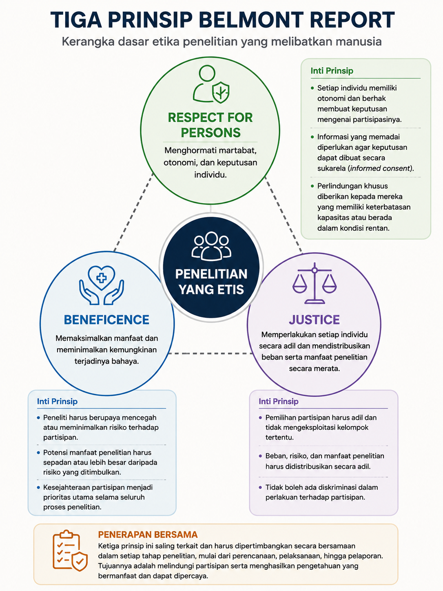
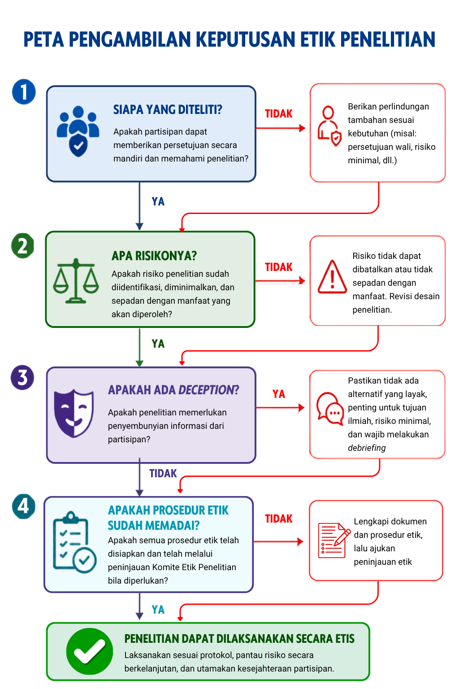

---
author:
  - name: Ratih Arruum Listiyandini
filters:
  # Run Quarto's default filters first
  - quarto
  - section-bibliographies
bibliography: references.bib
reference-section-title:
citeproc: true
---

# Etika Penelitian Psikologi {#sec-desainkuali}

::: callout-note
## Capaian Pembelajaran

Setelah mempelajari bab ini, mahasiswa diharapkan mampu:

1.  **Menjelaskan** pentingnya etika dalam penelitian psikologi serta prinsip *respect for persons*, *beneficence*, dan *justice* sebagai dasar perlindungan partisipan.
2.  **Mengevaluasi** penerapan *informed consent*, perlindungan privasi dan kerahasiaan, analisis risiko–manfaat, serta penggunaan *deception* dan *debriefing* dalam penelitian psikologi.
3.  **Mengidentifikasi** kelompok yang memerlukan perlindungan tambahan serta menjelaskan langkah-langkah yang diperlukan untuk melindungi hak, keselamatan, dan kesejahteraan partisipan.
4.  **Menjelaskan** peran komite etik penelitian dan tanggung jawab peneliti dalam melaksanakan penelitian secara etis dan bertanggung jawab.
5.  **Mengidentifikasi** bentuk-bentuk utama pelanggaran integritas penelitian serta isu etika dalam pengelolaan data dan penelitian di era digital.
:::

Penelitian ilmiah tidak hanya harus menghasilkan pengetahuan yang dapat dipertanggungjawabkan, tetapi juga harus dilakukan dengan menghormati hak, martabat, keselamatan, dan kesejahteraan partisipan. Dalam penelitian psikologi, hal ini penting karena penelitian sering melibatkan manusia dan dapat menyentuh pengalaman, perilaku, serta informasi pribadi yang sensitif.

Etika penelitian bukan sekadar persyaratan administratif, melainkan bagian dari tanggung jawab peneliti sejak merancang penelitian hingga melaporkan hasilnya. Bab ini membahas prinsip dasar etika penelitian, perlindungan partisipan, informed consent, analisis risiko dan manfaat, deception dan debriefing, peran komite etik, serta integritas penelitian dan tantangan etika dalam pengelolaan data di era digital.

## Mengapa Etika Penelitian Penting?

Etika penelitian berkembang melalui proses panjang yang tidak terlepas dari berbagai pengalaman dan kasus penelitian yang menimbulkan persoalan serius. Kasus-kasus tersebut menunjukkan bahwa perkembangan ilmu pengetahuan tidak selalu berjalan seiring dengan perlindungan terhadap manusia yang menjadi partisipan penelitian. Dari pengalaman tersebut, berkembang kebutuhan untuk menetapkan prinsip dan pedoman yang dapat membantu peneliti mengambil keputusan secara bertanggung jawab.

**Belajar dari Sejarah**

Dalam berbagai periode, sejumlah studi menunjukkan bagaimana antusiasme terhadap pengetahuan dapat mengabaikan batas-batas perlindungan terhadap partisipan. Dari konteks inilah muncul kesadaran kolektif bahwa penelitian membutuhkan kerangka etika yang lebih jelas dan mengikat.

-   ***Monster Study*** **(1939).** Penelitian Mary Tudor di University of Iowa melibatkan 22 anak di panti asuhan untuk mempelajari pengaruh evaluasi dan pemberian label terhadap kelancaran bicara. Sebagian anak yang berbicara normal diberi label mengalami gagap dan menerima umpan balik negatif. Kasus ini menjadi contoh historis mengenai persoalan penelitian yang melibatkan anak dan potensi dampak psikologis dari prosedur penelitian [@Tudor1939].
-   ***Milgram Obedience Study*** **(1961–1962).** Dalam penelitian Stanley Milgram, partisipan diminta memberikan "kejutan listrik" kepada orang lain, meskipun kejutan tersebut sebenarnya tidak diberikan. Penelitian ini menggunakan *deception* dan menimbulkan tekanan psikologis pada sebagian partisipan. Kasus ini kemudian menjadi salah satu contoh penting dalam pembahasan mengenai penggunaan *deception* dan pengelolaan risiko psikologis dalam penelitian [@Milgram1963].
-   ***Stanford Prison Experiment*** **(1971).** Penelitian yang dilakukan oleh Philip Zimbardo dan koleganya melibatkan mahasiswa yang diberi peran sebagai tahanan atau penjaga dalam lingkungan penjara simulasi. Penelitian dihentikan setelah enam hari ketika kondisi yang berkembang menimbulkan kekhawatiran terhadap partisipan [@HaneyBanksZimbardo1973]. Kasus ini sering digunakan untuk membahas pentingnya pemantauan kondisi penelitian dan kewenangan untuk menghentikan penelitian ketika situasi berkembang di luar batas yang dapat diterima.
-   ***Tuskegee Syphilis Study*** **(1932–1972).** Penelitian ini melibatkan 600 laki-laki Afrika-Amerika, termasuk 399 orang dengan sifilis dan 201 orang tanpa sifilis. Partisipan tidak memperoleh informasi dan persetujuan yang memadai mengenai penelitian, sementara pengobatan yang efektif tidak diberikan setelah penisilin tersedia. Kasus ini menunjukkan persoalan serius dalam perlakuan terhadap partisipan dan menjadi salah satu peristiwa penting dalam perkembangan sistem perlindungan partisipan penelitian [@CDC2024].

Kasus-kasus tersebut memperlihatkan bahwa penelitian memerlukan batas dan tanggung jawab yang melampaui pertimbangan ilmiah semata. Perkembangan sistem etika penelitian kemudian mendorong lahirnya berbagai pedoman dan mekanisme pengawasan untuk melindungi partisipan penelitian.

## Prinsip Dasar Etika Penelitian

Salah satu kerangka paling berpengaruh dalam etika penelitian yang melibatkan manusia adalah *Belmont Report*, yang diterbitkan pada 1979 oleh *National Commission for the Protection of Human Subjects of Biomedical and Behavioral Research*. Laporan ini merumuskan tiga prinsip dasar sebagai landasan perlindungan partisipan penelitian, yaitu ***respect for persons*****, *beneficence*, dan *justice***. Ketiga prinsip tersebut memberikan kerangka untuk menilai berbagai keputusan etik dalam perencanaan dan pelaksanaan penelitian.

1.  ***Respect for Persons*****: Menghormati Otonomi dan Martabat Manusia**

    Prinsip *respect for persons* mengandung dua gagasan utama. Pertama, individu harus diperlakukan sebagai agen yang otonom, yaitu memiliki hak untuk membuat keputusan mengenai dirinya sendiri. Kedua, individu dengan otonomi yang berkurang berhak memperoleh perlindungan tambahan, termasuk anak-anak dan individu yang kapasitas pengambilan keputusannya terbatas karena kondisi tertentu. Namun, prinsip ini tidak berarti bahwa semua kelompok yang memerlukan perlindungan tambahan harus dikeluarkan dari penelitian. Tingkat perlindungan perlu disesuaikan dengan kapasitas individu, kemungkinan risiko, dan potensi manfaat penelitian. Dalam praktiknya, prinsip ini terutama diwujudkan melalui *informed consent*, yaitu proses memastikan bahwa calon partisipan memahami informasi penting mengenai penelitian dan secara sukarela memutuskan untuk berpartisipasi.

2.  ***Beneficence*****: Memaksimalkan Manfaat dan Meminimalkan Risiko**

    *Beneficence* berarti kewajiban peneliti untuk berupaya meningkatkan kesejahteraan partisipan dan mengurangi kemungkinan terjadinya kerugian. Dalam *Belmont Report*, prinsip ini mencakup dua kewajiban yang saling berkaitan, yaitu tidak merugikan serta memaksimalkan kemungkinan manfaat sekaligus meminimalkan kemungkinan bahaya. Karena penelitian dapat menimbulkan risiko, peneliti perlu melakukan penilaian risiko dan manfaat (*risk–benefit assessment*) sebelum penelitian dilaksanakan. Risiko dapat berupa dampak fisik, psikologis, sosial, ekonomi, maupun pelanggaran privasi dan kerahasiaan. Peneliti perlu mempertimbangkan apakah risiko tersebut diperlukan untuk menjawab pertanyaan penelitian, dapat dikurangi, dan layak dibandingkan dengan manfaat yang diharapkan.

3.  ***Justice*****: Keadilan dalam Distribusi Risiko dan Manfaat**

    Prinsip *justice* berkaitan dengan keadilan dalam pembagian manfaat dan beban penelitian. Pertanyaan utamanya adalah: **siapa yang memperoleh manfaat dari penelitian dan siapa yang menanggung risikonya?** Peneliti perlu memastikan bahwa kelompok tertentu tidak dipilih sebagai partisipan hanya karena mudah diakses, memiliki posisi yang lemah, atau mudah dikendalikan. Pemilihan partisipan harus memiliki alasan ilmiah dan etis yang dapat dipertanggungjawabkan, serta tidak membebankan risiko penelitian secara tidak proporsional kepada kelompok tertentu. Pada saat yang sama, kelompok yang memerlukan perlindungan tambahan tidak seharusnya secara otomatis dikeluarkan dari penelitian apabila keterlibatan mereka memiliki alasan ilmiah yang jelas dan dapat dilakukan dengan perlindungan yang memadai.

**Ketiga Prinsip dalam Praktik**

Ketiga prinsip tersebut saling berkaitan dan perlu dipertimbangkan secara bersama-sama. Dalam suatu penelitian, peneliti dapat menghadapi situasi ketika kepentingan ilmiah, otonomi partisipan, perlindungan dari risiko, dan keadilan dalam pemilihan partisipan perlu dipertimbangkan secara bersamaan. Sebagai panduan sederhana, peneliti dapat mengajukan tiga pertanyaan: Apakah calon partisipan dapat membuat keputusan secara bebas berdasarkan informasi yang memadai? (*respect for persons*); Apakah risiko penelitian telah diminimalkan dan dapat dibenarkan dibandingkan dengan manfaat yang diharapkan? (*beneficence*); dan Apakah pemilihan partisipan serta distribusi beban dan manfaat penelitian dilakukan secara adil? (*justice*). Ketiga pertanyaan tersebut memberikan kerangka awal untuk menilai kelayakan etik suatu penelitian (lihat @fig-belmont).

{#fig-belmont}

**Prinsip Etika dalam Kode Etik Psikologi**

Prinsip-prinsip etika penelitian juga tercermin dalam kode etik profesi psikologi. *Ethical Principles of Psychologists and Code of Conduct* dari American Psychological Association (APA) memuat lima *General Principles*: *Beneficence and Nonmaleficence*, *Fidelity and Responsibility*, *Integrity*, *Justice*, serta *Respect for People's Rights and Dignity*. APA juga memiliki standar khusus mengenai penelitian dan publikasi dalam *Standard 8*: *Research and Publication* [@AmericanPsychologicalAssociation2017]. Di Indonesia, Kode Etik Psikologi Indonesia yang diterbitkan oleh Himpunan Psikologi Indonesia (HIMPSI) menjadi pedoman bagi psikolog dan ilmuwan psikologi dalam menjalankan kegiatan profesional, termasuk penelitian [@HIMPSI2010]. Dengan demikian, prinsip-prinsip etika penelitian perlu dipahami tidak hanya melalui kerangka umum seperti *Belmont Report*, tetapi juga melalui kode etik dan ketentuan yang berlaku dalam konteks profesi dan penelitian yang dilakukan.

## Persetujuan Setelah Penjelasan (*Informed Consent*)

*Informed consent* atau persetujuan setelah penjelasan merupakan proses yang memungkinkan calon partisipan memahami penelitian dan secara sukarela memutuskan untuk berpartisipasi. Karena itu, *informed consent* bukan sekadar tanda tangan pada lembar persetujuan, tetapi proses komunikasi yang perlu memastikan bahwa informasi dapat dipahami dan keputusan diberikan secara bebas. Informasi yang diberikan setidaknya mencakup tujuan dan prosedur penelitian, durasi, risiko atau ketidaknyamanan, manfaat yang mungkin diperoleh, perlindungan data, sifat sukarela partisipasi, hak untuk menolak atau mengundurkan diri, serta kontak peneliti. Bahasa yang digunakan perlu disesuaikan dengan karakteristik calon partisipan agar informasi tersebut dapat dipahami dengan baik [@Belmont1979].

Pada anak atau individu yang kapasitas pengambilan keputusannya terbatas, diperlukan mekanisme perlindungan tambahan, seperti persetujuan orang tua atau wali dan *assent* dari anak apabila sesuai dengan usia dan kapasitas pemahamannya. Peneliti juga perlu memastikan bahwa keputusan untuk berpartisipasi tidak diperoleh melalui paksaan atau pengaruh yang tidak semestinya. Keterbatasan kapasitas tidak dengan sendirinya berarti seseorang harus dikeluarkan dari penelitian; perlindungan perlu disesuaikan dengan kondisi dan risiko penelitian.

**Privasi dan Kerahasiaan**

Peneliti wajib melindungi privasi dan kerahasiaan partisipan. **Privasi** berkaitan dengan hak individu untuk menentukan bagaimana informasi mengenai dirinya diakses atau dikumpulkan, sedangkan **kerahasiaan** berkaitan dengan kewajiban peneliti untuk melindungi informasi yang telah diperoleh dari akses atau pengungkapan yang tidak berwenang. Perlindungan dapat dilakukan melalui pengodean data, pemisahan data identitas dan data penelitian, pembatasan akses, penyimpanan yang aman, serta prosedur penyimpanan dan pemusnahan data yang sesuai. Peneliti juga perlu menjelaskan penggunaan dan perlindungan data kepada partisipan sebagai bagian dari proses *informed consent*.

## Analisis Risiko dan Manfaat (*Risk–Benefit Analysis*)

Setiap penelitian memiliki potensi risiko, mulai dari ketidaknyamanan ringan hingga risiko psikologis atau fisik yang lebih serius. Karena itu, peneliti perlu melakukan analisis risiko dan manfaat (*risk–benefit assessment*) sebelum penelitian dilaksanakan. Risiko dapat berupa dampak fisik, psikologis, sosial, ekonomi, maupun terhadap privasi dan kerahasiaan partisipan. Peneliti perlu mempertimbangkan apakah risiko tersebut diperlukan untuk menjawab pertanyaan penelitian, bagaimana risiko dapat diminimalkan, dan apakah manfaat yang diharapkan bagi partisipan, ilmu pengetahuan, atau masyarakat cukup untuk membenarkannya.

Salah satu konsep yang digunakan dalam menilai risiko penelitian adalah *minimal risk*, yaitu kondisi ketika kemungkinan dan tingkat bahaya yang ditimbulkan penelitian tidak lebih besar daripada yang umumnya dihadapi dalam kehidupan sehari-hari atau dalam pemeriksaan atau prosedur rutin. Survei sederhana, misalnya, dapat memiliki risiko yang relatif rendah, sedangkan wawancara mengenai pengalaman traumatis dapat menimbulkan risiko psikologis yang lebih besar. Semakin besar risiko yang mungkin timbul, semakin kuat pula justifikasi ilmiah dan langkah perlindungan yang diperlukan. Risiko yang tidak diperlukan atau tidak proporsional dengan manfaat yang diharapkan tidak dapat dibenarkan hanya karena penelitian memiliki nilai ilmiah.

## *Deception* dan *Debriefing*

*Deception* adalah penggunaan informasi yang menyesatkan atau penyembunyian informasi tertentu dari partisipan agar pengetahuan mereka mengenai penelitian tidak memengaruhi perilaku yang sedang diteliti. *Deception* dapat berupa *active deception*, yaitu memberikan informasi yang sengaja dibuat tidak benar, atau *passive deception*, yaitu menyembunyikan informasi tertentu. Penggunaannya perlu dipertimbangkan secara hati-hati karena dapat membatasi kemampuan partisipan untuk membuat keputusan berdasarkan informasi yang lengkap.

Menurut APA *Ethical Standard* 8.07, *deception* dapat digunakan apabila penelitian memiliki nilai ilmiah, edukasional, atau aplikatif yang signifikan, tidak tersedia alternatif *non-deceptive* yang efektif, dan penggunaannya tidak diperkirakan menimbulkan nyeri fisik atau *severe emotional distress*. *Deception* juga tidak boleh digunakan untuk menyembunyikan risiko penting yang dapat memengaruhi keputusan seseorang untuk berpartisipasi [@AmericanPsychologicalAssociation2017].

Jika *deception* digunakan, peneliti perlu melakukan ***debriefing***, yaitu menjelaskan informasi yang sebelumnya disembunyikan, alasan penggunaannya, dan memberikan kesempatan kepada partisipan untuk bertanya. *Debriefing* sebaiknya dilakukan sesegera mungkin setelah partisipasi, kecuali penundaan diperlukan karena alasan metodologis yang dapat dipertanggungjawabkan. Jika prosedur penelitian memungkinkan, partisipan juga perlu diberi kesempatan untuk mempertimbangkan penarikan datanya. Dengan demikian, *deception* hanya layak digunakan ketika benar-benar diperlukan untuk mencapai tujuan penelitian dan tidak tersedia alternatif yang lebih etis dengan kualitas ilmiah yang sebanding.

## Penelitian dengan Kelompok yang Memerlukan Perlindungan Tambahan

Dalam penelitian, sebagian individu atau kelompok mungkin memerlukan perlindungan tambahan karena memiliki keterbatasan dalam mengambil keputusan secara mandiri atau berada dalam kondisi yang meningkatkan risiko *coercion*, *undue influence*, atau eksploitasi [@Belmont1979]. Kerentanan tidak selalu melekat pada suatu kelompok, tetapi dapat muncul karena karakteristik individu, kondisi penelitian, atau hubungan kekuasaan. Kelompok yang dapat memerlukan perlindungan tambahan antara lain anak-anak, individu dengan kapasitas pengambilan keputusan terbatas, tahanan, pasien, serta individu yang berada dalam hubungan hierarkis seperti mahasiswa atau pegawai.

Perlindungan tambahan perlu disesuaikan dengan sumber dan tingkat kerentanan serta risiko penelitian. Bentuknya dapat mencakup persetujuan orang tua atau wali dan *assent* untuk anak, penilaian kapasitas pengambilan keputusan, penggunaan bahasa yang mudah dipahami, jaminan bahwa partisipasi benar-benar sukarela, serta kepastian bahwa penolakan atau pengunduran diri tidak menimbulkan konsekuensi negatif. Peneliti juga perlu memastikan bahwa kelompok tersebut dilibatkan karena alasan ilmiah yang jelas dan bukan semata-mata karena mudah dijangkau atau berada dalam posisi yang lebih mudah dikendalikan. Rencana perlindungan tambahan perlu dijelaskan dalam proposal dan, apabila diperlukan, memperoleh persetujuan komite etik sebelum penelitian dilaksanakan [@AmericanPsychologicalAssociation2017].

## Komite Etik Penelitian

Komite Etik Penelitian (KEP) merupakan badan independen yang melakukan penilaian terhadap kelayakan etik penelitian yang melibatkan manusia sebelum penelitian dilaksanakan. Dalam konteks penelitian kesehatan di Indonesia, komite ini antara lain dikenal sebagai Komite Etik Penelitian Kesehatan (KEPK). Dalam beberapa konteks internasional, istilah *Institutional Review Board* (IRB) digunakan untuk mekanisme peninjauan etik yang sejenis. Tujuan utama *ethical review* adalah melindungi hak, keselamatan, dan kesejahteraan partisipan serta memastikan bahwa risiko penelitian telah dipertimbangkan dan diminimalkan [@KEPKN2021].

Peneliti perlu mengajukan protokol dan dokumen yang relevan, seperti lembar *informed consent*, instrumen penelitian, prosedur penelitian, serta informasi mengenai risiko dan perlindungan partisipan. Komite etik dapat meminta perbaikan, memberikan persetujuan, atau tidak menyetujui penelitian apabila persyaratan etik belum terpenuhi. Tingkat dan bentuk peninjauan dapat berbeda sesuai dengan karakteristik dan risiko penelitian. Setelah memperoleh persetujuan, peneliti tetap bertanggung jawab melaksanakan penelitian sesuai protokol yang disetujui dan melaporkan perubahan atau masalah etik yang relevan sesuai ketentuan komite [@KEPKN2021].

Persetujuan etik bukan berarti seluruh tanggung jawab etis beralih kepada komite etik. **Tanggung jawab utama tetap berada pada peneliti.** Peneliti harus menjaga perlindungan partisipan dan mengambil tindakan yang diperlukan apabila muncul risiko atau masalah etik selama penelitian berlangsung.

Berbagai pertimbangan etik tersebut saling berkaitan dan perlu dipertimbangkan secara sistematis sebelum penelitian dilaksanakan. Peta pengambilan keputusan etik pada @fig-etik merangkum beberapa pertimbangan utama yang perlu diperhatikan peneliti.

{#fig-etik}

## Integritas dan Tanggung Jawab dalam Penelitian

Etika penelitian tidak hanya berkaitan dengan perlindungan partisipan, tetapi juga dengan kejujuran dan tanggung jawab peneliti dalam menghasilkan serta menyampaikan pengetahuan. Integritas penelitian mencakup nilai kejujuran, keterbukaan, keadilan, akuntabilitas, dan tanggung jawab dalam seluruh proses penelitian [@NASEM2017]. Peneliti perlu melaporkan proses dan hasil penelitian secara akurat serta menghindari tindakan yang dapat menyesatkan pembaca atau merusak kepercayaan terhadap hasil penelitian.

Pelanggaran integritas penelitian yang secara umum dikenal sebagai *research misconduct* mencakup **fabrikasi**, yaitu membuat data atau hasil penelitian yang sebenarnya tidak ada; **falsifikasi**, yaitu memanipulasi bahan, prosedur, atau data penelitian sehingga catatan penelitian tidak lagi merepresentasikan keadaan sebenarnya; dan **plagiarisme**, yaitu menggunakan gagasan, proses, hasil, atau kata-kata orang lain tanpa memberikan pengakuan yang semestinya [@ORI2026]. Selain *research misconduct*, praktik penelitian yang tidak bertanggung jawab dapat mencakup pelaporan hasil secara selektif, pengelolaan data yang tidak tepat, konflik kepentingan yang tidak diungkapkan, atau pemberian kredit kepengarangan yang tidak sesuai.

Tanggung jawab peneliti juga mencakup pengelolaan data, pengungkapan dan pengelolaan konflik kepentingan, serta pemberian pengakuan yang tepat terhadap kontribusi dalam penelitian dan publikasi. Peneliti bertanggung jawab memastikan bahwa hasil penelitian dilaporkan secara jujur, termasuk ketika hasil tersebut tidak mendukung hipotesis yang diajukan. Dengan demikian, penelitian yang etis tidak hanya melindungi manusia yang menjadi partisipan, tetapi juga menjaga **kejujuran proses ilmiah dan kepercayaan terhadap pengetahuan yang dihasilkan** [@NASEM2017].

## Etika Penelitian di Era Digital

Perkembangan teknologi digital memudahkan pengumpulan dan penggunaan data penelitian, tetapi juga menimbulkan persoalan etika baru. Penelitian daring, media sosial, *digital trace data*, dan data sekunder perlu mempertimbangkan bagaimana data diperoleh, tujuan penggunaannya, serta ekspektasi privasi individu. Informasi yang tersedia secara publik tidak selalu berarti bebas digunakan untuk penelitian tanpa pertimbangan etik [@AoIR2020; @AcklandVivanco2024].

Perlindungan data menjadi semakin penting karena penghapusan identitas langsung tidak selalu menghilangkan seluruh risiko identifikasi ketika data dapat dikombinasikan dengan informasi lain. Peneliti perlu membatasi akses, menggunakan penyimpanan yang aman, dan mempertimbangkan risiko ketika data dibagikan atau digunakan kembali. Penggunaan kecerdasan artifisial (AI) juga menuntut perhatian terhadap privasi, transparansi, akuntabilitas, dan pengawasan manusia dalam penggunaan data dan teknologi penelitian [@UNESCO2022]. Prinsip dasar etika penelitian tetap berlaku meskipun metode dan teknologi yang digunakan terus berkembang.

## Etika Penelitian dengan Hewan

Dalam penelitian yang menggunakan hewan nonmanusia, peneliti memiliki tanggung jawab untuk mempertimbangkan kesejahteraan hewan dan meminimalkan rasa sakit atau *distress* yang mungkin ditimbulkan oleh prosedur penelitian. Salah satu prinsip yang banyak digunakan adalah **3R** yang diperkenalkan oleh @RussellBurch1959, yaitu ***Replacement*** (menggunakan alternatif yang layak untuk menggantikan hewan), ***Reduction*** (menggunakan jumlah hewan seminimal mungkin tanpa mengurangi kualitas penelitian), dan ***Refinement*** (meminimalkan rasa sakit dan *distress* serta memperbaiki kondisi pemeliharaan dan prosedur penelitian).

Penelitian dengan hewan juga perlu melalui peninjauan etik oleh komite yang berwenang, seperti *Institutional Animal Care and Use Committee* (IACUC) [@OLAW2026]. Peninjauan tersebut mempertimbangkan kebutuhan penggunaan hewan, prosedur penelitian, serta langkah-langkah untuk melindungi kesejahteraan hewan. Dengan demikian, penggunaan hewan dalam penelitian perlu didasarkan pada alasan ilmiah yang jelas dan dilakukan dengan upaya meminimalkan dampak yang tidak perlu terhadap hewan.

::: callout-tip
## Rangkuman

1.  Perkembangan etika penelitian tidak terlepas dari berbagai kasus historis yang menunjukkan pentingnya perlindungan terhadap manusia dalam penelitian.
2.  *Belmont Report* merumuskan tiga prinsip dasar etika penelitian, yaitu *respect for persons*, *beneficence*, dan *justice*.
3.  *Informed consent* merupakan proses untuk memastikan bahwa calon partisipan memperoleh informasi yang memadai dan membuat keputusan secara sukarela, disertai perlindungan terhadap privasi dan kerahasiaan.
4.  Peneliti perlu menilai risiko dan manfaat penelitian, meminimalkan risiko, serta memastikan bahwa risiko yang mungkin timbul dapat dibenarkan oleh tujuan dan manfaat penelitian.
5.  Penggunaan *deception* hanya dapat dipertimbangkan dalam kondisi tertentu dan perlu diikuti dengan *debriefing* untuk memberikan penjelasan kepada partisipan.
6.  Kelompok yang memerlukan perlindungan tambahan perlu memperoleh perlindungan yang sesuai dengan kapasitas, kondisi, dan risiko penelitian, sedangkan Komite Etik Penelitian berperan menilai kelayakan etik penelitian.
7.  Integritas penelitian menuntut peneliti menghasilkan, mengelola, dan melaporkan pengetahuan secara jujur serta menghindari *fabrication*, *falsification*, dan plagiarisme.
8.  Perkembangan penelitian digital dan penggunaan hewan menghadirkan pertimbangan etik tersendiri, termasuk perlindungan data serta penerapan prinsip *Replacement, Reduction,* dan *Refinement*.
:::

::: callout-important
## Refleksi & Diskusi

-   Bayangkan Anda akan melakukan penelitian psikologi yang melibatkan kelompok yang memerlukan perlindungan tambahan, misalnya anak, mahasiswa yang Anda ajar, atau pasien. Apa saja potensi masalah etik yang mungkin muncul?
-   Bagaimana Anda akan memastikan bahwa calon partisipan memahami penelitian dan memberikan *informed consent* secara sukarela? Apa yang perlu dilakukan jika terdapat hubungan kekuasaan antara peneliti dan calon partisipan?
-   Suatu penelitian memiliki manfaat ilmiah yang besar, tetapi juga berpotensi menimbulkan risiko psikologis bagi partisipan. Bagaimana Anda akan menilai apakah penelitian tersebut dapat dibenarkan secara etis?
-   Peneliti ingin menggunakan *deception* karena khawatir partisipan akan mengubah perilakunya jika mengetahui tujuan penelitian yang sebenarnya. Kapan penggunaan *deception* dapat dibenarkan, dan apa yang perlu dilakukan setelah penelitian selesai?
-   Anda menemukan bahwa sebagian data penelitian tidak mendukung hipotesis yang diajukan. Apakah peneliti boleh hanya melaporkan hasil yang mendukung hipotesis? Jelaskan alasan Anda berdasarkan prinsip integritas penelitian.
:::

## Daftar Pustaka {.unnumbered .unlisted}

::: sectionrefs
:::
