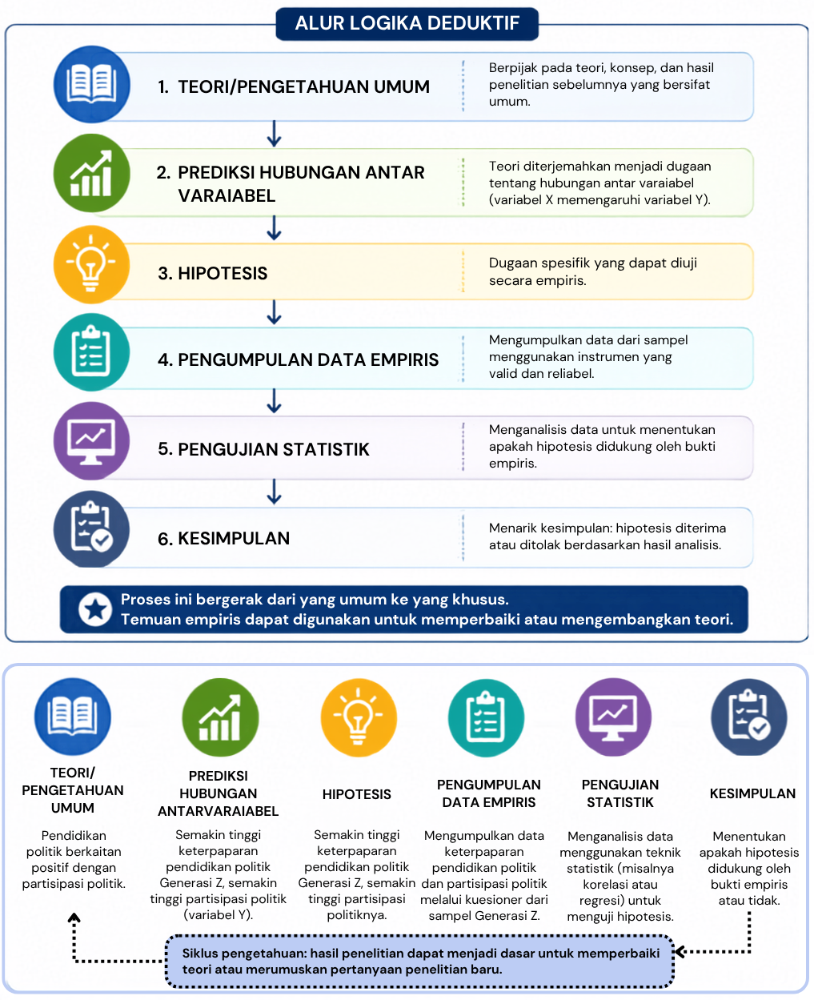

---
author:
  - name: Entin Nurhayati
filters:
  # Run Quarto's default filters first
  - quarto
  - section-bibliographies
bibliography: references.bib
reference-section-title: Daftar Pustaka
citeproc: true
---

# Prinsip dan Logika Penelitian Kuantitatif

::: callout-note
## Capaian Pembelajaran

Setelah mempelajari bab ini, mahasiswa diharapkan mampu:

1.  Menjelaskan landasan filosofis yang mendasari penelitian kuantitatif.
2.  Menguraikan prinsip-prinsip utama penelitian kuantitatif serta implikasinya terhadap proses penelitian.
3.  Menjelaskan logika deduktif sebagai dasar penalaran dalam penelitian kuantitatif.
4.  Mengaitkan prinsip dan logika penelitian kuantitatif dengan penyusunan hipotesis serta tahapan penelitian kuantitatif secara keseluruhan.
:::

Penelitian kuantitatif merupakan pendekatan penelitian yang disusun berdasarkan prinsip-prinsip ilmiah dan pola penalaran yang sistematis. Setiap tahap penelitian, mulai dari perumusan masalah, penyusunan hipotesis, penentuan variabel, pengumpulan data, hingga penarikan kesimpulan, didasarkan pada asumsi dan logika tertentu. Oleh karena itu, memahami prinsip dan logika penelitian kuantitatif menjadi penting agar peneliti tidak hanya mengetahui *bagaimana* penelitian dilakukan, tetapi juga memahami *mengapa* setiap tahapan tersebut harus dilakukan dengan cara tertentu.

Bab ini membahas landasan filosofis, prinsip-prinsip dasar, serta logika deduktif yang menjadi dasar penelitian kuantitatif. Pemahaman terhadap materi ini akan membantu pembaca memahami alasan di balik penggunaan hipotesis, pengukuran variabel, dan pengujian statistik yang akan dibahas pada bab-bab berikutnya.

## Hakikat Penelitian Kuantitatif

Penelitian kuantitatif merupakan pendekatan penelitian yang bertujuan memperoleh pengetahuan melalui pengukuran yang objektif, analisis data numerik, dan pengujian hipotesis secara empiris. Pendekatan ini digunakan untuk menjelaskan hubungan antar variabel, menguji teori, serta menghasilkan temuan yang dapat digeneralisasikan ke populasi yang lebih luas [@Creswell2018a; @Cohen2108].

Karakteristik tersebut menjadikan penelitian kuantitatif memiliki prosedur yang sistematis, terstruktur, dan mengikuti kaidah metode ilmiah. Setiap tahapan penelitian, mulai dari perumusan masalah hingga penarikan kesimpulan, disusun berdasarkan asumsi filosofis dan logika ilmiah tertentu. Oleh karena itu, untuk memahami bagaimana penelitian kuantitatif dilakukan, penting terlebih dahulu memahami landasan filosofis, prinsip-prinsip dasar, dan logika yang mendasarinya [@Leavy2017; @Neuman2014].

## Landasan Filosofis dan Prinsip Penelitian Kuantitatif

Penelitian kuantitatif tidak hanya ditandai oleh penggunaan angka atau analisis statistik, tetapi juga oleh cara pandang tertentu terhadap realitas dan bagaimana pengetahuan ilmiah diperoleh. Cara pandang tersebut berakar pada filsafat positivisme, yang meyakini bahwa fenomena alam maupun sosial memiliki keteraturan, dapat diamati secara empiris, diukur secara objektif, dan dijelaskan melalui metode ilmiah [@Leavy2017; @Neuman2014]. Dengan demikian, tujuan penelitian kuantitatif bukan sekadar mendeskripsikan fenomena, tetapi juga menemukan pola, menguji hubungan antar variabel, serta menghasilkan temuan yang dapat diverifikasi oleh peneliti lain.

Berangkat dari landasan filosofis tersebut, penelitian kuantitatif dikembangkan berdasarkan sejumlah prinsip yang menjadi pedoman dalam proses penelitian. @Cohen2108 mengemukakan empat prinsip utama yang mendasari penelitian kuantitatif, yaitu *determinism*, *empiricism*, *parsimony*, dan *generalization*. Keempat prinsip tersebut saling berkaitan dan memengaruhi cara peneliti merumuskan masalah, menyusun hipotesis, mengumpulkan data, hingga menarik kesimpulan. Secara ringkas, prinsip-prinsip dasar tersebut memiliki implikasi terhadap cara penelitian kuantitatif dirancang dan dilaksanakan, sebagaimana dirangkum pada @tbl-prinsipkuantitatif.

### *Determinism*

Prinsip *determinism* menyatakan bahwa setiap fenomena memiliki penyebab dan tidak terjadi secara kebetulan. Dengan kata lain, suatu peristiwa dipengaruhi oleh kondisi atau faktor tertentu sehingga hubungan sebab-akibat tersebut dapat dipelajari dan dijelaskan melalui penelitian ilmiah [@Cohen2108]. Adanya keteraturan inilah yang memungkinkan ilmuwan menyusun teori, membuat prediksi, serta menjelaskan berbagai fenomena yang terjadi.

Dalam penelitian kuantitatif, prinsip ini menjadi dasar untuk mengidentifikasi hubungan antarvariabel. Peneliti merumuskan dugaan mengenai bagaimana suatu variabel memengaruhi variabel lain, kemudian mengujinya menggunakan data empiris. Oleh karena itu, penelitian kuantitatif umumnya berorientasi pada pengujian hipotesis dan pencarian hubungan yang konsisten antarvariabel.

### *Empiricism*

Prinsip *empiricism* menyatakan bahwa pengetahuan ilmiah harus didasarkan pada fakta yang dapat diamati, diukur, dan diverifikasi melalui pengalaman empiris [@Cohen2108]. Oleh karena itu, fenomena yang diteliti perlu diterjemahkan ke dalam variabel yang dapat diukur menggunakan instrumen yang valid dan reliabel sehingga hasil pengukuran dapat dipercaya.

Konsekuensi dari prinsip ini adalah munculnya pendekatan reduksionisme, yaitu upaya memahami fenomena yang kompleks dengan menguraikannya menjadi komponen-komponen yang lebih sederhana dan dapat diukur. Selain itu, penelitian kuantitatif harus dilaksanakan secara sistematis dan terstruktur. Sistematis berarti setiap tahapan penelitian disusun secara logis dan saling berkaitan, sedangkan terstruktur menunjukkan bahwa proses penelitian mengikuti prosedur dan desain yang telah direncanakan sebelumnya.

Prinsip empirisme menekankan bahwa pengetahuan ilmiah berkembang melalui proses yang sistematis dan berkesinambungan. Proses tersebut diawali dengan observasi terhadap suatu fenomena, kemudian diikuti dengan pengukuran yang objektif, analisis hubungan antar variabel, serta penarikan kesimpulan berdasarkan bukti empiris. Temuan yang diperoleh tidak dipandang sebagai kebenaran yang mutlak, melainkan sebagai pengetahuan yang terus diuji, direplikasi, dan disempurnakan melalui penelitian selanjutnya [@Babbie2021; @Creswell2018a].

### *Parsimony*

Prinsip *parsimony* menyatakan bahwa suatu fenomena sebaiknya dijelaskan dengan cara yang paling sederhana tanpa mengabaikan fakta yang ada. Prinsip ini dikenal sebagai *Occam's Razor*, yaitu gagasan bahwa penjelasan yang melibatkan asumsi paling sedikit umumnya lebih disukai dibandingkan penjelasan yang lebih rumit apabila keduanya memiliki kemampuan yang sama dalam menjelaskan suatu fenomena [@Cohen2108].

Dalam penelitian kuantitatif, prinsip ini mendorong peneliti menyusun model penelitian yang sederhana namun tetap mampu menjawab pertanyaan penelitian. Peneliti tidak perlu memasukkan terlalu banyak variabel atau hubungan yang tidak relevan apabila hubungan utama sudah dapat dijelaskan secara memadai.

### *Generalization*

Prinsip *generalization* menyatakan bahwa pengetahuan ilmiah diperoleh melalui pengamatan terhadap sebagian anggota populasi, kemudian hasilnya digunakan untuk menarik kesimpulan mengenai populasi yang lebih luas [@Cohen2108]. Oleh karena itu, kualitas generalisasi sangat bergantung pada representativitas sampel dan ketepatan prosedur pengambilan sampel.

Dalam penelitian kuantitatif, prinsip ini menjadi dasar penggunaan teknik sampling dan inferensi statistik. Melalui analisis statistik, peneliti memperkirakan apakah hasil yang diperoleh dari sampel dapat diberlakukan pada populasi dengan tingkat keyakinan tertentu.

::: {#tbl-prinsipkuantitatif}
|  |  |
|:-----------------------|:-----------------------------------------------|
| **Prinsip/Logika** | **Implikasi dalam Penelitian Kuantitatif** |
| *Determinism* | Mengidentifikasi dan menguji hubungan antar variabel |
| *Empiricism* | Menerjemahkan konsep menjadi variabel yang dapat diamati dan diukur |
| *Parsimony* | Menyusun penjelasan atau model yang memadai tanpa kompleksitas yang tidak diperlukan |
| *Generalization* | Menggunakan sampel untuk menarik inferensi mengenai populasi |

: Prinsip-prinsip Dasar Penelitian Kuantitatif
:::

## Logika Deduktif dalam Penelitian Kuantitatif

Logika merupakan cara penalaran yang mengikuti kaidah tertentu agar suatu kesimpulan dapat ditarik secara tepat dari informasi yang menjadi dasarnya. Dalam penelitian ilmiah, logika diperlukan untuk memastikan adanya keterkaitan yang masuk akal antara teori, pertanyaan penelitian, hipotesis, bukti empiris, dan kesimpulan. Dua bentuk penalaran yang umum dikenal dalam penelitian adalah deduktif dan induktif. Penalaran deduktif bergerak dari gagasan atau pernyataan yang bersifat umum menuju kesimpulan yang lebih khusus, sedangkan penalaran induktif bergerak dari pengamatan terhadap kasus-kasus tertentu menuju pola atau kesimpulan yang lebih umum [@Cohen2108; @Babbie2021].

Penelitian kuantitatif utamanya menggunakan logika deduktif. Peneliti berangkat dari teori atau pengetahuan yang telah ada, kemudian menurunkannya menjadi dugaan yang lebih spesifik dalam bentuk hipotesis. Hipotesis tersebut selanjutnya diuji menggunakan data empiris untuk menentukan apakah bukti yang diperoleh konsisten dengan prediksi yang diturunkan dari teori [@Creswell2018a]. Alur tersebut tidak berhenti pada penarikan kesimpulan; temuan empiris yang diperoleh dapat menjadi dasar untuk memperbaiki atau mengembangkan teori dan selanjutnya diuji kembali melalui penelitian berikutnya (lihat @fig-deduktif).

::: {#fig-deduktif}

:::

Meskipun demikian, deduksi dan induksi tidak harus dipandang sebagai dua proses yang sepenuhnya terpisah. Temuan empiris dari penelitian kuantitatif dapat menghasilkan pola atau persoalan baru yang kemudian digunakan untuk memperbaiki dan mengembangkan penjelasan teoretis. Dengan demikian, perkembangan pengetahuan ilmiah berlangsung secara berkelanjutan melalui hubungan antara teori dan bukti empiris [@Babbie2021].

## Silogisme dalam Penelitian Kuantitatif

Logika deduktif berkaitan erat dengan silogisme, yaitu bentuk penalaran yang menghasilkan kesimpulan berdasarkan premis-premis yang telah ditetapkan. Dalam bentuk sederhana, silogisme terdiri atas premis mayor, premis minor, dan kesimpulan. Jika premis yang digunakan benar dan struktur penalarannya valid, kesimpulan yang dihasilkan mengikuti premis tersebut secara logis [@Smith2022; @Cohen2108].

Sebagai contoh:

> **Premis mayor**: Semua manusia akan mati.
>
> **Premis minor:** Katrina adalah manusia.
>
> **Kesimpulan**: Katrina akan mati.

Dalam penelitian kuantitatif, pola penalaran tersebut membantu menjelaskan bagaimana peneliti bergerak dari pengetahuan yang bersifat umum menuju dugaan yang lebih spesifik. Teori dan temuan penelitian sebelumnya menyediakan dasar penalaran, sedangkan kesimpulan yang diturunkan darinya dapat menjadi dasar dalam merumuskan hipotesis yang selanjutnya diuji menggunakan data empiris.

### Silogisme Kategoris

Silogisme kategoris merupakan penalaran yang premis dan kesimpulannya berupa pernyataan tanpa syarat. Dalam penelitian, pola ini dapat digunakan untuk menggambarkan bagaimana suatu pengetahuan umum diterapkan pada kondisi yang lebih khusus.

Silogisme kategoris merupakan bentuk penalaran yang premis dan kesimpulannya berupa pernyataan tanpa syarat. Silogisme ini terdiri atas premis mayor yang memuat pernyataan umum, premis minor yang memuat pernyataan lebih khusus, dan kesimpulan yang diturunkan dari kedua premis tersebut.

Sebagai contoh, pertumbuhan tinggi badan yang cepat (*growth spurt*) merupakan salah satu karakteristik perkembangan fisik pada masa pubertas. Penalarannya dapat disederhanakan sebagai berikut:

> **Premis mayor**: Anak yang memasuki masa pubertas mengalami *growth spurt*.
>
> **Premis minor**: Anak-anak usia awal belasan di daerah X sedang memasuki masa pubertas.
>
> **Prediksi**: Anak-anak usia awal belasan di daerah X akan menunjukkan pertambahan tinggi badan yang cepat.

Prediksi tersebut selanjutnya dapat diuji dengan melakukan pengukuran tinggi badan secara berkala. Data yang diperoleh digunakan untuk menilai apakah pola pertumbuhan yang diamati konsisten dengan prediksi yang diturunkan dari pengetahuan sebelumnya.

### Silogisme Hipotetis

Silogisme hipotetis menggunakan pernyataan bersyarat yang biasanya berbentuk “jika … maka ….” Premis menyatakan bahwa suatu kondisi akan menghasilkan konsekuensi tertentu. Bentuk penalaran ini sangat relevan untuk menggambarkan hipotesis mengenai hubungan sebab-akibat, khususnya dalam penelitian eksperimen.

Sebagai contoh, siswa mengeluh lebih cepat merasa lapar ketika belajar di ruangan yang sangat dingin. Penalarannya dapat dirumuskan sebagai berikut:

> **Premis mayor**: Jika seseorang berada dalam ruangan yang sangat dingin, maka ia akan lebih cepat merasa lapar.
>
> **Premis minor**: Siswa ditempatkan dalam ruangan yang sangat dingin.
>
> **Prediksi**: Siswa yang berada dalam ruangan sangat dingin akan lebih cepat merasa lapar dibandingkan siswa yang berada dalam ruangan bersuhu normal.

Prediksi tersebut dapat diuji dengan menempatkan dua kelompok siswa pada kondisi yang sama, kecuali suhu ruangan. Waktu munculnya rasa lapar kemudian dibandingkan antara kedua kelompok. Jika kelompok yang berada dalam ruangan sangat dingin lebih cepat merasa lapar, data memberikan dukungan terhadap prediksi yang diajukan.

Pemahaman terhadap logika deduktif menunjukkan bahwa hipotesis penelitian bukan sekadar dugaan, melainkan prediksi yang memiliki dasar teoretis dan dapat diuji secara empiris. Agar prediksi tersebut dapat diuji, konsep-konsep yang terkandung di dalamnya perlu diterjemahkan menjadi variabel yang dapat diamati dan diukur. Proses penyusunan hipotesis dan operasionalisasi variabel inilah yang akan dibahas pada bab berikutnya.

::: callout-tip
## Rangkuman

1.  Penelitian kuantitatif merupakan pendekatan yang menggunakan prosedur sistematis dan terstruktur untuk menguji teori atau hipotesis melalui pengukuran dan analisis data empiris.
2.  Penelitian kuantitatif berakar pada filsafat positivisme yang memandang bahwa fenomena memiliki keteraturan serta dapat diamati, diukur, dan dipelajari menggunakan metode ilmiah.
3.  Empat prinsip utama penelitian kuantitatif adalah *determinism*, *empiricism*, *parsimony*, dan *generalization*. Prinsip-prinsip tersebut mendasari cara peneliti menjelaskan fenomena, melakukan pengukuran, membangun penjelasan, dan menarik kesimpulan.
4.  Penelitian kuantitatif terutama menggunakan logika deduktif, yaitu penalaran yang bergerak dari teori atau pengetahuan yang bersifat umum menuju prediksi atau hipotesis yang lebih spesifik untuk kemudian diuji menggunakan data empiris.
5.  Silogisme merupakan model sederhana untuk memahami penalaran deduktif. Silogisme kategoris bergerak dari pernyataan umum menuju kasus yang lebih khusus, sedangkan silogisme hipotetik menggunakan hubungan bersyarat dalam bentuk “jika ... maka ...”.
6.  Hasil penelitian tidak membuktikan suatu teori secara mutlak. Bukti empiris digunakan untuk menilai sejauh mana hasil penelitian konsisten atau tidak konsisten dengan prediksi yang diturunkan dari teori.
:::

::: callout-important
## Refleksi & Diskusi

- Mengapa penelitian kuantitatif perlu dilakukan secara sistematis dan terstruktur? Kaitkan jawaban Anda dengan prinsip-prinsip penelitian kuantitatif.
- Pilih satu fenomena psikologis yang menarik bagi Anda. Jelaskan bagaimana prinsip *determinism*, *empiricism*, *parsimony*, dan *generalization* dapat diterapkan untuk meneliti fenomena tersebut.
- Buatlah satu contoh sederhana yang menunjukkan alur teori → hipotesis → pengumpulan data → analisis → kesimpulan.
- Mengapa hipotesis dalam penelitian kuantitatif seharusnya memiliki dasar teori atau temuan penelitian sebelumnya?
- Seorang peneliti memperoleh hasil yang tidak mendukung hipotesisnya. Apakah hal tersebut berarti teori yang digunakannya pasti salah? Jelaskan alasan Anda.
- Pilih salah satu topik penelitian, kemudian susun sebuah contoh silogisme kategoris atau hipotetik yang dapat menjadi dasar penalaran dalam penelitian tersebut.
:::

::: sectionrefs
:::
