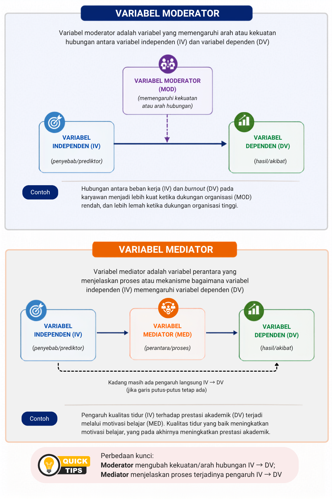

---
author:
  - name: Sunu Bagaskara
filters:
  # Run Quarto's default filters first
  - quarto
  - section-bibliographies
bibliography: references.bib
reference-section-title:
citeproc: true
---

# Kontrol dalam Penelitian Eksperimen

::: callout-note
## Capaian Pembelajaran

Setelah mempelajari bab ini, mahasiswa diharapkan mampu:

1.  Menjelaskan pengertian variabel serta karakteristik variabel dalam penelitian kuantitatif.
2.  Membedakan jenis-jenis variabel berdasarkan perannya dalam penelitian kuantitatif, yaitu variabel independen, dependen, mediator, moderator, dan kontrol.
3.  Menjelaskan perbedaan antara variabel kontrol dan variabel perancu (*confounding variable*) serta pentingnya pengendalian variabel dalam penelitian kuantitatif.
4.  Mengidentifikasi dan mengklasifikasikan variabel berdasarkan perannya dari judul atau model penelitian kuantitatif.
:::

Variabel merupakan unsur utama dalam penelitian kuantitatif karena menjadi dasar dalam merumuskan masalah penelitian, menyusun hipotesis, memilih instrumen, dan menganalisis data. Melalui variabel, fenomena yang menjadi fokus penelitian dapat didefinisikan secara jelas sehingga dapat diamati, diukur, dan dianalisis secara sistematis. Oleh karena itu, pemahaman yang baik mengenai variabel merupakan langkah awal yang penting sebelum peneliti menyusun rancangan penelitian kuantitatif.

Bab ini membahas pengertian variabel, karakteristik variabel, serta berbagai jenis variabel berdasarkan perannya dalam penelitian kuantitatif, yaitu variabel independen, dependen, mediator, moderator, dan kontrol. Selain itu, pembaca akan mempelajari cara mengidentifikasi dan mengklasifikasikan variabel dari berbagai contoh penelitian sebagai bekal untuk menyusun hipotesis dan mengoperasionalkan variabel pada bab berikutnya.

## Pengertian Variabel

Variabel merupakan karakteristik, atribut, atau sifat yang menjadi objek pengamatan dalam suatu penelitian dan nilainya dapat berbeda antarunit analisis. Dalam penelitian kuantitatif, variabel digunakan untuk menggambarkan, membandingkan, atau menjelaskan hubungan antarfenomena melalui proses pengukuran dan analisis data. @Creswell2018a mendefinisikan variabel sebagai karakteristik atau atribut dari individu atau organisasi yang dapat diukur atau diamati serta memiliki variasi di antara subjek penelitian. Sejalan dengan itu, @Kerlinger2000 menyatakan bahwa variabel adalah simbol atau konsep yang memiliki lebih dari satu nilai.

Berdasarkan definisi tersebut, terdapat dua ciri utama suatu variabel. Pertama, variabel merupakan karakteristik yang menjadi fokus penelitian, misalnya usia, tingkat pendidikan, motivasi belajar, atau kepuasan kerja. Kedua, karakteristik tersebut harus memiliki variasi nilai. Sebagai contoh, usia merupakan variabel karena setiap responden memiliki usia yang berbeda. Demikian pula motivasi belajar dapat berbeda tingkatnya pada setiap mahasiswa. Sebaliknya, karakteristik yang memiliki nilai sama untuk seluruh responden dalam suatu penelitian tidak dapat berfungsi sebagai variabel karena tidak menunjukkan adanya variasi.

Sebagai ilustrasi, perhatikan judul penelitian berikut.

> *Pengaruh Motivasi Belajar terhadap Prestasi Akademik Mahasiswa*

Pada penelitian tersebut terdapat dua variabel, yaitu **motivasi belajar** dan **prestasi akademik**. Kedua variabel tersebut memiliki variasi nilai pada setiap mahasiswa sehingga dapat diukur dan dianalisis untuk mengetahui hubungan di antara keduanya.

Dengan demikian, dapat disimpulkan bahwa variabel merupakan karakteristik yang dapat diamati atau diukur dan memiliki variasi nilai. Dalam penelitian kuantitatif, setiap variabel memiliki peran tertentu sesuai dengan tujuan penelitian. Pembahasan mengenai berbagai peran tersebut akan dijelaskan pada bagian berikutnya.

## Jenis Variabel Berdasarkan Perannya dalam Penelitian

Secara umum, terdapat lima jenis variabel berdasarkan perannya dalam penelitian, yaitu variabel independen, variabel dependen, variabel mediator, variabel moderator, dan variabel kontrol. Berikut ini adalah penjelasan lebih lanjut mengenai setiap jenis variabel:

1.  **Variabel Independen**

    Variabel independen (*independent variable*) adalah variabel yang diduga memengaruhi atau menjadi penyebab terjadinya perubahan pada variabel lain. Variabel ini sering disebut sebagai variabel bebas karena nilainya digunakan untuk menjelaskan variasi pada variabel dependen [@Kerlinger2000].

    Sebagai contoh, pada penelitian yang menguji pengaruh motivasi belajar terhadap prestasi akademik, **motivasi belajar** merupakan variabel independen.

2.  **Variabel Dependen**

    Variabel dependen (*dependent variable*) adalah variabel yang dipengaruhi atau dijelaskan oleh variabel independen. Variabel ini sering disebut sebagai variabel terikat karena nilainya diasumsikan bergantung pada perubahan variabel independen [@Creswell2018a].

    Pada contoh sebelumnya, **prestasi akademik** merupakan variabel dependen karena diduga dipengaruhi oleh motivasi belajar.

3.  **Variabel Mediator**

    Variabel mediator (*mediating variable*) adalah variabel yang menjelaskan mekanisme atau proses bagaimana variabel independen memengaruhi variabel dependen. Dengan kata lain, variabel mediator menjawab pertanyaan *mengapa* atau *melalui proses apa* suatu pengaruh dapat terjadi [@Hayes2022].

    Sebagai contoh, pada penelitian mengenai pengaruh dukungan sosial terhadap kesejahteraan psikologis melalui resiliensi, **resiliensi** berperan sebagai variabel mediator. Dukungan sosial diperkirakan meningkatkan resiliensi, yang selanjutnya berkontribusi terhadap peningkatan kesejahteraan psikologis.

4.  **Variabel Moderator**

    Variabel moderator (*moderating variable*) adalah variabel yang memengaruhi arah atau kekuatan hubungan antara variabel independen dan variabel dependen. Dengan demikian, hubungan antara kedua variabel tersebut dapat menjadi lebih kuat, lebih lemah, atau bahkan berbeda pada kelompok tertentu [@Baron1986].

    Sebagai contoh, pada penelitian mengenai pengaruh beban kerja terhadap burnout, **dukungan organisasi** dapat berperan sebagai variabel moderator. Pengaruh beban kerja terhadap burnout mungkin lebih lemah pada karyawan yang memperoleh dukungan organisasi yang tinggi dibandingkan pada karyawan yang memperoleh dukungan yang rendah.

    @fig-modmed mengilustrasikan perbedaan konseptual, tujuan, serta contoh variabel moderator dan variabel mediator dalam sebuah penelitian.

    {#fig-modmed}

5.  **Variabel Kontrol**

    Variabel kontrol (*control variable*) adalah variabel yang sengaja diperhitungkan atau dikendalikan oleh peneliti agar hubungan antara variabel independen dan variabel dependen dapat diamati dengan lebih akurat. Variabel ini bukan merupakan fokus utama penelitian, tetapi diduga ikut memengaruhi variabel dependen sehingga perlu diperhatikan dalam analisis atau interpretasi hasil penelitian [@Creswell2018a].

    Salah satu alasan penggunaan variabel kontrol adalah adanya kemungkinan bahwa hubungan antara variabel independen dan variabel dependen dipengaruhi oleh faktor lain. Dalam kondisi tertentu, faktor tersebut dapat menjadi **variabel perancu** (*confounding variable*), yaitu variabel yang berhubungan dengan variabel independen sekaligus variabel dependen sehingga dapat menyebabkan hubungan di antara keduanya tampak lebih kuat, lebih lemah, atau bahkan menimbulkan kesimpulan yang keliru apabila tidak diperhitungkan [@Rothman2021].

    Sebagai contoh, seorang peneliti ingin mengetahui pengaruh **durasi penggunaan media sosial** terhadap **tingkat kecemasan** pada mahasiswa. Hasil penelitian mungkin menunjukkan bahwa mahasiswa yang lebih sering menggunakan media sosial memiliki tingkat kecemasan yang lebih tinggi. Namun, hubungan tersebut belum tentu sepenuhnya disebabkan oleh penggunaan media sosial. Bisa jadi mahasiswa yang memiliki **neurotisisme** tinggi cenderung lebih sering menggunakan media sosial sekaligus lebih rentan mengalami kecemasan. Dalam kondisi ini, **neurotisisme** merupakan variabel perancu karena berhubungan dengan variabel independen (durasi penggunaan media sosial) maupun variabel dependen (tingkat kecemasan). Apabila variabel tersebut tidak diperhitungkan, peneliti dapat menyimpulkan secara keliru bahwa penggunaan media sosial merupakan penyebab utama meningkatnya kecemasan.

    Untuk mengurangi kemungkinan terjadinya bias tersebut, peneliti dapat memasukkan neurotisisme sebagai **variabel kontrol**. Dengan demikian, hubungan antara durasi penggunaan media sosial dan tingkat kecemasan dapat dianalisis setelah mempertimbangkan pengaruh neurotisisme, sehingga hasil penelitian memberikan gambaran yang lebih akurat mengenai hubungan kedua variabel tersebut.

    Perlu diperhatikan bahwa variabel kontrol dan variabel perancu merupakan dua konsep yang saling berkaitan, tetapi tidak identik. Variabel perancu menggambarkan **potensi sumber bias** yang dapat mengganggu hubungan antara variabel independen dan dependen. Sebaliknya, variabel kontrol merupakan **peran** yang diberikan kepada variabel tersebut ketika peneliti secara sengaja memperhitungkan atau mengendalikannya dalam penelitian. Dengan kata lain, suatu variabel yang berpotensi menjadi variabel perancu dapat berfungsi sebagai variabel kontrol apabila peneliti memasukkannya ke dalam desain penelitian atau analisis data.

    Pembahasan mengenai berbagai strategi untuk mengendalikan variabel perancu, seperti randomisasi, penggunaan kelompok kontrol, *matching*, dan pengendalian melalui desain eksperimen, akan dibahas lebih lanjut pada bab mengenai **penelitian eksperimen**.

Dalam penelitian kuantitatif, suatu variabel dapat memiliki peran yang berbeda sesuai dengan tujuan penelitian dan hubungan yang ingin dikaji. Oleh karena itu, pengelompokan variabel umumnya didasarkan pada fungsi atau perannya dalam model penelitian, bukan berdasarkan nama variabel itu sendiri [@Creswell2018a].

Sebagai contoh, variabel *stres* dapat berperan sebagai variabel independen pada penelitian yang mengkaji pengaruh stres terhadap kualitas tidur. Namun, pada penelitian lain, stres dapat menjadi variabel dependen apabila peneliti ingin mengetahui pengaruh beban kerja terhadap tingkat stres. Dengan demikian, jenis variabel ditentukan oleh posisinya dalam penelitian, bukan oleh karakteristik variabel tersebut.

## Mengidentifikasi dan Mengklasifikasikan Variabel dalam Penelitian

Kemampuan mengidentifikasi variabel merupakan salah satu keterampilan dasar dalam penelitian kuantitatif. Sebelum menyusun hipotesis, menentukan instrumen, atau memilih teknik analisis data, peneliti harus terlebih dahulu mengenali variabel yang akan diteliti beserta perannya dalam penelitian. Oleh karena itu, identifikasi variabel sebaiknya dilakukan sejak tahap penyusunan judul atau perumusan masalah penelitian.

Dalam praktiknya, penentuan jenis variabel tidak didasarkan pada nama variabel, tetapi pada fungsi atau perannya dalam hubungan yang diteliti. Variabel yang sama dapat memiliki peran yang berbeda pada penelitian yang berbeda. Oleh karena itu, penting bagi mahasiswa untuk mempelajari pentingnya kemampuan mengindentifikasi variabel-variabel penelitian dari sejumlah contoh judul penelitian.

**Contoh 1**

**Judul penelitian**

> *Peran Motivasi Belajar terhadap Prestasi Akademik Mahasiswa.*

**Identifikasi variabel**

-   Variabel independen: Motivasi belajar
-   Variabel dependen: Prestasi akademik

**Contoh 2**

**Judul penelitian**

> *Pengaruh Beban Kerja terhadap Burnout dengan Dukungan Sosial sebagai Moderator.*

**Identifikasi variabel**

-   Variabel independen: Beban kerja
-   Variabel dependen: *Burnout*
-   Variabel moderator: Dukungan sosial

**Contoh 3**

**Judul penelitian**

> *Pengaruh Dukungan Orang Tua terhadap Prestasi Belajar melalui Motivasi Belajar.*

**Identifikasi variabel**

-   Variabel independen: Dukungan orang tua
-   Variabel mediator: Motivasi belajar
-   Variabel dependen: Prestasi belajar

**Contoh 3**

**Judul penelitian**

> *Pengaruh Durasi Penggunaan Media Sosial terhadap Tingkat Kecemasan pada Mahasiswa.*

**Identifikasi variabel**

-   Variabel independen: Durasi penggunaan media sosial
-   Variabel dependen: Tingkat kecemasan
-   Variabel kontrol: Neurotisisme

Perlu diperhatikan bahwa **variabel kontrol** dan **variabel perancu** merupakan dua konsep yang saling berkaitan, tetapi tidak identik. Variabel perancu menggambarkan **potensi sumber bias** yang dapat mengganggu hubungan antara variabel independen dan dependen. Sebaliknya, variabel kontrol merupakan **peran** yang diberikan kepada variabel tersebut ketika peneliti secara sengaja memperhitungkan atau mengendalikannya dalam penelitian. Dengan kata lain, suatu variabel yang berpotensi menjadi variabel perancu dapat berfungsi sebagai variabel kontrol apabila peneliti memasukkannya ke dalam desain penelitian atau analisis data.

Dari keempat contoh tersebut terlihat bahwa penentuan jenis variabel selalu bergantung pada model penelitian yang digunakan. Oleh karena itu, peneliti perlu memahami hubungan antarvariabel sebelum menetapkan peran masing-masing variabel.

::: callout-tip
## Cara mudah mengidentifikasi variabel

Salah satu cara sederhana untuk mengidentifikasi variabel adalah dengan mengajukan pertanyaan berikut.

-   **Apa yang diduga memengaruhi?** → Variabel independen
-   **Apa yang dipengaruhi?** → Variabel dependen
-   **Melalui apa pengaruh tersebut terjadi?** → Variabel mediator
-   **Dalam kondisi apa hubungan tersebut berubah?** → Variabel moderator
-   **Variabel apa yang perlu dikendalikan agar hasil penelitian lebih akurat?** → Variabel kontrol
:::

Kemampuan mengidentifikasi variabel dengan tepat akan memudahkan peneliti dalam menyusun hipotesis penelitian dan menentukan cara mengukur setiap variabel. Oleh karena itu, langkah selanjutnya setelah mengidentifikasi variabel adalah merumuskan hipotesis dan mendefinisikan variabel secara operasional, sebagaimana akan dibahas pada bab berikutnya.

::: callout-tip
## Rangkuman

1.   Tidak semua karakteristik dapat disebut sebagai variabel. Suatu karakteristik hanya dapat berfungsi sebagai variabel apabila nilainya berbeda antarpartisipan atau antarunit analisis sehingga dapat diukur dan dibandingkan.
2.  Jenis variabel ditentukan oleh perannya dalam model penelitian, bukan oleh nama variabelnya. Variabel yang sama dapat berperan sebagai variabel independen pada satu penelitian, tetapi menjadi variabel dependen atau variabel lain pada penelitian yang berbeda.
3.  Berdasarkan perannya, variabel dalam penelitian kuantitatif dapat dibedakan menjadi variabel independen, dependen, mediator, moderator, dan kontrol. Masing-masing memiliki fungsi yang berbeda dalam menjelaskan hubungan antarvariabel.
4.  Variabel kontrol digunakan untuk mengurangi pengaruh faktor lain yang dapat mengganggu hubungan antara variabel independen dan dependen. Variabel kontrol berbeda dengan variabel perancu (*confounding variable*); variabel perancu merupakan potensi sumber bias, sedangkan variabel kontrol adalah variabel yang secara sengaja diperhitungkan atau dikendalikan oleh peneliti.
5.  Kemampuan mengidentifikasi variabel merupakan keterampilan dasar dalam penelitian kuantitatif. Identifikasi variabel yang tepat akan memudahkan peneliti menyusun hipotesis, menentukan instrumen pengukuran, memilih teknik analisis data, serta mengoperasionalkan variabel pada tahap penelitian berikutnya.
:::

::: callout-important
## Refleksi & Diskusi

-   Mengapa suatu karakteristik harus memiliki variasi nilai agar dapat disebut sebagai variabel dalam penelitian kuantitatif? Berikan satu contoh karakteristik yang merupakan variabel dan satu contoh yang bukan variabel dalam konteks penelitian tertentu.

-   Perhatikan judul penelitian berikut.

    *Pengaruh Literasi Digital terhadap Kemampuan Berpikir Kritis Mahasiswa.*

    Identifikasikan variabel independen dan variabel dependen pada penelitian tersebut. Jelaskan alasan Anda.

-   Perhatikan judul penelitian berikut.

    *Pengaruh Beban Kerja terhadap Burnout dengan Resiliensi sebagai Mediator dan Dukungan Organisasi sebagai Moderator.*

    Identifikasikan seluruh variabel yang terdapat pada penelitian tersebut beserta perannya.

-   Jelaskan perbedaan antara variabel mediator, variabel moderator, dan variabel kontrol. Mengapa ketiga jenis variabel tersebut memiliki fungsi yang berbeda dalam menjelaskan hubungan antarvariabel?

-   Pilih salah satu judul penelitian yang sesuai dengan bidang psikologi yang Anda minati. Kemudian:

    -   identifikasikan seluruh variabel yang terdapat dalam judul tersebut;

    -   tentukan peran masing-masing variabel (independen, dependen, mediator, moderator, atau kontrol); dan

    -   jelaskan alasan penetapan peran setiap variabel.
:::

## Daftar Pustaka {.unnumbered .unlisted}

::: sectionrefs
:::
