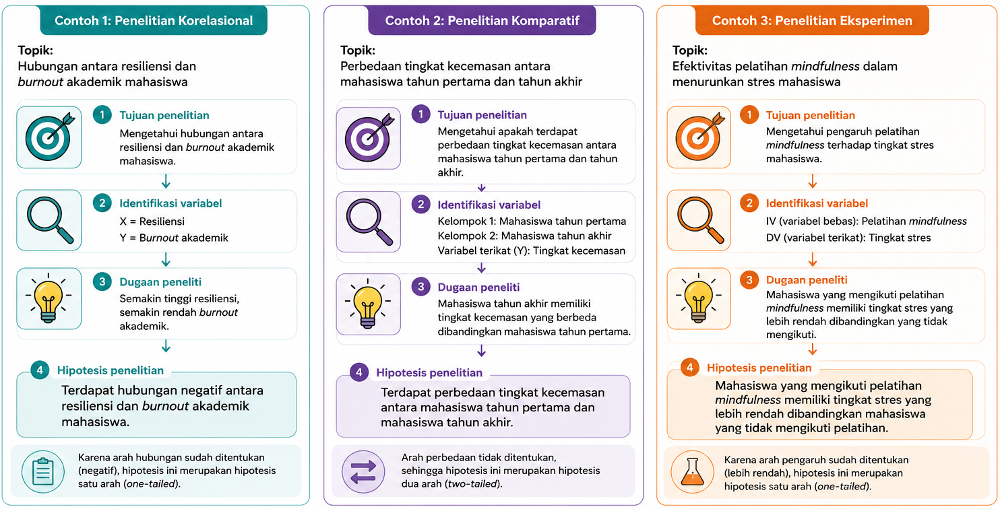

# Hipotesis dan Operasionalisasi Variabel

::: callout-note
## Capaian Pembelajaran

Setelah mempelajari bab ini, mahasiswa diharapkan mampu:

1.  Menjelaskan konsep, fungsi, dan jenis-jenis hipotesis dalam penelitian.
2.  Merumuskan hipotesis penelitian yang sesuai dengan tujuan, kerangka berpikir, dan desain penelitian.
3.  Menjelaskan konsep variabel, definisi konseptual, dan definisi operasional.
4.  Mengoperasionalkan variabel penelitian menjadi indikator yang dapat diukur.
5.  Menyusun tabel operasionalisasi variabel sebagai dasar pengembangan instrumen penelitian.
:::

Hipotesis dan operasionalisasi variabel merupakan bagian penting dari proses penelitian kuantitatif karena keduanya memastikan bahwa penelitian dilakukan secara sistematis, objektif, dan dapat diuji. Hipotesis memberikan arah mengenai hubungan, perbedaan, atau pengaruh yang ingin diuji, sedangkan operasionalisasi variabel menjelaskan bagaimana setiap variabel didefinisikan dan diukur secara empiris.

Pada bab ini akan dibahas konsep dasar hipotesis, jenis-jenis hipotesis, prinsip-prinsip penyusunannya, serta cara mengoperasionalkan variabel penelitian ke dalam bentuk yang dapat diukur sebagai dasar penyusunan instrumen penelitian.

## Hipotesis Penelitian

Salah satu karakteristik utama penelitian kuantitatif adalah adanya dugaan ilmiah yang akan diuji melalui pengumpulan dan analisis data. Dugaan tersebut dikenal sebagai **hipotesis**. Hipotesis memberikan arah yang jelas mengenai apa yang ingin dibuktikan atau diuji sehingga seluruh proses penelitian, mulai dari pemilihan variabel, penyusunan instrumen, pengumpulan data, hingga analisis statistik, dilakukan secara sistematis dan terarah.

Hipotesis bukan sekadar dugaan atau perkiraan pribadi peneliti. Hipotesis harus disusun berdasarkan landasan teori, hasil penelitian terdahulu, maupun kerangka konseptual yang logis. Oleh karena itu, hipotesis merupakan dugaan ilmiah (*educated guess*) yang memiliki dasar konseptual dan dapat diuji menggunakan metode ilmiah. Dalam penelitian kuantitatif, kualitas hipotesis yang dirumuskan akan menentukan ketepatan pemilihan desain penelitian, instrumen pengukuran, teknik analisis statistik, serta interpretasi hasil penelitian.

### Pengertian Hipotesis

Hipotesis merupakan dugaan atau jawaban sementara terhadap rumusan masalah penelitian yang masih memerlukan pembuktian melalui pengumpulan dan analisis data empiris. Disebut sebagai "jawaban sementara" karena kebenarannya belum dapat dipastikan sebelum dilakukan pengujian menggunakan metode ilmiah. Dalam literatur metodologi penelitian modern, hipotesis dipandang sebagai prediksi yang dapat diuji secara empiris mengenai hubungan, perbedaan, atau pengaruh antarvariabel. Hipotesis disusun berdasarkan landasan teori, hasil penelitian terdahulu, serta penalaran logis yang dikembangkan oleh peneliti, sehingga bukan sekadar dugaan atau opini pribadi [@Gravetter2018; @Creswell2018a].

Dalam penelitian kuantitatif, hipotesis berfungsi sebagai dasar untuk menentukan hubungan, perbedaan, atau pengaruh yang akan diuji. Keberadaan hipotesis membantu peneliti menetapkan variabel penelitian, memilih desain penelitian yang sesuai, menentukan teknik analisis statistik, serta menginterpretasikan hasil penelitian secara objektif. Dengan demikian, hipotesis menjadi salah satu komponen yang membedakan penelitian kuantitatif inferensial dari penelitian yang hanya bersifat deskriptif.

Perlu dipahami bahwa tidak semua penelitian kuantitatif memerlukan hipotesis. Penelitian deskriptif yang bertujuan menggambarkan karakteristik suatu populasi umumnya tidak mengajukan hipotesis karena tidak berusaha menguji hubungan atau perbedaan antarvariabel. Sebaliknya, penelitian korelasional, komparatif, eksperimen, maupun penelitian yang menggunakan analisis regresi umumnya memerlukan hipotesis sebagai dasar pengujian empiris.

Contoh:

> **Rumusan masalah:** Apakah terdapat hubungan antara resiliensi dan *academic burnout* pada mahasiswa?
>
> **Hipotesis penelitian:** Terdapat hubungan negatif antara resiliensi dan *academic burnout* pada mahasiswa.

### Klasifikasi Hipotesis

Hipotesis dapat diklasifikasikan berdasarkan beberapa sudut pandang. Dalam penelitian kuantitatif, klasifikasi yang paling umum didasarkan pada fungsi hipotesis dalam penelitian, bentuk statistik yang digunakan dalam pengujian, serta arah dugaan yang diajukan peneliti [@Creswell2018a; @Gravetter2018]. Memahami berbagai jenis hipotesis ini penting karena setiap jenis memiliki tujuan dan cara perumusan yang berbeda sesuai dengan desain penelitian dan teknik analisis statistik yang digunakan.

1.  **Berdasarkan Fungsinya dalam Penelitian**

    Berdasarkan fungsinya, hipotesis dibedakan menjadi **hipotesis penelitian (*research hypothesis*)** dan **hipotesis statistik (*statistical hypothesis*)**. Hipotesis penelitian merupakan dugaan ilmiah yang dirumuskan berdasarkan teori, hasil penelitian terdahulu, serta kerangka berpikir peneliti. Hipotesis ini ditulis dalam bentuk kalimat substantif yang menjelaskan adanya hubungan, perbedaan, atau pengaruh antarvariabel, tanpa menggunakan simbol atau notasi statistik [@Creswell2018a]. Hipotesis penelitian inilah yang biasanya dituliskan pada proposal atau laporan penelitian sebagai jawaban sementara terhadap rumusan masalah.

    Contoh:

    > Terdapat hubungan positif antara *self-efficacy* dan motivasi belajar mahasiswa.

    atau

    > Pelatihan *mindfulness* menurunkan tingkat stres mahasiswa.

    Ketika data penelitian akan dianalisis menggunakan statistik inferensial, hipotesis penelitian diterjemahkan ke dalam bentuk hipotesis statistik. Hipotesis statistik menggunakan simbol matematis atau notasi statistik sehingga dapat diuji melalui prosedur analisis statistik [@Gravetter2018].

2.  **Berdasarkan Bentuk Statistik**

    Hipotesis statistik terdiri atas dua bentuk, yaitu **hipotesis nol (H₀)** dan **hipotesis alternatif (H₁ atau Hₐ)**. Hipotesis nol menyatakan bahwa **tidak terdapat hubungan, tidak terdapat perbedaan, atau tidak terdapat pengaruh** antarvariabel dalam populasi. Dengan kata lain, setiap perbedaan atau hubungan yang ditemukan pada sampel dianggap tidak cukup kuat untuk menyimpulkan adanya hubungan atau perbedaan dalam populasi [@Gravetter2018].

    Contoh:

    > H₀: Tidak terdapat hubungan antara *self-efficacy* dan motivasi belajar mahasiswa.

    atau

    > H₀: Tidak terdapat perbedaan tingkat stres antara kelompok yang mengikuti pelatihan *mindfulness* dan kelompok kontrol.

    Dalam praktik penelitian, pengujian statistik pada dasarnya dilakukan untuk mengevaluasi apakah terdapat bukti yang cukup untuk **menolak H₀**. Oleh karena itu, peneliti tidak berusaha "membuktikan" H₀ benar, melainkan mencari bukti apakah H₀ dapat ditolak berdasarkan data yang diperoleh.

    Hipotesis alternatif merupakan kebalikan dari hipotesis nol. Hipotesis ini menyatakan bahwa **terdapat hubungan, perbedaan, atau pengaruh** antarvariabel dalam populasi. Dalam laporan penelitian, hipotesis penelitian yang ditulis pada Bab Pendahuluan umumnya merupakan bentuk verbal dari hipotesis alternatif, sedangkan H₀ dan H₁ digunakan secara eksplisit pada tahap analisis statistik.

    Contoh:

    > H₁: Terdapat hubungan antara *self-efficacy* dan motivasi belajar mahasiswa.

    atau

    > H₁: Terdapat perbedaan tingkat stres antara kelompok yang mengikuti pelatihan *mindfulness* dan kelompok kontrol.

3.  **Berdasarkan Arah Dugaan**

    Berdasarkan arah dugaan yang diajukan, hipotesis alternatif dibedakan menjadi **hipotesis satu arah (*directional/one-tailed hypothesis*)** dan **hipotesis dua arah (*non-directional/two-tailed hypothesis*)** [@Creswell2018a]. Hipotesis satu arah digunakan apabila teori atau hasil penelitian sebelumnya (bukti empiris) memberikan dasar yang kuat mengenai arah hubungan, perbedaan, atau pengaruh yang diharapkan.

    Contoh:

    > Terdapat hubungan positif antara *self-efficacy* dan motivasi belajar mahasiswa.

    atau

    > Mahasiswa yang mengikuti pelatihan *mindfulness* memiliki tingkat stres yang lebih rendah dibandingkan mahasiswa yang tidak mengikuti pelatihan.

    Pada contoh tersebut, arah dugaan telah ditentukan sejak awal, yaitu *positif* atau *lebih rendah*.

    Hipotesis dua arah digunakan apabila peneliti hanya menduga adanya hubungan, perbedaan, atau pengaruh tanpa menentukan arahnya. Hipotesis ini biasanya digunakan ketika bukti teoritis maupun hasil penelitian sebelumnya belum cukup kuat untuk memprediksi arah hubungan.

    Contoh:

    > Terdapat hubungan antara *self-efficacy* dan motivasi belajar mahasiswa.

    atau

    > Terdapat perbedaan tingkat stres antara mahasiswa yang mengikuti pelatihan *mindfulness* dan mahasiswa yang tidak mengikuti pelatihan.

    Pada hipotesis ini, peneliti tidak menyatakan apakah hubungan tersebut positif atau negatif, maupun kelompok mana yang diperkirakan memiliki skor lebih tinggi.

### Karakteristik Hipotesis yang Baik

Hipotesis merupakan dugaan ilmiah yang menjadi dasar pengujian dalam penelitian kuantitatif. Agar dapat berfungsi sebagai pedoman penelitian sekaligus dapat diuji secara empiris, hipotesis perlu memenuhi sejumlah karakteristik tertentu. Meskipun setiap buku metodologi penelitian menggunakan istilah yang sedikit berbeda, secara umum hipotesis yang baik memiliki enam karakteristik berikut [@Kerlinger2000; @Creswell2018a; @Gravetter2018; @Neuman2014]:

1.  **Berdasarkan teori dan bukti empiris**

    Hipotesis tidak disusun berdasarkan intuisi atau dugaan pribadi peneliti. Sebaliknya, hipotesis harus berangkat dari teori yang relevan, hasil penelitian terdahulu, maupun kerangka konseptual yang logis. Dengan demikian, hipotesis memiliki landasan ilmiah yang kuat dan dapat dipertanggungjawabkan.

2.  **Dirumuskan secara jelas dan spesifik**

    Hipotesis harus menggunakan kalimat yang jelas sehingga tidak menimbulkan penafsiran yang berbeda. Selain itu, variabel yang diteliti harus disebutkan secara spesifik sehingga pembaca memahami apa yang akan diuji.

    *Kurang tepat*:

    > Stres memengaruhi kehidupan mahasiswa.

    *Lebih tepat*:

    > Tingkat stres akademik berhubungan negatif dengan kesejahteraan psikologis mahasiswa.

3.  **Menyatakan hubungan antarvariabel**

    Dalam penelitian kuantitatif, hipotesis harus menjelaskan hubungan, perbedaan, atau pengaruh antarvariabel. Dengan kata lain, hipotesis harus menunjukkan dengan jelas variabel mana yang menjadi prediktor, variabel yang diprediksi, atau kelompok yang dibandingkan.

4.  **Dapat diuji secara empiris**

    Hipotesis harus berkaitan dengan variabel yang dapat diamati atau diukur sehingga dapat diuji menggunakan data empiris. Apabila suatu konsep tidak dapat diukur melalui indikator yang jelas, maka hipotesis tersebut tidak dapat diuji secara ilmiah.

5.  **Dapat dibuktikan salah (*falsifiable*)**

    Menurut @Popper2005, suatu hipotesis ilmiah harus memungkinkan untuk dibuktikan salah apabila data empiris tidak mendukungnya. Oleh karena itu, hipotesis tidak boleh berupa pernyataan yang selalu dianggap benar dalam segala situasi. Sebagai contoh, hipotesis "Semua mahasiswa selalu belajar dengan sungguh-sungguh" bukan merupakan hipotesis ilmiah yang baik karena sulit dirumuskan dalam bentuk yang dapat diuji secara objektif.

6.  **Konsisten dengan tujuan penelitian**

    Hipotesis harus sesuai dengan tujuan penelitian dan desain penelitian yang digunakan. Penelitian korelasional, misalnya, seharusnya merumuskan hipotesis mengenai hubungan antarvariabel, sedangkan penelitian eksperimen merumuskan hipotesis mengenai pengaruh suatu perlakuan terhadap variabel tertentu.

::: {#fig-hipotesis}

:::

::: callout-tip
## Kesalahan yang Sering Terjadi dalam Merumuskan Hipotesis

Mahasiswa sering melakukan beberapa kesalahan berikut ketika menyusun hipotesis penelitian:

-   Menyusun hipotesis tanpa didukung teori atau hasil penelitian terdahulu.
-   Merumuskan hipotesis yang terlalu umum sehingga variabel yang diteliti tidak jelas.
-   Menggunakan bentuk hipotesis yang tidak sesuai dengan tujuan penelitian, misalnya tujuan penelitian menguji hubungan tetapi hipotesis menyatakan adanya pengaruh.
-   Menggunakan konsep yang tidak dapat diukur secara empiris.
-   Menyusun hipotesis setelah melihat hasil analisis data (*HARKing* atau *Hypothesizing After the Results are Known*), padahal hipotesis seharusnya dirumuskan sebelum pengumpulan data dilakukan.
:::

## Operasionalisasi Variabel

Variabel merupakan konsep utama yang menjadi objek pengamatan dalam penelitian kuantitatif. Namun, banyak variabel dalam ilmu sosial dan psikologi, seperti *resiliensi*, *motivasi belajar*, *burnout*, atau *kesejahteraan psikologis*, tidak dapat diamati secara langsung. Konsep-konsep tersebut bersifat abstrak sehingga perlu diterjemahkan ke dalam bentuk yang dapat diamati dan diukur melalui proses **operasionalisasi variabel**.

Operasionalisasi variabel merupakan langkah penting dalam penelitian kuantitatif karena menentukan bagaimana suatu konsep akan diukur secara empiris. Proses ini mencakup penetapan definisi operasional, pemilihan indikator, penentuan instrumen pengukuran, hingga cara pemberian skor terhadap data yang diperoleh. Operasionalisasi yang baik memastikan bahwa data yang dikumpulkan benar-benar merepresentasikan konsep yang ingin diteliti sehingga hasil penelitian menjadi lebih valid dan reliabel [@Creswell2018a; @Kerlinger2000].

### Apa Itu Operasionalisasi Variabel?

Operasionalisasi variabel adalah proses mengubah konsep atau konstruk teoretis menjadi variabel yang dapat diukur secara empiris melalui indikator, instrumen pengukuran, prosedur penskoran, dan interpretasi hasil pengukuran (Kerlinger & Lee, 2000; Creswell & Creswell, 2023). Dengan kata lain, operasionalisasi menjelaskan bagaimana suatu konsep akan diukur dalam penelitian.

Sebagai contoh, apabila seorang peneliti ingin mengukur *resiliensi*, ia tidak cukup hanya menyebutkan definisi resiliensi menurut teori tertentu. Peneliti juga harus menjelaskan instrumen yang digunakan, dimensi atau indikator yang diukur, cara pemberian skor, serta makna dari skor yang diperoleh. Melalui operasionalisasi, konsep yang semula bersifat abstrak dapat diubah menjadi data numerik yang selanjutnya dianalisis menggunakan teknik statistik.

Operasionalisasi variabel merupakan salah satu tahapan penting dalam penelitian kuantitatif karena menentukan kualitas data yang diperoleh. Operasionalisasi yang kurang tepat dapat menyebabkan instrumen gagal merepresentasikan konsep yang ingin diukur sehingga hasil penelitian menjadi kurang valid. Sebaliknya, operasionalisasi yang baik akan menghasilkan pengukuran yang lebih akurat, konsisten, dan sesuai dengan tujuan penelitian (DeVellis & Thorpe, 2022).

### Definisi Konseptual dan Definisi Operasional

Dalam proses operasionalisasi, peneliti perlu membedakan **definisi konseptual** dan **definisi operasional**. Kedua jenis definisi tersebut saling melengkapi, tetapi memiliki tujuan yang berbeda.

**Definisi konseptual** menjelaskan makna suatu konsep berdasarkan teori atau pendapat para ahli. Definisi ini bertujuan memberikan batasan ilmiah mengenai konsep yang diteliti sehingga pembaca memahami ruang lingkup variabel penelitian. Oleh karena itu, definisi konseptual biasanya disusun berdasarkan kajian literatur dan mengacu pada teori yang menjadi landasan penelitian.

Sebaliknya, **definisi operasional** menjelaskan bagaimana konsep tersebut diukur dalam penelitian. Definisi operasional memuat informasi mengenai instrumen yang digunakan, aspek atau indikator yang diukur, bentuk skala pengukuran, serta cara menginterpretasikan skor yang diperoleh. Dengan demikian, definisi operasional menjembatani konsep teoretis dengan proses pengumpulan data empiris.

Sebagai ilustrasi, konsep *resiliensi* dapat didefinisikan secara konseptual sebagai kemampuan individu untuk beradaptasi secara positif ketika menghadapi kesulitan atau tekanan hidup. Namun, dalam penelitian, konsep tersebut perlu didefinisikan secara operasional, misalnya sebagai skor yang diperoleh responden pada *Connor–Davidson Resilience Scale* (CD-RISC-10). Semakin tinggi skor yang diperoleh, semakin tinggi tingkat resiliensi individu.

Perbedaan kedua jenis definisi tersebut dapat dilihat pada Tabel 12.1.

Tabel 12.1 Perbedaan Definisi Konseptual dan Definisi Operasional

|  |  |  |  |  |  |  |
|----|----|----|----|----|----|----|
|  |  |  |  |  |  |  |
|  | **Aspek** |  | **Definisi Konseptual** |  | **Definisi Operasional** |  |
|  |  |  |  |  |  |  |
|  | Tujuan |  | Menjelaskan makna suatu konsep berdasarkan teori |  | Menjelaskan bagaimana konsep diukur dalam penelitian |  |
|  |  |  |  |  |  |  |
|  | Sumber |  | Teori dan kajian literatur |  | Instrumen dan prosedur pengukuran |  |
|  |  |  |  |  |  |  |
|  | Fokus |  | Makna atau hakikat konsep |  | Pengukuran empiris |  |
|  |  |  |  |  |  |  |
|  | Isi |  | Definisi dari ahli, karakteristik konsep |  | Instrumen, indikator, skala, penskoran, interpretasi |  |
|  |  |  |  |  |  |  |

Definisi konseptual dan definisi operasional harus disusun secara selaras karena definisi operasional merupakan penerjemahan dari konsep teoretis ke dalam bentuk yang dapat diukur secara empiris. Oleh karena itu, indikator, dimensi, maupun instrumen yang digunakan harus benar-benar merepresentasikan konstruk yang telah didefinisikan secara konseptual. Keselarasan ini penting untuk memastikan bahwa data yang dikumpulkan benar-benar mengukur variabel yang dimaksud sehingga menghasilkan temuan penelitian yang valid dan dapat dipertanggungjawabkan (DeVellis & Thorpe, 2022; AERA, APA, & NCME, 2014).

Callout

**Contoh Operasionalisasi Variabel**

**Variabel:** *Academic Burnout*

**Definisi konseptual:** *Academic burnout* merupakan kondisi kelelahan fisik, emosional, dan mental akibat tuntutan akademik yang berkepanjangan (Maslach & Leiter, 2016).

**Definisi operasional:** *Academic burnout* diukur menggunakan ***Maslach Burnout Inventory–Student Survey*** **(MBI-SS)** yang terdiri atas tiga dimensi, yaitu *exhaustion*, *cynicism*, dan *academic efficacy*. Semakin tinggi skor pada dimensi *exhaustion* dan *cynicism* serta semakin rendah skor *academic efficacy*, semakin tinggi tingkat *academic burnout*.

### Mengoperasionalkan Variabel Penelitian

Operasionalisasi variabel merupakan proses sistematis yang menghubungkan konsep teoretis dengan pengukuran empiris. Dalam praktiknya, proses ini tidak hanya menentukan instrumen yang akan digunakan, tetapi juga memastikan bahwa setiap aspek yang diukur benar-benar merepresentasikan konstruk yang menjadi fokus penelitian. Secara umum, operasionalisasi variabel dapat dilakukan melalui lima langkah berikut.

**1. Menentukan konsep atau konstruk yang akan diukur**

Langkah pertama adalah menetapkan secara jelas konsep yang menjadi variabel penelitian. Konsep tersebut harus didefinisikan berdasarkan teori yang menjadi landasan penelitian sehingga memiliki batasan yang jelas.

Sebagai contoh, apabila variabel yang diteliti adalah *resiliensi*, peneliti terlebih dahulu menentukan definisi konseptual yang akan digunakan, misalnya berdasarkan teori Connor dan Davidson.

**2. Mengidentifikasi dimensi atau indikator variabel**

Sebagian besar konstruk psikologis bersifat multidimensional. Oleh karena itu, setelah menentukan definisi konseptual, peneliti perlu mengidentifikasi dimensi atau indikator yang menyusun variabel tersebut berdasarkan teori atau instrumen yang digunakan.

Sebagai contoh, apabila menggunakan *Connor–Davidson Resilience Scale (CD-RISC)*, maka indikator yang diukur mengikuti dimensi yang dikembangkan oleh penyusun instrumen tersebut.

**3. Menentukan instrumen pengukuran**

Langkah berikutnya adalah memilih atau mengembangkan instrumen yang sesuai dengan konstruk yang akan diukur. Dalam penelitian kuantitatif, peneliti umumnya menggunakan instrumen yang telah memiliki bukti validitas dan reliabilitas sehingga hasil pengukuran lebih dapat dipercaya (DeVellis & Thorpe, 2022).

Apabila menggunakan instrumen yang telah ada, peneliti perlu menjelaskan nama instrumen, jumlah item, dimensi yang diukur, jenis skala, serta bukti validitas dan reliabilitasnya. Sebaliknya, apabila mengembangkan instrumen sendiri, peneliti perlu menjelaskan proses pengembangan instrumen tersebut secara rinci.

**4. Menentukan prosedur penskoran**

Operasionalisasi variabel juga harus menjelaskan bagaimana jawaban responden diubah menjadi skor numerik. Peneliti perlu menjelaskan jenis skala yang digunakan (misalnya skala Likert 1–5), cara menghitung skor total atau skor setiap dimensi, serta perlakuan terhadap item yang bersifat *reverse* apabila ada.

**5. Menentukan interpretasi hasil pengukuran**

Langkah terakhir adalah menjelaskan makna skor yang diperoleh. Misalnya, apakah skor yang lebih tinggi menunjukkan tingkat variabel yang lebih tinggi atau justru sebaliknya. Penjelasan ini penting agar pembaca memahami bagaimana hasil pengukuran akan diinterpretasikan pada tahap analisis data.

Callout

**Kesalahan yang Sering Terjadi dalam Operasionalisasi Variabel**

Beberapa kesalahan yang sering dilakukan mahasiswa ketika menyusun operasionalisasi variabel antara lain:

-   

-   Menyalin definisi konseptual sebagai definisi operasional tanpa menjelaskan cara pengukurannya.

-   

-   Menggunakan instrumen yang tidak sesuai dengan definisi konseptual variabel.

-   

-   Mencantumkan indikator yang tidak berasal dari teori atau instrumen yang digunakan.

-   

-   Tidak menjelaskan prosedur penskoran maupun interpretasi skor.

-   

-   Menggabungkan indikator dari beberapa teori tanpa dasar konseptual yang jelas.

-   

Setelah variabel berhasil dioperasionalkan, informasi tersebut biasanya dirangkum dalam bentuk tabel operasionalisasi variabel. Tabel ini berfungsi sebagai ringkasan mengenai bagaimana setiap variabel didefinisikan dan diukur sehingga memudahkan pembaca memahami keterkaitan antara konsep teoretis dan prosedur pengukuran. Contoh format tabel operasionalisasi variabel disajikan pada Tabel 12.2.

<table>
<tbody>
<tr>
<td></td>
<td></td>
<td></td>
<td></td>
<td></td>
<td></td>
<td></td>
<td></td>
<td></td>
<td></td>
<td></td>
</tr>
<tr>
<td></td>
<td>
<strong>Variabel</strong>
</td>
<td></td>
<td>
<strong>Definisi Konseptual</strong>
</td>
<td></td>
<td>
<strong>Dimensi/Indikator</strong>
</td>
<td></td>
<td>
<strong>Instrumen</strong>
</td>
<td></td>
<td>
<strong>Skala</strong>
</td>
<td></td>
</tr>
<tr>
<td></td>
<td></td>
<td></td>
<td></td>
<td></td>
<td></td>
<td></td>
<td></td>
<td></td>
<td></td>
<td></td>
</tr>
<tr>
<td></td>
<td>
<em>Resiliensi</em>
</td>
<td></td>
<td>
Kemampuan individu untuk beradaptasi secara positif ketika menghadapi kesulitan hidup.
</td>
<td></td>
<td>
Kemampuan beradaptasi, ketekunan, regulasi emosi, optimisme
</td>
<td></td>
<td>
CD-RISC-10
</td>
<td></td>
<td>
Likert 0–4
</td>
<td></td>
</tr>
<tr>
<td></td>
<td></td>
<td></td>
<td></td>
<td></td>
<td></td>
<td></td>
<td></td>
<td></td>
<td></td>
<td></td>
</tr>
<tr>
<td></td>
<td>
<em>Academic Burnout</em>
</td>
<td></td>
<td>
Kondisi kelelahan akibat tuntutan akademik yang berkepanjangan.
</td>
<td></td>
<td>
<em>Exhaustion</em>, <em>cynicism</em>, <em>academic efficacy</em>
</td>
<td></td>
<td>
MBI-SS
</td>
<td></td>
<td>
Likert 1–7
</td>
<td></td>
</tr>
<tr>
<td></td>
<td></td>
<td></td>
<td></td>
<td></td>
<td></td>
<td></td>
<td></td>
<td></td>
<td></td>
<td></td>
</tr>
</tbody>
</table>

Tabel 12.2 Contoh Tabel Operasionalisasi Variabel
