---
author:
  - name: Endang Fourianalistyawati
filters:
  # Run Quarto's default filters first
  - quarto
  - section-bibliographies
bibliography: references.bib
reference-section-title: Daftar Pustaka
citeproc: true
---

# Desain Eksperimen dan Kuasi Eksperimen

::: callout-note
## Capaian Pembelajaran

Setelah mempelajari bab ini, mahasiswa diharapkan mampu:

1.  Menjelaskan pengertian dan karakteristik desain eksperimen serta kuasi-eksperimen
2.  Membedakan desain eksperimen dan kuasi-eksperimen
3.  Menjelaskan pentingnya manipulasi, kontrol, dan validitas internal dalam penelitian eksperimen
4.  Memilih rancangan eksperimen atau kuasi-eksperimen yang sesuai dengan tujuan penelitian.
:::

Dalam kehidupan sehari-hari, seseorang sering mengaitkan suatu peristiwa dengan akibat yang terjadi setelahnya. Misalnya, mahasiswa yang belajar lebih giat memperoleh nilai yang lebih baik, atau seseorang yang rutin berolahraga merasa tingkat stresnya menurun. Namun, hubungan seperti ini belum tentu menunjukkan hubungan sebab-akibat karena berbagai faktor lain juga dapat memengaruhi hasil yang diamati. Oleh karena itu, penelitian ilmiah memerlukan rancangan yang mampu menguji apakah suatu perlakuan atau intervensi benar-benar menyebabkan perubahan pada variabel yang diteliti.

Desain eksperimen merupakan pendekatan penelitian yang dirancang untuk memperoleh bukti mengenai hubungan sebab-akibat melalui pemberian perlakuan, pengendalian variabel luar, serta perbandingan hasil antar kondisi penelitian. Dalam praktiknya, tidak semua penelitian memungkinkan penerapan eksperimen murni sehingga berkembang pula desain kuasi eksperimen dan pra-eksperimen sebagai alternatif yang disesuaikan dengan kondisi lapangan. Bab ini membahas konsep dasar penelitian eksperimen, unsur-unsur yang membentuk desain eksperimen, berbagai jenis desain eksperimen dan kuasi eksperimen, struktur kondisi eksperimen, serta pertimbangan validitas dan etika dalam pelaksanaannya.

## Konsep Dasar Penelitian Eksperimen

Penelitian eksperimen merupakan salah satu pendekatan penelitian yang dirancang untuk menjawab pertanyaan mengenai hubungan sebab-akibat. Berbeda dengan penelitian deskriptif atau korelasional yang hanya menggambarkan suatu fenomena atau hubungan antarvariabel, penelitian eksperimen memungkinkan peneliti menguji apakah suatu perlakuan, intervensi, atau kondisi tertentu benar-benar menyebabkan perubahan pada variabel yang diamati. Oleh karena itu, desain eksperimen banyak digunakan dalam penelitian psikologi, pendidikan, kesehatan, dan ilmu sosial ketika tujuan penelitian adalah mengevaluasi efektivitas suatu program atau menguji pengaruh suatu perlakuan terhadap perilaku maupun kondisi psikologis individu.

### Definisi Desain Eksperimen

Desain eksperimen merupakan tipe penelitian yang dirancang untuk menguji hubungan kausal antara variabel independen dan variabel dependen. Dalam desain ini, peneliti secara sengaja memanipulasi variabel independen melalui pemberian perlakuan atau pengkondisian tertentu, kemudian mengamati perubahan yang terjadi pada variabel dependen [@Campbell1963; @Jhangiani2019]. Dengan kata lain, penelitian eksperimen tidak sekadar mengamati fenomena yang terjadi secara alami, tetapi secara aktif menciptakan kondisi tertentu untuk mengetahui apakah perubahan pada variabel independen diikuti oleh perubahan pada variabel dependen.

Keunggulan utama penelitian eksperimen dibandingkan desain noneksperimental terletak pada tingkat kontrol yang dimiliki peneliti. Selain melakukan manipulasi terhadap variabel independen, peneliti juga berupaya mengendalikan berbagai faktor lain yang berpotensi memengaruhi hasil penelitian (extraneous variables). Variabel luar yang tidak dikendalikan dapat berkembang menjadi variabel perancu (*confounding variables*), yaitu faktor yang berubah secara sistematis bersama variabel independen sehingga menyulitkan peneliti menentukan penyebab sebenarnya dari perubahan pada variabel dependen [@Shadish2002].

Tujuan utama desain eksperimen adalah memperoleh bukti yang mendukung adanya hubungan sebab-akibat. Untuk mencapai tujuan tersebut, peneliti mengatur kondisi penelitian sedemikian rupa sehingga satu kelompok menerima perlakuan tertentu, sedangkan kelompok lain tidak menerima perlakuan atau menerima perlakuan pembanding. Apabila setelah perlakuan terdapat perbedaan hasil yang bermakna dan faktor-faktor lain telah dikendalikan, maka peneliti memiliki dasar yang lebih kuat untuk menyimpulkan bahwa perlakuan tersebut berkontribusi terhadap perubahan pada variabel dependen. Oleh karena itu, desain eksperimen banyak digunakan dalam penelitian evaluatif maupun penelitian yang menguji efektivitas suatu program, pelatihan, terapi, atau intervensi psikologis, pendidikan, kesehatan, maupun sosial.

### Inferensi Kausal dalam Penelitian Eksperimen

Meskipun penelitian eksperimen dirancang untuk menguji hubungan sebab-akibat, tidak setiap hasil eksperimen secara otomatis dapat diinterpretasikan sebagai bukti kausal. Agar suatu hubungan dapat dinyatakan sebagai hubungan sebab-akibat, paling tidak terdapat tiga syarat utama yang perlu dipenuhi [@Shadish2002]:

**Kovariasi (*covariation*)**, yaitu adanya hubungan antara variabel independen dan variabel dependen. Artinya, perubahan pada variabel dependen terjadi seiring dengan perubahan atau manipulasi pada variabel independen. Sebagai contoh, apabila mahasiswa yang mengikuti pelatihan mindfulness menunjukkan tingkat stres akademik yang lebih rendah dibandingkan mahasiswa yang tidak mengikuti pelatihan, maka terdapat hubungan antara perlakuan dan perubahan tingkat stres akademik.

**Urutan waktu yang tepat (*temporal precedence*)**, yaitu perlakuan harus diberikan sebelum perubahan pada variabel dependen diukur. Dengan demikian, peneliti dapat memastikan bahwa perubahan yang diamati terjadi setelah perlakuan diberikan. Jika perubahan telah terjadi sebelum perlakuan diberikan, maka perlakuan tersebut tidak dapat dianggap sebagai penyebab perubahan.

**Menghilangkan penjelasan alternatif (*elimination of alternative explanations*)**. Peneliti harus berupaya memastikan bahwa perubahan pada variabel dependen tidak disebabkan oleh faktor lain di luar perlakuan yang diberikan. Misalnya, apabila tingkat stres mahasiswa menurun setelah mengikuti pelatihan, peneliti perlu mempertimbangkan kemungkinan bahwa penurunan tersebut sebenarnya disebabkan oleh berakhirnya masa ujian, berkurangnya beban tugas, atau faktor lain yang tidak berkaitan dengan pelatihan. Oleh karena itu, penelitian eksperimen menerapkan berbagai prosedur seperti manipulasi variabel independen, penggunaan kelompok kontrol, *random assignment*, dan pengendalian variabel luar untuk meminimalkan munculnya penjelasan alternatif.

Ketiga syarat tersebut menjadi dasar inferensi kausal dalam penelitian eksperimen. Semakin baik peneliti memenuhi ketiga syarat tersebut, semakin kuat pula keyakinan bahwa perubahan pada variabel dependen benar-benar disebabkan oleh perlakuan yang diberikan. Sebaliknya, apabila salah satu syarat tidak terpenuhi, maka kesimpulan mengenai hubungan sebab-akibat menjadi lebih lemah dan perlu diinterpretasikan secara hati-hati.

## Unsur-unsur Pokok Penelitian Eksperimen

Keunggulan utama penelitian eksperimen dibandingkan desain penelitian lainnya terletak pada kemampuannya menghasilkan bukti yang lebih kuat mengenai hubungan sebab-akibat. Kemampuan tersebut tidak hanya berasal dari adanya perlakuan atau intervensi, tetapi juga dari penerapan sejumlah unsur pokok yang dirancang untuk meminimalkan pengaruh faktor-faktor lain di luar perlakuan. Secara umum, terdapat lima unsur utama dalam penelitian eksperimen, yaitu manipulasi variabel independen, kelompok eksperimen dan kelompok kontrol, pengendalian variabel luar, random assignment, serta pengukuran hasil sebelum dan/atau sesudah perlakuan [@Campbell1963; @Gravetter2018].

### Manipulasi Variabel Independen

Manipulasi merupakan ciri utama yang membedakan penelitian eksperimen dari penelitian noneksperimental. Dalam penelitian eksperimen, peneliti secara sengaja mengubah atau mengatur kondisi dari variabel independen untuk mengetahui apakah perubahan tersebut akan diikuti oleh perubahan pada variabel dependen. Bentuk manipulasi dapat berupa pemberian program pelatihan, terapi, intervensi psikologis, metode pembelajaran, kondisi lingkungan tertentu, maupun perlakuan lainnya sesuai tujuan penelitian.

Tingkat atau variasi dari variabel independen yang diberikan kepada partisipan disebut sebagai **kondisi eksperimen** (*experimental conditions*). Sebagai contoh, pada penelitian mengenai efektivitas pelatihan mindfulness terhadap stres akademik mahasiswa, kondisi eksperimen dapat berupa kelompok yang mengikuti pelatihan mindfulness dan kelompok yang tidak mengikuti pelatihan. Setelah perlakuan diberikan, peneliti kemudian membandingkan tingkat stres akademik kedua kelompok untuk mengetahui apakah terdapat perubahan yang berkaitan dengan perlakuan tersebut.

### Kelompok Eksperimen dan Kelompok Kontrol

Dalam penelitian eksperimen, partisipan umumnya dibagi ke dalam dua kelompok, yaitu kelompok eksperimen dan kelompok kontrol. Kelompok eksperimen menerima perlakuan yang sedang diuji, sedangkan kelompok kontrol tidak menerima perlakuan tersebut atau menerima perlakuan pembanding.

Keberadaan kelompok kontrol membantu peneliti menentukan apakah perubahan yang terjadi pada kelompok eksperimen benar-benar berkaitan dengan perlakuan yang diberikan atau justru dipengaruhi oleh faktor lain, seperti perubahan lingkungan, bertambahnya pengalaman peserta, atau perubahan kondisi yang terjadi secara alami selama penelitian berlangsung.

Kelompok kontrol tidak selalu berarti kelompok yang sama sekali tidak memperoleh perlakuan. Dalam praktik penelitian, kelompok kontrol dapat menggunakan berbagai bentuk pembanding, antara lain:

-   ***No-treatment control***, yaitu kelompok yang tidak menerima perlakuan apa pun.
-   ***Placebo control***, yaitu kelompok yang menerima perlakuan semu sehingga peserta merasa memperoleh perlakuan, padahal tidak menerima intervensi utama.
-   ***Waiting-list control***, yaitu kelompok yang baru menerima perlakuan setelah penelitian selesai.
-   ***Active control***, yaitu kelompok yang menerima perlakuan lain yang telah digunakan sebagai pembanding.

Pemilihan jenis kelompok kontrol bergantung pada tujuan penelitian, pertimbangan etis, serta karakteristik intervensi yang diberikan.

### Pengendalian Variabel Luar

Selain memberikan perlakuan, peneliti juga berupaya mengendalikan berbagai faktor lain yang berpotensi memengaruhi hasil penelitian. Faktor-faktor tersebut dikenal sebagai **variabel luar** (*extraneous variables*).

Apabila variabel luar berubah secara sistematis bersama variabel independen dan ikut memengaruhi variabel dependen, maka variabel tersebut disebut **variabel perancu** (*confounding variables*). Keberadaan variabel perancu dapat menyebabkan peneliti keliru menyimpulkan bahwa perubahan pada variabel dependen disebabkan oleh perlakuan, padahal sebenarnya dipengaruhi oleh faktor lain.

Sebagai contoh, peneliti ingin menguji efektivitas pelatihan *mindfulness* terhadap stres akademik mahasiswa. Selama pelatihan berlangsung, masa ujian semester telah berakhir sehingga beban akademik mahasiswa menurun secara alami. Jika kondisi tersebut tidak diperhatikan, maka penurunan stres mungkin saja disebabkan oleh berakhirnya ujian, bukan semata-mata oleh pelatihan *mindfulness*.

Pengendalian variabel luar dapat dilakukan melalui berbagai cara, seperti penggunaan kelompok kontrol, *random assignment*, prosedur perlakuan yang sama untuk seluruh peserta, penggunaan instrumen yang konsisten, maupun pengaturan lingkungan penelitian agar relatif seragam.

### *Random Assignment*

*Random assignment* merupakan proses penempatan partisipan ke dalam kelompok eksperimen dan kelompok kontrol secara acak sehingga setiap peserta memiliki peluang yang sama untuk masuk ke salah satu kelompok. Tujuan *random assignment* adalah memperoleh kelompok yang memiliki karakteristik awal yang relatif seimbang. Dengan demikian, kemungkinan bahwa perbedaan hasil penelitian disebabkan oleh karakteristik peserta menjadi lebih kecil. *Random assignment* berperan penting dalam meningkatkan validitas internal penelitian karena membantu mengurangi bias seleksi (*selection bias*).

::: callout-caution
## *Random assignment* ≠ *Random sampling*

*Random assignment* berbeda dengan *random sampling*. ***Random sampling*** digunakan untuk memilih sampel dari populasi sehingga berkaitan dengan representativitas sampel terhadap populasi. Sedangkan, ***random assignment*** digunakan untuk membagi peserta penelitian ke dalam kelompok eksperimen dan kelompok kontrol setelah sampel diperoleh. Oleh karena itu, suatu penelitian dapat menggunakan *random assignment* tanpa harus menggunakan *random sampling*.
:::

### Pengukuran Sebelum dan Sesudah Perlakuan

Dalam penelitian eksperimen, pengukuran terhadap variabel dependen dapat dilakukan sebelum perlakuan (*pretest*), sesudah perlakuan (*posttest*), atau hanya sesudah perlakuan, tergantung pada desain yang digunakan.

Penggunaan pretest memungkinkan peneliti mengetahui kondisi awal peserta sebelum perlakuan diberikan sehingga perubahan yang terjadi dapat dibandingkan dengan kondisi setelah perlakuan. Sementara itu, posttest digunakan untuk mengevaluasi hasil perlakuan yang telah diberikan. Pada beberapa desain eksperimen, seperti *posttest-only control group design*, pretest tidak dilakukan untuk menghindari kemungkinan bahwa pengukuran awal memengaruhi respons peserta selama penelitian.

Secara umum, semakin lengkap informasi mengenai kondisi peserta sebelum dan sesudah perlakuan, semakin kuat pula dasar peneliti dalam mengevaluasi perubahan yang terjadi.

::: {#fig-unsureksp}
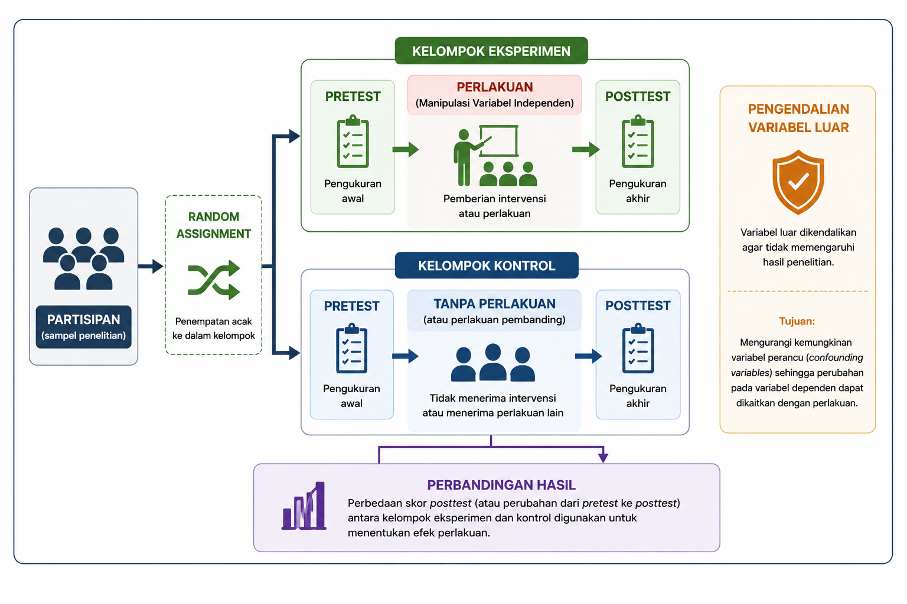{fig-align="center"}
:::

Sebagaimana ditunjukkan pada @fig-unsureksp, kelima unsur tersebut saling berkaitan dalam menghasilkan penelitian eksperimen yang memiliki validitas internal yang tinggi. Semakin baik manipulasi dilakukan, semakin efektif pengendalian variabel luar, semakin seimbang karakteristik kelompok melalui r*andom assignment*, serta semakin tepat pengukuran hasil dilakukan, maka semakin kuat pula dasar peneliti dalam menyimpulkan bahwa perubahan pada variabel dependen berkaitan dengan perlakuan yang diberikan.

Pada subbab berikutnya akan dibahas bagaimana kelima unsur tersebut diterapkan dalam berbagai jenis desain eksperimen, mulai dari pra-eksperimen, kuasi eksperimen, hingga eksperimen murni.

## Klasifikasi Desain Eksperimen

Penelitian eksperimen tidak selalu dilaksanakan dengan tingkat pengendalian yang sama. Dalam praktiknya, keterbatasan etika, kondisi lapangan, maupun karakteristik partisipan sering kali memengaruhi sejauh mana peneliti dapat menerapkan manipulasi, kelompok pembanding/kontrol, dan *random assignment*. Oleh karena itu, desain eksperimen diklasifikasikan berdasarkan tingkat kontrol yang dimiliki peneliti terhadap jalannya penelitian.

Secara umum, desain eksperimen dibedakan menjadi tiga kelompok, yaitu pra-eksperimen (*pre-experiment*), kuasi eksperimen (*quasi-experiment*), dan eksperimen murni (*true experiment* atau *randomized experiment*) [@Campbell1963; @Shadish2002; @Creswell2018a]. Perbedaan utama ketiga desain tersebut terletak pada ada atau tidaknya kelompok pembanding, *random assignment*, serta kemampuan peneliti mengendalikan variabel luar. Semakin tinggi tingkat kontrol yang diterapkan, semakin kuat pula validitas internal dan inferensi kausal yang dapat dihasilkan.

Namun demikian, bukan berarti eksperimen murni selalu menjadi pilihan terbaik. Pemilihan desain tetap harus disesuaikan dengan tujuan penelitian, kondisi lapangan, serta pertimbangan etis dalam pelaksanaan penelitian. @tbl-desaineksp memberikan gambaran umum mengenai karakteristik masing-masing jenis desain eksperimen.

::: {#tbl-desaineksp}
|  |  |  |  |
|----|:--:|:--:|:--:|
| **Karakteristik** | **Pra-eksperimen** | **Kuasi eksperimen** | **Eksperimen murni** |
| Manipulasi variabel independen | ✓ | ✓ | ✓ |
| Kelompok pembanding | Tidak selalu ada | Ada | Ada |
| *Random assignment* | ✗ | ✗ | ✓ |
| Kontrol terhadap variabel luar | Rendah | Sedang | Tinggi |
| Validitas internal | Rendah | Sedang | Tinggi |
| Kekuatan inferensi kausal | Rendah | Sedang | Tinggi |

: Perbandingan Umum Desain Eksperimen
:::

### Pra-Eksperimen

Pra-eksperimen merupakan bentuk eksperimen dengan tingkat kontrol yang paling rendah. Penelitian ini tetap melibatkan pemberian perlakuan, tetapi umumnya tidak menggunakan random assignment dan sering kali tidak memiliki kelompok pembanding yang memadai. Akibatnya, perubahan yang terjadi setelah perlakuan belum dapat dipastikan sepenuhnya sebagai akibat dari perlakuan tersebut karena masih terdapat kemungkinan dipengaruhi oleh faktor lain. Meskipun demikian, pra-eksperimen tetap bermanfaat sebagai studi pendahuluan, uji coba intervensi, atau evaluasi awal sebelum dilakukan penelitian dengan desain yang lebih kuat [@Campbell1963; @Gravetter2018].

**Kelebihan dan keterbatasan.** Kelebihan utama pra-eksperimen adalah prosedurnya relatif sederhana, mudah dilaksanakan, serta membutuhkan sumber daya yang lebih sedikit dibandingkan desain eksperimen lainnya. Oleh karena itu, desain ini sering digunakan sebagai studi pendahuluan (*pilot study*), evaluasi awal suatu program, atau uji coba intervensi sebelum dilakukan penelitian yang lebih komprehensif. Namun, karena umumnya tidak menggunakan kelompok pembanding maupun random assignment, validitas internalnya relatif rendah. Akibatnya, perubahan yang diamati setelah perlakuan belum dapat dipastikan sepenuhnya disebabkan oleh perlakuan, sehingga hasil penelitian perlu diinterpretasikan secara hati-hati [@Campbell1963; @Gravetter2018].

### Kuasi Eksperimen

Kuasi eksperimen merupakan alternatif ketika peneliti tidak memungkinkan melakukan random assignment, tetapi masih dapat memberikan perlakuan dan menggunakan kelompok pembanding. Kelompok penelitian biasanya telah terbentuk secara alami, misalnya berdasarkan kelas, sekolah, unit kerja, atau komunitas. Dibandingkan pra-eksperimen, kuasi eksperimen memiliki validitas internal yang lebih baik karena adanya kelompok pembanding, meskipun inferensi kausal yang dihasilkan masih lebih lemah dibandingkan eksperimen murni [@Shadish2002; @Morling2024].

**Kelebihan dan keterbatasan.** Kuasi eksperimen memiliki kelebihan berupa fleksibilitas yang lebih tinggi sehingga dapat diterapkan pada situasi nyata ketika random assignment tidak memungkinkan dilakukan, misalnya pada penelitian di sekolah, rumah sakit, organisasi, atau komunitas. Desain ini tetap memungkinkan peneliti mengevaluasi efektivitas suatu program atau intervensi dalam kondisi lapangan. Meskipun demikian, tidak adanya random assignment menyebabkan kemungkinan adanya perbedaan karakteristik awal antar kelompok yang dapat memengaruhi hasil penelitian. Oleh karena itu, inferensi kausal yang dihasilkan lebih terbatas dibandingkan eksperimen murni, sehingga peneliti perlu menerapkan prosedur pengendalian yang memadai untuk meningkatkan validitas internal [@Shadish2002; @Morling2024].

### Eksperimen Murni

Eksperimen murni (*true experiment*) merupakan desain eksperimen dengan tingkat kontrol tertinggi. Desain ini mengombinasikan manipulasi variabel independen, kelompok pembanding, serta random assignment sehingga peneliti memiliki dasar yang lebih kuat untuk menyimpulkan hubungan sebab-akibat. Karena mampu meminimalkan pengaruh variabel perancu, eksperimen murni sering dianggap sebagai standar terbaik (*gold standard*) dalam penelitian intervensi dan evaluasi efektivitas suatu program. Namun, penerapannya sering menghadapi kendala praktis maupun etis sehingga tidak selalu dapat digunakan dalam setiap penelitian [@Campbell1963; @Creswell2018a].

**Kelebihan dan keterbatasan.** Eksperimen murni memiliki keunggulan utama dalam menghasilkan bukti yang paling kuat mengenai hubungan sebab-akibat karena mengombinasikan manipulasi, kelompok kontrol, dan random assignment. Tingginya tingkat kontrol terhadap variabel luar menjadikan desain ini memiliki validitas internal yang lebih baik dibandingkan desain eksperimen lainnya. Namun, penerapan eksperimen murni sering kali menghadapi berbagai kendala praktis dan etis, seperti kesulitan melakukan *random assignment*, kebutuhan sumber daya yang lebih besar, serta keterbatasan dalam menerapkan intervensi pada situasi nyata. Oleh karena itu, meskipun sering dianggap sebagai *gold standard* dalam penelitian eksperimen, desain ini tidak selalu menjadi pilihan yang paling sesuai untuk setiap konteks penelitian [@Campbell1963; @Creswell2018a].

Berdasarkan uraian tersebut, dapat dipahami bahwa ketiga desain eksperimen memiliki fungsi dan karakteristik yang berbeda. Pra-eksperimen lebih sesuai digunakan untuk studi awal dengan kontrol yang terbatas, kuasi eksperimen menjadi pilihan ketika random assignment tidak memungkinkan, sedangkan eksperimen murni digunakan apabila peneliti dapat menerapkan kontrol yang optimal terhadap jalannya penelitian.

## Struktur Kondisi dalam Penelitian Eksperimen

Selain dibedakan berdasarkan tingkat kontrolnya, penelitian eksperimen juga dapat dibedakan berdasarkan cara partisipan mengikuti kondisi eksperimen. Perbedaan ini dikenal sebagai **struktur kondisi** (*experimental design structure*), yaitu bagaimana perlakuan diberikan kepada partisipan dan bagaimana data dikumpulkan pada setiap kondisi penelitian. Secara umum, terdapat dua struktur kondisi yang paling sering digunakan, yaitu ***between-subjects design*** dan ***within-subjects design*** [@Jhangiani2019; @Gravetter2018].

### *Between-subjects Design*

Pada *between-subjects design*, setiap partisipan hanya mengikuti satu kondisi eksperimen. Misalnya, sebagian peserta ditempatkan pada kelompok eksperimen yang menerima pelatihan *mindfulness*, sedangkan peserta lainnya berada pada kelompok kontrol yang tidak menerima pelatihan. Dengan demikian, setiap peserta hanya memberikan data untuk satu kondisi penelitian.

Kelebihan utama desain ini adalah tidak adanya pengaruh pengalaman dari kondisi sebelumnya (*carry-over effect*) karena setiap peserta hanya mengikuti satu perlakuan. Namun, desain ini umumnya memerlukan jumlah partisipan yang lebih banyak dan membutuhkan random assignment atau prosedur lain agar karakteristik awal setiap kelompok relatif seimbang.

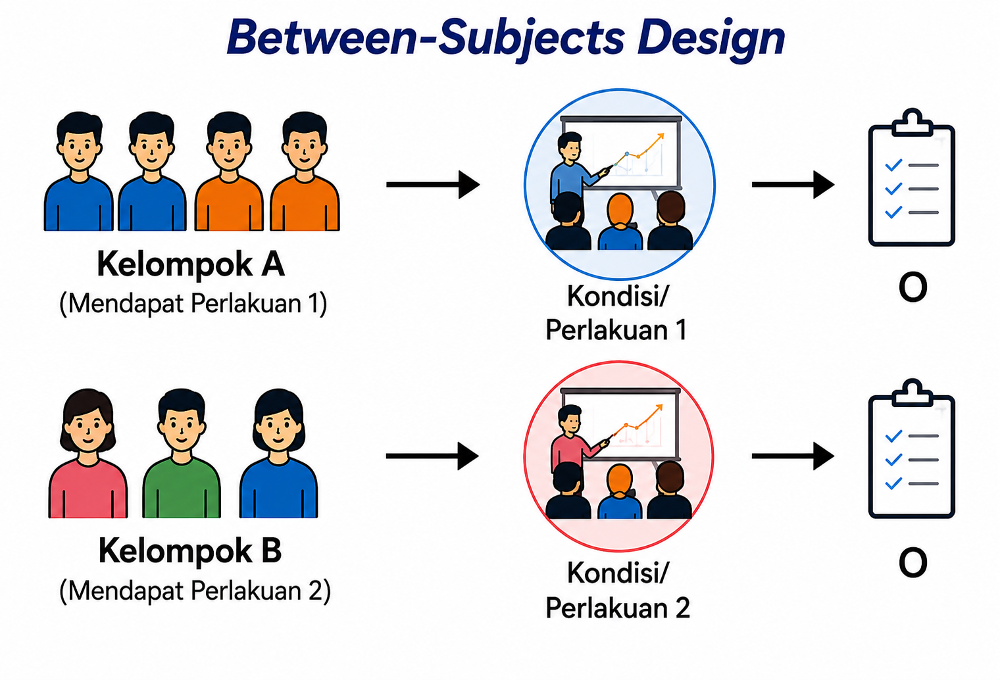

### *Within-subjecst Design*

Pada *within-subjects design*, setiap partisipan mengikuti seluruh kondisi eksperimen. Sebagai contoh, seorang peserta diminta mengikuti beberapa jenis strategi regulasi emosi, seperti latihan pernapasan sadar, menulis reflektif, dan kondisi tanpa perlakuan. Setelah setiap kondisi selesai, peneliti mengukur tingkat stres atau variabel lain yang menjadi fokus penelitian.

Keunggulan desain ini adalah membutuhkan jumlah partisipan yang lebih sedikit dan mampu mengurangi pengaruh perbedaan individual karena setiap peserta menjadi pembanding bagi dirinya sendiri. Namun, desain ini memiliki kelemahan berupa kemungkinan munculnya ***carry-over effect***, yaitu pengaruh dari kondisi sebelumnya terhadap kondisi berikutnya. Untuk meminimalkan hal tersebut, peneliti dapat mengatur urutan pemberian perlakuan menggunakan teknik ***counterbalancing***.

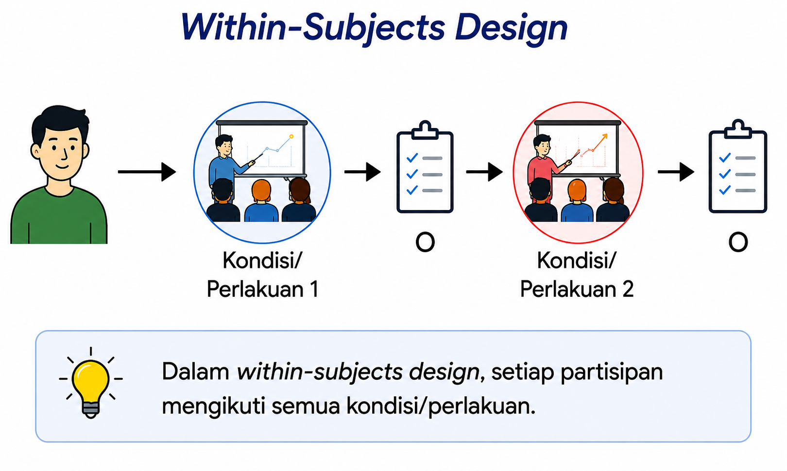

### *Perbandingan Between-subjects dan Within-subjects Design*

Pemilihan struktur kondisi bergantung pada tujuan penelitian, karakteristik perlakuan, serta kemungkinan munculnya efek urutan. *Between-subjects design* lebih sesuai apabila perlakuan memiliki efek yang menetap atau sulit dihilangkan, misalnya program pelatihan, terapi psikologis, atau intervensi pendidikan. Sebaliknya, *within-subjects design* lebih tepat digunakan apabila setiap peserta dapat mengikuti seluruh kondisi penelitian tanpa menimbulkan efek bawaan yang berarti. Kedua struktur tersebut dapat diterapkan pada berbagai bentuk eksperimen, baik pra-eksperimen, kuasi eksperimen, maupun eksperimen murni, sesuai dengan tujuan dan karakteristik penelitian.

Tabel 13.2 merangkum perbedaan utama kedua struktur kondisi tersebut.

::: {#tbl-struktur}
|  |  |  |
|:---|:---|:---|
| **Aspek** | ***Between-subjects design*** | ***Within-subjects design*** |
| Partisipan | Setiap peserta hanya mengikuti satu kondisi | Setiap peserta mengikuti seluruh kondisi |
| Jumlah partisipan | Relatif lebih banyak | Relatif lebih sedikit |
| Pengaruh perbedaan individual | Lebih besar | Lebih kecil |
| *Carry-over effect* | Tidak ada | Berpotensi terjadi |
| *Counterbalancing* | Umumnya tidak diperlukan | Umumnya diperlukan |
| Contoh penggunaan | Membandingkan kelompok eksperimen dan kelompok kontrol | Membandingkan beberapa perlakuan pada peserta yang sama |

: Perbandingan *Between-subjects Design* dan *Within-subjects Design*
:::

Secara umum, kedua struktur kondisi tersebut memiliki kelebihan dan keterbatasan masing-masing. Oleh karena itu, peneliti perlu memilih struktur yang paling sesuai dengan tujuan penelitian, jenis perlakuan yang diberikan, serta kondisi pelaksanaan penelitian. Pemahaman mengenai kedua struktur ini juga akan membantu peneliti dalam memilih bentuk desain eksperimen yang akan dibahas pada bagian berikutnya.

## Bentuk-bentuk Desain Eksperimen

Setelah memahami klasifikasi desain eksperimen, peneliti perlu mengenal berbagai bentuk rancangan yang umum digunakan dalam praktik penelitian. Masing-masing bentuk desain memiliki karakteristik yang berbeda, terutama dalam hal penggunaan kelompok pembanding, pengukuran sebelum dan sesudah perlakuan, serta cara penempatan partisipan ke dalam kelompok penelitian. Pemilihan bentuk desain perlu disesuaikan dengan tujuan penelitian, kondisi lapangan, serta tingkat kontrol yang dapat diterapkan oleh peneliti [@Campbell1963; @Shadish2002].

### Bentuk-bentuk Pra-Eksperimen

Pra-eksperimen memiliki beberapa bentuk rancangan yang sederhana dan umumnya digunakan ketika peneliti belum dapat menerapkan kelompok kontrol maupun *random assignment*.

#### *One-shot case study*

Pada desain ini, satu kelompok diberikan perlakuan, kemudian dilakukan pengukuran setelah perlakuan selesai. Desain ini merupakan bentuk pra-eksperimen yang paling sederhana karena tidak menggunakan pretest maupun kelompok pembanding.

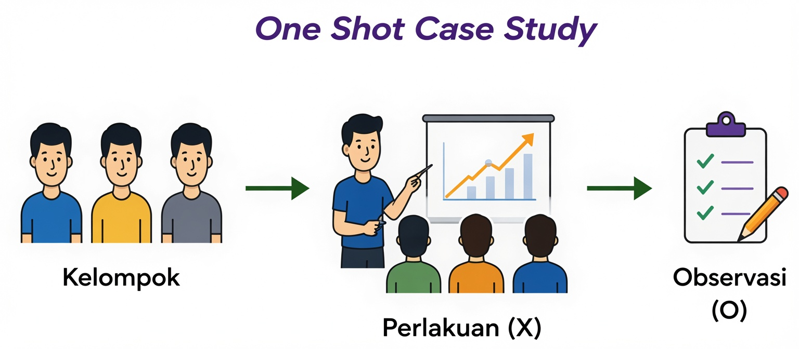

#### *One-group pretest-posttest design*

Pada desain ini, satu kelompok diukur sebelum dan sesudah perlakuan. Adanya *pretest* memungkinkan peneliti membandingkan perubahan yang terjadi sebelum dan sesudah perlakuan. Namun, karena tidak terdapat kelompok pembanding, perubahan tersebut belum tentu sepenuhnya disebabkan oleh perlakuan.

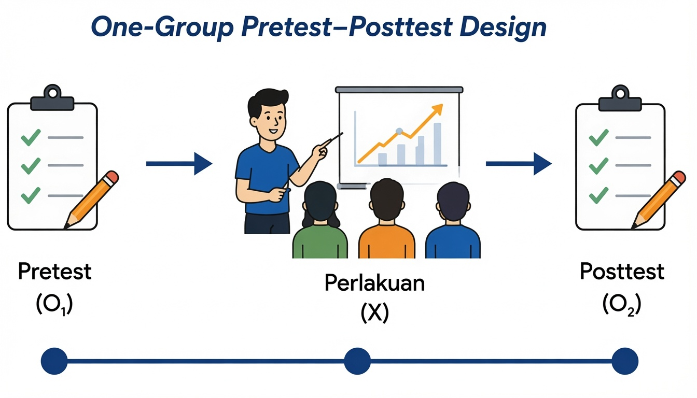

#### *Static-group comparison*

Pada desain ini terdapat dua kelompok, tetapi peserta tidak ditempatkan secara acak dan tidak dilakukan *pretest*. Desain ini memungkinkan adanya perbandingan hasil antar kelompok, tetapi masih memiliki kelemahan karena karakteristik awal kedua kelompok mungkin sudah berbeda sebelum penelitian dimulai.

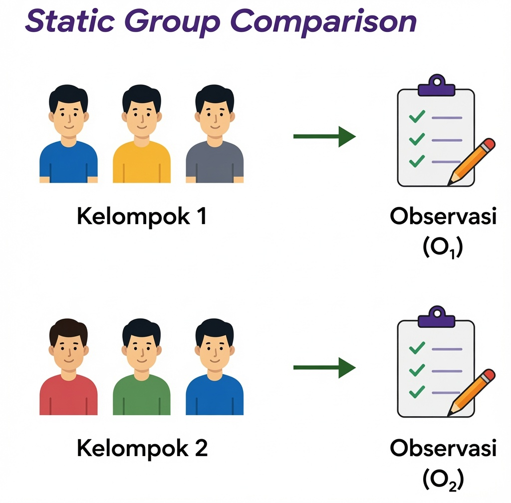

### Bentuk-bentuk Kuasi Eksperimen

Kuasi eksperimen digunakan ketika *random assignment* tidak memungkinkan dilakukan, tetapi peneliti masih dapat memberikan perlakuan dan menggunakan kelompok pembanding.

#### *Nonequivalent control group design*

Desain ini merupakan bentuk kuasi eksperimen yang paling sering digunakan. Peneliti menggunakan kelompok eksperimen dan kelompok pembanding yang telah terbentuk sebelumnya tanpa *random assignment*. Perbandingan hasil dilakukan dengan mempertimbangkan kondisi awal kedua kelompok melalui *pretest*.

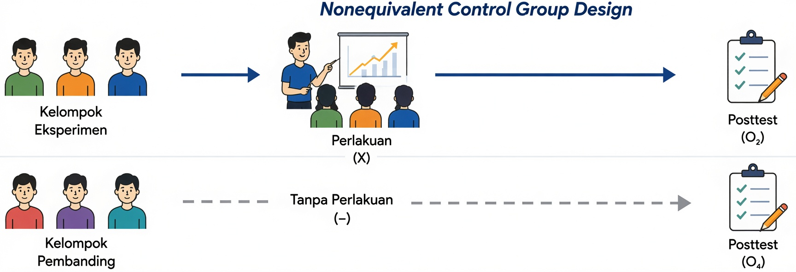

#### *Interrupted time-series design*

Pada desain ini, peneliti melakukan beberapa kali pengukuran sebelum dan sesudah perlakuan sehingga perubahan dapat diamati sebagai suatu pola dari waktu ke waktu. Desain ini bermanfaat ketika kelompok pembanding sulit diperoleh, tetapi peneliti masih dapat melakukan pengukuran berulang.

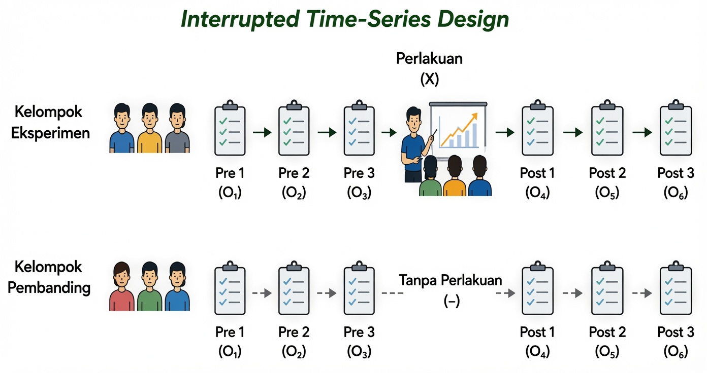

#### *Regression discontinuity design*

Desain ini digunakan ketika pemberian perlakuan didasarkan pada nilai batas (*cut-off score*). Contohnya, mahasiswa dengan tingkat stres di atas skor tertentu memperoleh layanan konseling, sedangkan mahasiswa dengan skor di bawah batas tersebut tidak memperoleh layanan yang sama. Analisis kemudian dilakukan untuk mengetahui apakah terdapat perubahan yang nyata di sekitar titik batas tersebut.

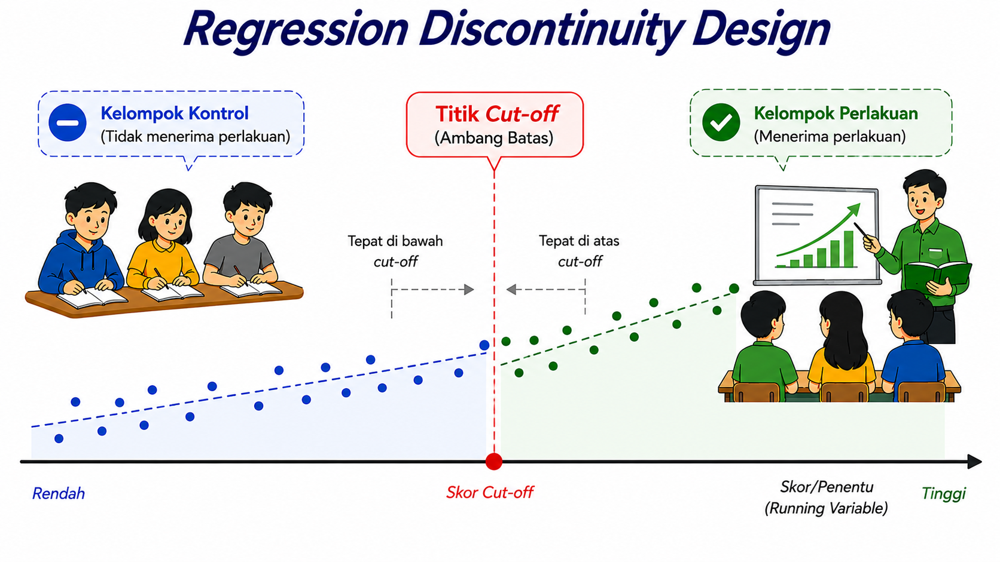

### Bentuk-bentuk Eksperimen Murni

Eksperimen murni menggunakan manipulasi, kelompok pembanding, serta *random assignment* sehingga menghasilkan validitas internal yang lebih tinggi dibandingkan bentuk desain lainnya.

#### *Posttest-only control group design*

Peserta dibagi secara acak ke dalam kelompok eksperimen dan kelompok kontrol. Pengukuran hanya dilakukan setelah perlakuan diberikan. Desain ini sesuai digunakan apabila *pretest* diperkirakan dapat memengaruhi respons peserta.

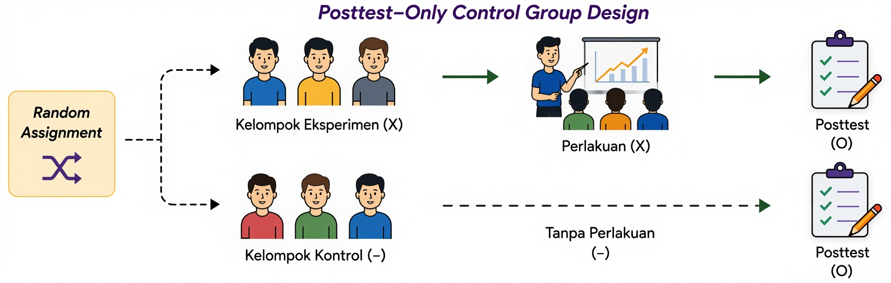

#### *Solomon four-group design*

Desain Solomon menggabungkan kelebihan desain *posttest-only* dan *pretest-posttest* dengan menggunakan empat kelompok penelitian. Dua kelompok diberikan *pretest*, sedangkan dua kelompok lainnya tidak. Desain ini digunakan untuk mengetahui apakah *pretest* ikut memengaruhi hasil penelitian (*testing effect*), meskipun membutuhkan jumlah partisipan yang lebih besar.

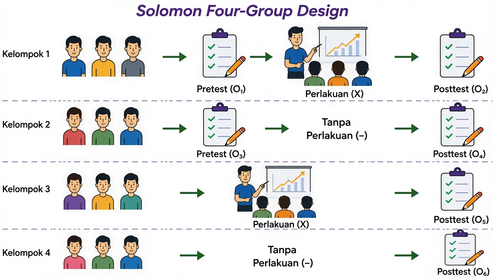

#### *Factorial design*

*Factorial design* digunakan ketika penelitian melibatkan lebih dari satu variabel independen. Selain menguji pengaruh masing-masing variabel (*main effect*), desain ini juga memungkinkan peneliti menguji apakah terdapat interaksi (*interaction effect*) antarvariabel independen. Sebagai contoh, peneliti dapat menguji pengaruh **jenis pelatihan** (*mindfulness* vs. relaksasi) dan **durasi pelatihan** (10 menit vs. 20 menit) terhadap stres akademik mahasiswa menggunakan desain faktorial 2 × 2.

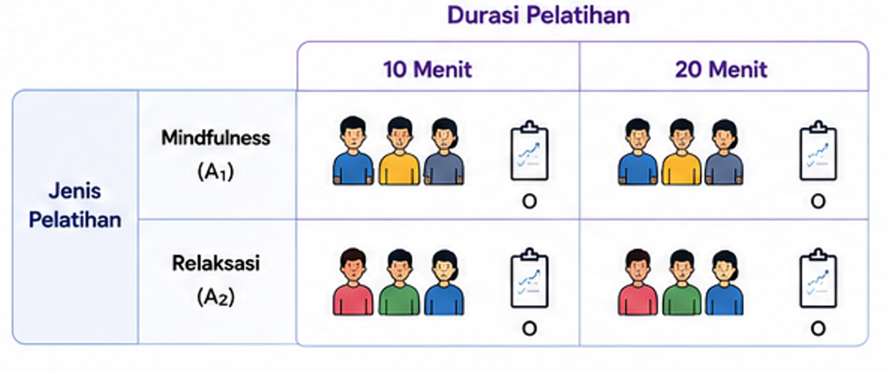

@tbl-desainexp merangkum karakteristik utama masing-masing bentuk desain eksperimen sehingga memudahkan peneliti membandingkan kelebihan dan penerapan setiap desain.

::: {#tbl-desainexp}
|  |  |  |  |  |
|----|:--:|:--:|:--:|:--:|
| **Desain** | **Kelompok Pembanding** | ***Pretest*** | ***Random Assignment*** | **Kegunaan** |
| *One-shot case study* | ✗ | ✗ | ✗ | Studi awal |
| *One-group pretest-posttest* | ✗ | ✓ | ✗ | Evaluasi awal |
| *Static-group comparison* | ✓ | ✗ | ✗ | Perbandingan sederhana |
| *Nonequivalent control group* | ✓ | ✓ | ✗ | Penelitian lapangan |
| *Interrupted time series* | Tidak selalu | Berulang | ✗ | Evaluasi kebijakan |
| *Regression discontinuity* | ✓ | Berdasarkan *cut-off* | ✗ | Program selektif |
| *Posttest-only* | ✓ | ✗ | ✓ | Menghindari efek *pretest* |
| *Pretest-posttest* | ✓ | ✓ | ✓ | Intervensi psikologi |
| *Solomon four-group* | ✓ | Sebagian | ✓ | Menguji efek *pretest* |
| *Factorial* | ✓ | Fleksibel | ✓ | Menguji lebih dari satu perlakuan |

: Perbandingan karakteristik antar desain eksperimen
:::

## Validitas dan Etika dalam Penelitian Eksperimen

Pemilihan desain eksperimen yang tepat merupakan salah satu upaya untuk meningkatkan kualitas penelitian. Dalam penelitian eksperimen, validitas sangat dipengaruhi oleh kemampuan peneliti mengendalikan variabel luar sehingga perubahan pada variabel dependen benar-benar berkaitan dengan perlakuan yang diberikan. Oleh karena itu, penerapan manipulasi, kelompok pembanding, *random assignment*, serta prosedur penelitian yang konsisten menjadi aspek penting dalam menghasilkan temuan yang dapat dipercaya [@Shadish2002; @Morling2024].

Selain itu, penelitian eksperimen harus dilaksanakan sesuai dengan prinsip-prinsip etika penelitian. Peneliti perlu memperoleh *informed consent*, menjaga kerahasiaan data partisipan, meminimalkan risiko yang mungkin timbul, memberikan kebebasan kepada partisipan untuk mengundurkan diri kapan saja, serta melakukan *debriefing* apabila penelitian melibatkan penyamaran informasi (*deception*). Dengan memperhatikan validitas dan etika secara bersamaan, penelitian eksperimen tidak hanya menghasilkan bukti ilmiah yang kuat, tetapi juga tetap menghormati hak dan kesejahteraan partisipan.

::: callout-tip
## Rangkuman

1.  Penelitian eksperimen merupakan desain penelitian yang digunakan untuk menguji hubungan sebab-akibat melalui manipulasi variabel independen dan pengamatan terhadap perubahan pada variabel dependen.
2.  Berdasarkan tingkat kontrol terhadap variabel luar, desain eksperimen dibedakan menjadi eksperimen murni, kuasi eksperimen, dan pra-eksperimen. Ketiga desain tersebut memiliki karakteristik, tingkat validitas internal, serta kekuatan inferensi kausal yang berbeda.
3.  Penelitian eksperimen dapat menggunakan *between-subjects design* atau *within-subjects design*, bergantung pada cara partisipan mengikuti kondisi eksperimen dan tujuan penelitian.
4.  Pemilihan desain eksperimen harus mempertimbangkan keseimbangan antara kekuatan kontrol metodologis, kondisi lapangan, pertimbangan etika, ketersediaan sumber daya, serta tujuan penelitian.
5.  Penelitian eksperimen harus dilaksanakan dengan memperhatikan validitas penelitian dan prinsip-prinsip etika agar menghasilkan temuan yang dapat dipercaya sekaligus melindungi hak dan kesejahteraan partisipan.
:::

::: callout-important
## Refleksi & Diskusi

-   Mengapa eksperimen dianggap lebih kuat daripada penelitian korelasional dalam menjelaskan hubungan sebab-akibat?

-   Apa perbedaan utama antara eksperimen murni, kuasi eksperimen, dan pra-eksperimen?

    Dalam situasi apa peneliti lebih tepat menggunakan kuasi eksperimen daripada eksperimen murni?

-   Apa perbedaan antara *between-subjects design* dan *within-subjects design*?

-   Apa saja pertimbangan etis yang perlu diperhatikan ketika peneliti memberikan perlakuan atau intervensi kepada partisipan?

-   Tentukan sebuah masalah penelitian di bidang psikologi, kemudian pilih desain eksperimen yang paling sesuai (pra-eksperimen, kuasi eksperimen, atau eksperimen murni). Jelaskan alasan pemilihan desain tersebut beserta bentuk rancangan eksperimen yang akan digunakan.
:::

::: sectionrefs
:::
