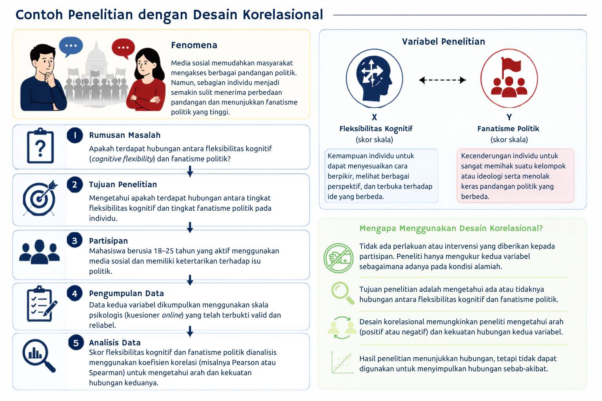
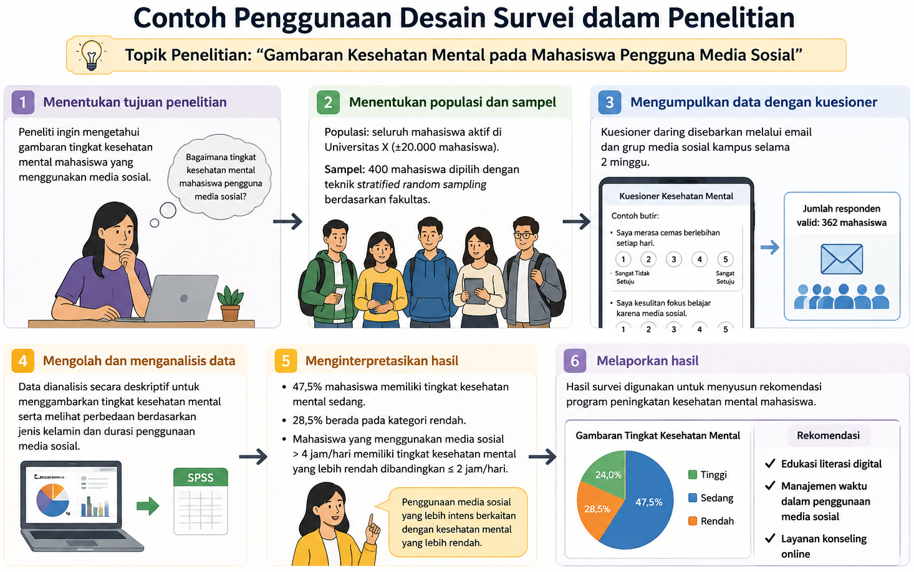
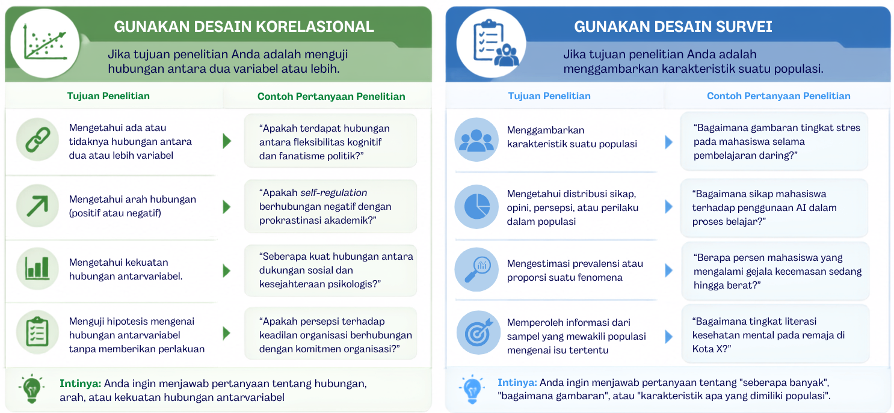

---
author:
  - name: Endang Fourianalistyawati
filters:
  # Run Quarto's default filters first
  - quarto
  - section-bibliographies
bibliography: references.bib
reference-section-title: Daftar Pustaka
citeproc: true
---

# Desain Korelasional & Survei

::: callout-note
## Capaian Pembelajaran

Setelah mempelajari bab ini, mahasiswa diharapkan mampu:

1.  Menjelaskan konsep, tujuan, dan karakteristik utama desain korelasional dan desain survei.
2.  Membedakan desain korelasional dan desain survei berdasarkan tujuan penelitian, jenis pertanyaan penelitian, metode pengumpulan data, serta luaran penelitian.
3.  Menentukan desain penelitian yang paling sesuai berdasarkan tujuan penelitian dan rumusan masalah yang diajukan.
4.  Mengidentifikasi contoh penerapan desain korelasional dan desain survei dalam berbagai topik penelitian psikologi maupun ilmu sosial.
:::

Dalam penelitian kuantitatif, tidak semua pertanyaan penelitian bertujuan menguji pengaruh atau hubungan sebab-akibat melalui eksperimen. Pada banyak kasus, peneliti hanya ingin mengetahui apakah terdapat hubungan antara dua atau lebih variabel, atau memperoleh gambaran mengenai karakteristik suatu populasi tanpa memberikan perlakuan apa pun. Untuk tujuan tersebut, tersedia berbagai desain penelitian non-eksperimental, di antaranya desain korelasional dan desain survei.

Kedua desain tersebut sama-sama dilakukan pada kondisi alamiah tanpa manipulasi variabel dan sering kali menggunakan kuesioner sebagai instrumen pengumpulan data. Kesamaan ini menyebabkan desain korelasional dan desain survei kerap dianggap sebagai desain yang sama, padahal keduanya memiliki tujuan, fokus analisis, dan hasil yang berbeda. Oleh karena itu, bab ini membahas konsep dasar, karakteristik, serta perbedaan antara desain korelasional dan desain survei agar pembaca dapat memilih desain yang paling sesuai dengan tujuan penelitiannya.

## Desain Korelasional

### Pengertian

Desain korelasional merupakan salah satu desain penelitian kuantitatif non-eksperimental yang bertujuan untuk mengkaji hubungan antara dua atau lebih variabel tanpa memberikan perlakuan atau manipulasi terhadap variabel yang diteliti [@Creswell2018a]. Dalam desain ini, peneliti mengamati variabel sebagaimana adanya pada kondisi alamiah, kemudian menganalisis apakah perubahan pada suatu variabel berkaitan dengan perubahan pada variabel lainnya.

Perlu dipahami bahwa hubungan yang ditemukan dalam penelitian korelasional tidak menunjukkan adanya hubungan sebab-akibat. Hal ini karena peneliti tidak mengendalikan variabel luar maupun memanipulasi variabel independen sebagaimana dilakukan pada penelitian eksperimen [@Johnson2020]. Oleh sebab itu, hasil penelitian korelasional hanya dapat menunjukkan adanya keterkaitan antarvariabel, bukan membuktikan bahwa satu variabel menyebabkan perubahan pada variabel lainnya.

Istilah *desain korelasional* berasal dari teknik analisis statistik yang digunakan, yaitu analisis korelasi. Hasil analisis tersebut dinyatakan dalam bentuk koefisien korelasi yang menggambarkan arah dan kekuatan hubungan antarvariabel.

### Tujuan

Tujuan utama desain korelasional adalah mengidentifikasi dan mengukur hubungan antara dua atau lebih variabel. Hubungan tersebut dinyatakan dalam bentuk koefisien korelasi yang menunjukkan **arah** hubungan (positif atau negatif) dan **kekuatan** hubungan (lemah hingga kuat) [@Creswell2018a].

Suatu hubungan dikatakan ada apabila perubahan pada satu variabel cenderung diikuti oleh perubahan pada variabel lain secara konsisten. Sebaliknya, apabila perubahan pada satu variabel tidak berkaitan dengan perubahan pada variabel lainnya, maka kedua variabel tersebut dikatakan tidak memiliki hubungan. Dengan kata lain, penelitian korelasional berusaha mengidentifikasi apakah variasi skor pada suatu variabel berkaitan dengan variasi skor pada variabel lain.

Secara umum, desain korelasional digunakan untuk:

1.  Menguji apakah terdapat hubungan antara dua atau lebih variabel.
2.  Menentukan arah hubungan, yaitu hubungan positif atau negatif.
3.  Mengetahui kekuatan hubungan antarvariabel.
4.  Menilai signifikansi statistik dari hubungan yang ditemukan.
5.  Menjadi dasar untuk mengembangkan model prediksi atau penelitian lanjutan, termasuk penelitian eksperimen, apabila diperlukan.

### Pengumpulan Data

Pada penelitian korelasional, pengumpulan data bertujuan memperoleh informasi mengenai seluruh variabel yang akan dianalisis hubungan di antaranya. Oleh karena itu, setiap variabel harus diukur pada unit analisis yang sama sehingga hubungan antarvariabel dapat dianalisis. Peneliti dapat memilih teknik pengumpulan data yang paling sesuai dengan karakteristik variabel dan sumber data yang tersedia [@Fraenkel2023; @Johnson2020].

Beberapa teknik pengumpulan data yang umum digunakan dalam penelitian korelasional adalah sebagai berikut.

1.  **Kuesioner atau skala psikologis.** Teknik ini banyak digunakan apabila variabel yang diteliti berupa konstruk psikologis, seperti sikap, kepribadian, stres, kecemasan, kepuasan hidup, atau motivasi. Setiap partisipan diminta memberikan respons terhadap seperangkat pertanyaan atau pernyataan sehingga diperoleh skor untuk masing-masing variabel yang akan dianalisis.
2.  **Observasi.** Apabila variabel yang diteliti berupa perilaku yang dapat diamati secara langsung, peneliti dapat menggunakan pedoman observasi. Sebagai contoh, peneliti dapat mengamati hubungan antara frekuensi interaksi guru dengan siswa dan tingkat partisipasi siswa selama proses pembelajaran.
3.  **Dokumentasi atau data arsip.** Penelitian korelasional juga dapat memanfaatkan data yang telah tersedia, seperti nilai akademik, rekam medis, data administrasi, atau hasil pengukuran sebelumnya [@Babbie2021]. Misalnya, seorang peneliti ingin mengetahui hubungan antara nilai ujian masuk perguruan tinggi dengan indeks prestasi kumulatif (IPK) mahasiswa. Dalam penelitian tersebut, kedua variabel dapat diperoleh dari data akademik tanpa perlu melakukan pengukuran ulang.

Dalam praktiknya, peneliti juga dapat mengombinasikan beberapa teknik pengumpulan data apabila variabel yang diteliti berasal dari sumber yang berbeda. Sebagai contoh, tingkat kecemasan dapat diukur menggunakan skala psikologis, sedangkan prestasi akademik diperoleh dari data arsip universitas. Selama setiap variabel berasal dari partisipan yang sama, data tersebut dapat digunakan untuk mengkaji hubungan antarvariabel.

Perlu diperhatikan bahwa pemilihan teknik pengumpulan data tidak menentukan apakah suatu penelitian termasuk desain korelasional atau bukan. Desain penelitian ditentukan oleh tujuan penelitian, yaitu mengkaji hubungan antarvariabel, sedangkan teknik pengumpulan data dipilih berdasarkan jenis variabel yang akan diukur dan ketersediaan sumber data [@Creswell2018a]. Contoh penerapan desain korelasional mulai dari identifikasi fenomena hingga pemilihan desain penelitian dapat dilihat pada @fig-korelasional.

::: {#fig-korelasional}

:::

### Keunggulan & Keterbatasan

Keunggulan dan keterbatasan desain penelitian korelasional dapat dibandingkan secara ringkas melalui @tbl-korelasional.

::: {#tbl-korelasional}
| **Keunggulan** | **Keterbatasan** |
|:-----------------------------------|:-----------------------------------|
| Lebih efisien karena tidak memerlukan manipulasi variabel atau pemberian perlakuan. | Tidak dapat digunakan untuk menyimpulkan hubungan sebab–akibat. |
| Data dikumpulkan pada kondisi alami sehingga memiliki validitas ekologis yang relatif tinggi. | Rentan terhadap pengaruh variabel perancu (*confounding variables*) yang tidak diukur. |
| Dapat digunakan untuk meneliti variabel yang sulit atau tidak etis dimanipulasi secara eksperimen. | Tidak dapat memastikan arah hubungan antarvariabel. |
| Mampu menganalisis hubungan antara banyak variabel sekaligus dengan berbagai teknik analisis korelasional. | Korelasi yang signifikan secara statistik belum tentu memiliki makna praktis yang besar. |

: Keunggulan dan keterbatasan desain korelasional
:::

## Desain Survey

### Pengertian

Desain survei (*survey design*) adalah desain penelitian kuantitatif yang digunakan untuk mengumpulkan data dari sampel guna menggambarkan karakteristik, sikap, opini, perilaku, atau kondisi suatu populasi. Hasil yang diperoleh dari sampel kemudian digunakan untuk mengestimasi karakteristik populasi yang lebih luas [@Creswell2018a; @Fraenkel2023].

Seperti desain korelasional, dalam desain survei peneliti tidak memberikan perlakuan maupun memanipulasi variabel yang diteliti. Data dikumpulkan sebagaimana adanya dari responden menggunakan instrumen yang terstandarisasi. Perlu dipahami bahwa survei merupakan desain penelitian, sedangkan kuesioner hanyalah salah satu instrumen yang dapat digunakan untuk mengumpulkan data dalam penelitian survei [@Babbie2021].

Berbeda dengan **desain korelasional** yang berfokus pada pengujian hubungan antarvariabel, **desain survei** berfokus pada pengumpulan informasi untuk menggambarkan karakteristik suatu populasi. Meskipun data survei dapat dianalisis menggunakan teknik korelasional, tujuan utama penelitian survei bukanlah menguji hubungan antarvariabel, melainkan mendeskripsikan kondisi atau karakteristik populasi yang diteliti [@Creswell2018a].

### Tujuan

Desain survei digunakan ketika peneliti ingin memperoleh informasi mengenai karakteristik suatu populasi berdasarkan data yang dikumpulkan dari sampel. Bergantung pada tujuan penelitian, survei dapat dimanfaatkan untuk mendeskripsikan suatu fenomena, mengukur karakteristik populasi, maupun membandingkan karakteristik antar kelompok [@Creswell2018a; @Privitera2020]. Secara umum, tujuan penggunaan desain survei meliputi hal-hal berikut:

1.  Menggambarkan karakteristik suatu populasi
2.  Mengukur sikap, opini, persepsi, atau perilaku responden
3.  Mengestimasi prevalensi atau distribusi suatu fenomena
4.  Membandingkan karakteristik antar kelompok
5.  Menyediakan dasar bagi pengambilan keputusan

### Pengumpulan Data

Dalam penelitian survei, data dikumpulkan secara sistematis dari sejumlah responden menggunakan instrumen yang terstandarisasi. Instrumen yang paling umum digunakan adalah kuesioner, meskipun wawancara terstruktur juga dapat digunakan sesuai dengan tujuan dan karakteristik responden.

Survei dapat dilaksanakan secara tatap muka, melalui telepon, melalui pos, maupun secara daring (*online survey*). Pemilihan metode pengumpulan data perlu mempertimbangkan karakteristik populasi, ketersediaan sumber daya, serta kemudahan akses responden.

Agar hasil survei dapat menggambarkan kondisi populasi secara akurat, peneliti perlu menggunakan instrumen yang valid dan reliabel, memilih sampel yang representatif, serta mengupayakan tingkat respons (*response rate*) yang memadai untuk meminimalkan potensi *nonresponse bias* [@Fraenkel2023]. Contoh penerapan desain survei mulai dari identifikasi fenomena hingga pemilihan desain penelitian dapat dilihat pada @fig-survei.

::: {#fig-survei}

:::

### Keunggulan & Keterbatasan

Keunggulan dan keterbatasan desain survei dapat dibandingkan secara ringkas dalam @tbl-survei .

::: {#tbl-survei}
|  |  |
|:---------------------------------|:-------------------------------------|
| **Keunggulan** | **Keterbatasan** |
| Mampu mengumpulkan data dari banyak responden dalam waktu yang relatif singkat. | Tidak dapat digunakan untuk menyimpulkan hubungan sebab–akibat. |
| Efisien dari segi biaya dan pelaksanaan, terutama melalui survei daring (*online survey*). | Kualitas data sangat bergantung pada kejujuran dan pemahaman responden. |
| Hasil penelitian dapat digeneralisasikan apabila menggunakan sampel yang representatif. | Rentan terhadap *response bias* dan *nonresponse bias*. |
| Dapat mengukur berbagai karakteristik, sikap, opini, dan perilaku secara bersamaan menggunakan instrumen yang terstandarisasi. | Kesalahan dalam penyusunan instrumen atau teknik sampling dapat menurunkan validitas hasil penelitian. |

: Keunggulan dan keterbatasan desain survei
:::

## Perbandingan Desain Korelasional dan Desain Survei

Desain korelasional dan desain survei sama-sama termasuk dalam penelitian kuantitatif non-eksperimental karena peneliti tidak memberikan perlakuan maupun memanipulasi variabel penelitian. Keduanya juga sering menggunakan kuesioner sebagai instrumen pengumpulan data. Meskipun demikian, kedua desain memiliki tujuan yang berbeda. Desain korelasional berfokus pada pengujian hubungan antarvariabel, sedangkan desain survei bertujuan memperoleh gambaran mengenai karakteristik suatu populasi berdasarkan data yang dikumpulkan dari sampel [@Creswell2018a; @Privitera2020] (lihat @tbl-korelvssurvei).

::: {#tbl-korelvssurvei}
|  |  |  |
|:------------------|:------------------------|:---------------------------|
| **Aspek** | **Desain Korelasional** | **Desain Survei** |
| Tujuan utama | Menguji hubungan antara dua atau lebih variabel. | Menggambarkan karakteristik, sikap, opini, atau perilaku suatu populasi. |
| Fokus penelitian | Hubungan antarvariabel. | Karakteristik populasi. |
| Pertanyaan penelitian | *Apakah terdapat hubungan antara variabel X dan Y?* | *Bagaimana karakteristik populasi yang diteliti?* |
| Jumlah variabel | Minimal 2 | Minimal 1 |
| Analisis utama | Korelasi (*Pearson*, *Spearman*), regresi, atau analisis hubungan lainnya. | Statistik deskriptif, seperti frekuensi, persentase, rata-rata, dan distribusi data. |
| Hasil penelitian | Menunjukkan arah dan kekuatan hubungan antarvariabel. | Memberikan gambaran kondisi atau karakteristik populasi. |
| Contoh topik | Hubungan antara *cognitive flexibility* dan fanatisme politik. | Gambaran tingkat literasi *artificial intelligence* pada mahasiswa Indonesia. |

: Perbandingan desain korelasi dan survei
:::

Perbedaan tersebut tidak berarti bahwa kedua desain tidak dapat digunakan secara bersamaan. Sebagai contoh, seorang peneliti dapat mengumpulkan data menggunakan desain survei, kemudian menganalisis hubungan antarvariabel dalam data tersebut menggunakan analisis korelasional. Dalam kondisi seperti ini, survei menggambarkan cara pengumpulan data, sedangkan korelasional menggambarkan tujuan analisis data. Oleh karena itu, peneliti perlu menjelaskan secara jelas apakah istilah "survei" merujuk pada desain penelitian, metode pengumpulan data, atau konteks pelaksanaan penelitian agar tidak menimbulkan ambiguitas [@Babbie2021].

## Memilih Desain Penelitian yang Tepat

Pemilihan desain penelitian harus disesuaikan dengan tujuan dan pertanyaan penelitian. Meskipun sama-sama termasuk penelitian kuantitatif non-eksperimental, desain korelasional dan desain survei memiliki fokus yang berbeda. @Fig-korelvssurvei dapat digunakan sebagai panduan dalam memilih desain yang paling sesuai.

::: {#fig-korelvssurvei}

:::

::: sectionrefs
:::
