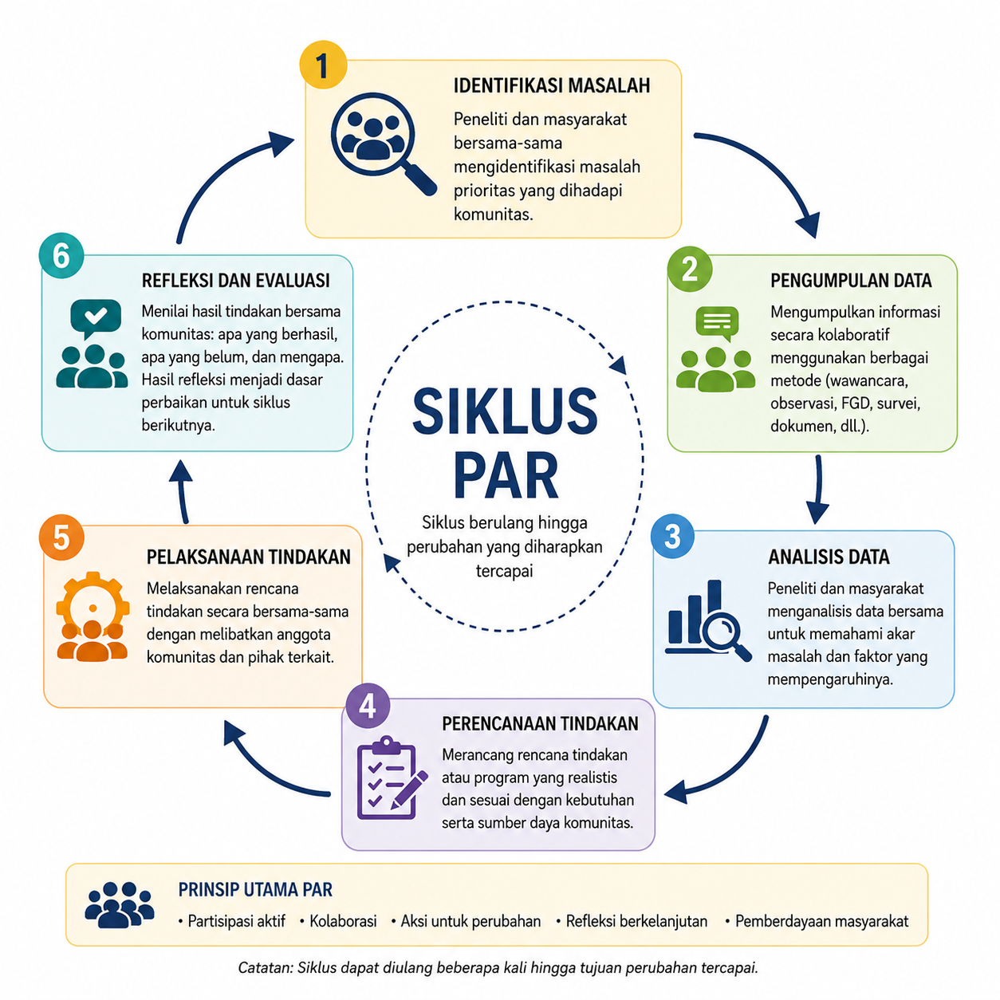

---
author:
  - name: Melok Roro Kinanthi
filters:
  # Run Quarto's default filters first
  - quarto
  - section-bibliographies
bibliography: references.bib
reference-section-title: Daftar Pustaka
citeproc: true
---

# Desain Penelitian Kualitatif {#sec-desainkuali}

::: callout-note
## Capaian Pembelajaran

Setelah mempelajari bab ini, mahasiswa diharapkan mampu:

1.  Menjelaskan karakteristik, tujuan, orientasi filosofis, serta perbedaan antara desain penelitian etnografi, studi kasus, biografi, *participatory action research* (PAR), fenomenologi, dan *grounded theory*.
2.  Mengidentifikasi karakteristik masalah penelitian yang sesuai untuk setiap desain penelitian kualitatif berdasarkan tujuan penelitian, fokus kajian, dan jenis pertanyaan penelitian.
3.  Menentukan desain penelitian kualitatif yang paling tepat disertai alasan akademik yang logis sesuai dengan tujuan, konteks, dan fenomena yang akan diteliti.
4.  Merumuskan pertanyaan penelitian yang mencerminkan karakteristik dan tujuan utama dari berbagai desain penelitian kualitatif.
:::

Penelitian kualitatif memiliki beragam desain yang dikembangkan untuk menjawab tujuan penelitian yang berbeda-beda. Meskipun sama-sama berupaya memahami fenomena secara mendalam, setiap desain memiliki fokus, asumsi, strategi pengumpulan data, dan luaran yang berbeda. Oleh karena itu, pemilihan desain penelitian tidak dapat dilakukan secara sembarangan, tetapi harus disesuaikan dengan fenomena yang ingin dipahami serta pertanyaan penelitian yang ingin dijawab.

Bab ini membahas enam desain penelitian kualitatif yang paling banyak digunakan, yaitu etnografi, studi kasus, biografi, *participatory action research* (PAR), fenomenologi, dan *grounded theory*. Untuk setiap desain akan dijelaskan karakteristik, metode pengumpulan data, keunggulan, keterbatasan, serta situasi penelitian yang paling sesuai. Dengan memahami perbedaan di antara berbagai desain tersebut, diharapkan pembaca mampu memilih desain penelitian yang paling tepat sesuai dengan tujuan dan konteks penelitiannya.

## Etnografi

Etnografi merupakan salah satu desain penelitian kualitatif yang digunakan untuk memahami budaya, pola kehidupan, serta makna yang dimiliki bersama oleh suatu kelompok melalui keterlibatan langsung peneliti di lingkungan alami mereka [@Hammersley2019; @Creswell2023]. Dalam etnografi, budaya tidak hanya merujuk pada adat istiadat atau kelompok etnis, tetapi juga mencakup nilai, norma, kepercayaan, bahasa, simbol, kebiasaan, serta pola interaksi yang berkembang dalam suatu komunitas. Oleh karena itu, etnografi dapat digunakan untuk mempelajari berbagai kelompok sosial, seperti komunitas pasien, organisasi, sekolah, rumah sakit, kelompok profesi, maupun komunitas *online*.

Melalui keterlibatan langsung dalam kehidupan sehari-hari kelompok yang diteliti, peneliti berupaya memahami bagaimana anggota kelompok memaknai pengalaman, membangun hubungan sosial, dan menjalankan praktik-praktik yang menjadi bagian dari budaya mereka. Dengan demikian, etnografi tidak hanya menggambarkan apa yang dilakukan oleh anggota kelompok, tetapi juga menjelaskan mengapa mereka melakukannya berdasarkan perspektif budaya yang mereka miliki [@Angrosino2008].

### Karakteristik Etnografi

Tujuan utama etnografi adalah memperoleh pemahaman yang mendalam mengenai kehidupan suatu kelompok berdasarkan perspektif anggotanya sendiri (*emic perspective*), meskipun peneliti juga dapat menggunakan perspektif luar (*etic perspective*) untuk membantu menafsirkan temuan [@Patton2014]. Etnografi memiliki beberapa karakteristik khas, yaitu dilakukan di lingkungan alami (*naturalistic*), berfokus pada budaya dan konteks sosial, menggunakan pendekatan yang bersifat induktif dan interpretatif, serta memandang kelompok yang diteliti secara holistik sebagai suatu kesatuan yang utuh [@Creswell2023].

### Metode Pengumpulan Data

Pengumpulan data dalam penelitian etnografi umumnya dilakukan melalui **observasi partisipatif**, yaitu peneliti mengamati sekaligus terlibat dalam kehidupan sehari-hari kelompok yang diteliti untuk memahami budaya, pola interaksi, dan praktik sosial mereka secara langsung [@Hammersley2019]. Observasi biasanya dipadukan dengan **wawancara mendalam** yang bersifat terbuka (*open-ended interview*) untuk menggali perspektif dan makna yang diberikan partisipan terhadap pengalaman mereka.

Selain itu, peneliti menyusun **catatan lapangan (*field notes*)** sebagai dokumentasi hasil observasi dan refleksi selama penelitian, serta dapat memanfaatkan berbagai dokumen atau artefak yang relevan, seperti foto, simbol, teks, maupun benda-benda yang menjadi bagian dari kehidupan kelompok tersebut [@Angrosino2008]. Seluruh proses pengumpulan data berlangsung secara berulang (iteratif), sehingga analisis awal dapat mengarahkan pengumpulan data berikutnya.

### Keunggulan Etnografi

1.  **Memberikan gambaran langsung mengenai kehidupan suatu kelompok di lingkungan alaminya.** Keterlibatan peneliti secara langsung memungkinkan diperolehnya pemahaman yang lebih autentik tentang budaya, perilaku, dan interaksi sosial partisipan.
2.  **Menghasilkan pemahaman yang kaya dan holistik.** Etnografi tidak hanya menggambarkan apa yang dilakukan oleh anggota kelompok, tetapi juga menjelaskan bagaimana mereka memaknai pengalaman, norma, dan praktik sosial yang berkembang dalam komunitas tersebut.
3.  **Mampu mengungkap berbagai praktik sehari-hari yang sering kali dianggap biasa (*taken-for-granted*).** Berbagai kebiasaan, nilai, dan pola interaksi yang sulit diungkap melalui wawancara saja dapat dipahami melalui pengamatan langsung dalam kehidupan sehari-hari.
4.  **Menghasilkan data yang lebih komprehensif melalui berbagai sumber informasi.** Kombinasi observasi, wawancara, catatan lapangan, serta dokumen atau artefak memungkinkan peneliti memperoleh gambaran fenomena secara lebih utuh.

### Keterbatasan Etnografi

1.  **Penelitian rentan terhadap subjektivitas peneliti.** Karena peneliti terlibat secara langsung dalam kehidupan kelompok yang diteliti, interpretasi data dapat dipengaruhi oleh pengalaman, nilai, maupun hubungan yang terjalin dengan partisipan.
2.  **Temuan penelitian sulit digeneralisasikan.** Etnografi umumnya melibatkan kelompok yang relatif kecil dan sangat dipengaruhi oleh konteks budaya tertentu sehingga hasil penelitian lebih ditujukan untuk memberikan pemahaman yang mendalam daripada menghasilkan generalisasi statistik.
3.  **Kehadiran peneliti dapat memengaruhi perilaku partisipan.** Kesadaran bahwa mereka sedang diamati dapat menyebabkan sebagian partisipan mengubah perilakunya sehingga kondisi yang diamati tidak sepenuhnya mencerminkan situasi sehari-hari.
4.  **Membutuhkan waktu dan komitmen yang besar.** Penelitian etnografi biasanya memerlukan kerja lapangan dalam jangka waktu yang relatif panjang, sehingga menuntut kesiapan waktu, tenaga, dan ketahanan peneliti selama proses pengumpulan maupun analisis data.

::: {.callout-tip icon="false"}
## Kapan menggunakan etnografi?

Etnografi tepat digunakan apabila tujuan penelitian adalah:

-   memahami budaya atau cara hidup suatu kelompok;
-   mengkaji norma, nilai, atau praktik sosial yang berkembang dalam suatu komunitas;
-   memahami bagaimana anggota kelompok berinteraksi dalam kehidupan sehari-hari; atau
-   menjelaskan suatu fenomena berdasarkan sudut pandang anggota kelompok itu sendiri.

Contoh pertanyaan penelitian:

-   Bagaimana budaya bermain dan norma sosial berkembang dalam komunitas pemain *online game* kompetitif?
-   Bagaimana budaya kerja memengaruhi komunikasi antarprofesi di ruang ICU?
-   Bagaimana budaya sekolah membentuk perilaku anti-perundungan di kalangan siswa?
:::

## Studi Kasus

**Studi kasus** merupakan desain penelitian kualitatif yang digunakan untuk mengkaji suatu kasus secara mendalam dalam konteks kehidupan nyata. Kasus yang diteliti dapat berupa individu, kelompok, organisasi, komunitas, program, atau peristiwa tertentu yang memiliki batasan yang jelas (*bounded system*). Melalui kajian yang mendalam, peneliti berupaya memahami bagaimana dan mengapa suatu fenomena terjadi dalam konteks tersebut [@Creswell2023; @Yin2018].

### Karakteristik Studi Kasus

Studi kasus memiliki beberapa karakteristik khas. Pertama, penelitian berfokus pada satu kasus atau sejumlah kecil kasus yang memiliki batasan yang jelas. Kedua, kasus dipelajari secara holistik dengan mempertimbangkan konteks sosial, budaya, organisasi, maupun sejarah yang melatarbelakanginya. Ketiga, studi kasus memanfaatkan berbagai sumber data melalui teknik triangulasi untuk memperoleh pemahaman yang lebih komprehensif mengenai kasus yang diteliti [@Creswell2023].

Ciri utama studi kasus adalah adanya **kasus** sebagai unit analisis. Kasus merupakan suatu entitas yang memiliki batasan yang jelas, baik berdasarkan individu, kelompok, organisasi, program, tempat, maupun periode waktu tertentu [@Yin2018]. Penting untuk membedakan antara **objek studi** dan **kasus**. Objek studi adalah fenomena yang ingin dipahami oleh peneliti, sedangkan kasus merupakan manifestasi nyata dari fenomena tersebut. Sebagai contoh, apabila objek studinya adalah proses pemulihan pasien pascaoperasi jantung, maka kasusnya dapat berupa seorang pasien tertentu, satu bangsal rumah sakit, atau satu program rehabilitasi yang dipilih sebagai fokus penelitian [@Willig2017].

### Jenis Penelitian Studi Kasus

#### Studi Kasus Intrinsik, Instrumental, & Kolektif

@Stake1995 mengklasifkasi studi kasus ke dalam 3 kategori, yaitu intrinsik, instrumental, dan kolektif. Studi kasus intrinsik dilakukan karena kasus itu sendiri dianggap menarik atau unik sehingga peneliti ingin memahaminya secara mendalam. Tujuan utamanya bukan untuk menjelaskan fenomena yang lebih luas, melainkan memahami karakteristik kasus tersebut secara khusus. Sebagai contoh, penelitian mengenai perkembangan kognitif seorang anak yang mengalami isolasi sosial ekstrem.

Sebaliknya, studi kasus instrumental menggunakan suatu kasus sebagai sarana untuk memahami fenomena, proses, atau konsep yang lebih umum. Dalam pendekatan ini, kasus dipilih karena dianggap mampu memberikan wawasan mengenai topik yang sedang diteliti. Sebagai contoh, seorang mahasiswa yang mengalami prokrastinasi akademik dipilih sebagai kasus untuk memahami faktor-faktor yang memengaruhi perilaku menunda tugas pada mahasiswa.

Studi kasus kolektif merupakan pengembangan dari studi kasus instrumental, di mana peneliti mengkaji beberapa kasus secara bersamaan untuk memperoleh pemahaman yang lebih luas mengenai suatu fenomena. Setiap kasus dipilih karena memberikan perspektif yang berbeda terhadap fenomena yang sama, sehingga analisis dilakukan dengan membandingkan persamaan maupun perbedaan antarkasus. Sebagai contoh, seorang peneliti ingin memahami faktor-faktor yang memengaruhi keberhasilan program promosi kesehatan mental di sekolah. Untuk itu, peneliti mengkaji pelaksanaan program tersebut di tiga sekolah yang memiliki karakteristik berbeda, kemudian membandingkan temuan dari masing-masing sekolah untuk memperoleh pemahaman yang lebih komprehensif.

#### Studi Kasus Tunggal dan Majemuk

Studi kasus tunggal berfokus pada satu kasus yang dipelajari secara mendalam. Pendekatan ini umumnya digunakan apabila kasus yang diteliti bersifat unik, langka, atau memiliki karakteristik khusus yang layak dipelajari secara komprehensif [@Willig2017]. Sebaliknya, studi kasus majemuk melibatkan dua atau lebih kasus yang dipelajari secara bersamaan. Tujuannya adalah membandingkan persamaan maupun perbedaan antar kasus sehingga peneliti dapat memperoleh pemahaman yang lebih luas mengenai fenomena yang sedang diteliti.

#### Studi Kasus Deskriptif dan Eksplanatoris

Studi kasus deskriptif bertujuan memberikan gambaran yang rinci mengenai suatu fenomena dalam konteks kehidupan nyata tanpa berfokus pada penjelasan hubungan sebab-akibat [@Priya2021]. Sebagai contoh, penelitian yang mendeskripsikan pelaksanaan layanan konseling di sebuah sekolah. Sebaliknya, studi kasus eksplanatoris bertujuan menjelaskan bagaimana atau mengapa suatu fenomena terjadi dengan mengidentifikasi berbagai faktor yang memengaruhinya. Misalnya, penelitian mengenai mengapa suatu program pencegahan *bullying* berhasil diterapkan di satu sekolah tetapi kurang berhasil di sekolah lainnya.

### Metode Pengumpulan Data

Studi kasus menggunakan berbagai metode pengumpulan data yang disesuaikan dengan karakteristik kasus dan tujuan penelitian. Metode yang paling sering digunakan meliputi wawancara mendalam, observasi, analisis dokumen, arsip, materi audiovisual, maupun sumber data lain yang relevan.

Penggunaan berbagai sumber data tersebut memungkinkan peneliti melakukan **triangulasi**, sehingga informasi yang diperoleh dapat saling melengkapi dan menghasilkan pemahaman yang lebih komprehensif mengenai kasus yang diteliti. Oleh karena itu, pemilihan metode pengumpulan data dalam studi kasus lebih ditentukan oleh kebutuhan untuk memahami kasus secara utuh daripada oleh penggunaan satu teknik tertentu.

### Keunggulan Studi Kasus

1.  **Memungkinkan peneliti memahami suatu fenomena secara mendalam dalam konteks kehidupan nyata.** Pendekatan ini menghasilkan gambaran yang kaya mengenai berbagai aspek yang memengaruhi kasus yang diteliti.
2.  **Mampu mengungkap hubungan antara fenomena dan konteksnya.** Studi kasus sangat sesuai untuk meneliti situasi yang kompleks, di mana berbagai faktor sosial, budaya, organisasi, maupun lingkungan saling memengaruhi.
3.  **Menggunakan berbagai sumber data sehingga meningkatkan kredibilitas temuan.** Kombinasi wawancara, observasi, dokumen, dan sumber informasi lainnya memungkinkan peneliti memperoleh gambaran kasus secara lebih utuh melalui triangulasi.

### Keterbatasan Studi Kasus

1.  **Temuan penelitian memiliki keterbatasan dalam generalisasi.** Karena jumlah kasus yang diteliti relatif sedikit dan sangat dipengaruhi oleh konteks tertentu, hasil penelitian lebih ditujukan untuk memberikan pemahaman yang mendalam daripada menghasilkan generalisasi statistik.
2.  **Rentan terhadap subjektivitas peneliti.** Interpretasi data sangat bergantung pada kemampuan peneliti dalam mendefinisikan kasus, menganalisis berbagai sumber informasi, serta menafsirkan hubungan antartemuan.
3.  **Membutuhkan waktu dan keterampilan metodologis yang tinggi.** Peneliti harus menentukan batas kasus secara jelas, mengumpulkan berbagai jenis data, melakukan triangulasi, serta menyusun deskripsi yang komprehensif agar penelitian memiliki kualitas ilmiah yang baik.

::: {.callout-tip icon="false"}
## Kapan menggunakan studi kasus?

Studi kasus tepat digunakan apabila tujuan penelitian adalah:

-   memahami satu kasus secara mendalam;
-   menjelaskan bagaimana atau mengapa suatu fenomena terjadi;
-   mengkaji fenomena yang sangat dipengaruhi oleh konteks; atau
-   mengintegrasikan berbagai sumber data untuk memperoleh gambaran yang komprehensif mengenai suatu kasus.

Contoh pertanyaan penelitian:

-   Bagaimana proses pemulihan psikologis seorang penyintas kecelakaan lalu lintas setelah mengikuti terapi kognitif-perilaku?
-   Mengapa program pencegahan *bullying* di SMA X berhasil menurunkan jumlah kasus perundungan?
-   Bagaimana dinamika kerja tim psikolog di Rumah Sakit Y dalam menangani pasien bencana?
-   Bagaimana implementasi layanan konseling sebaya di Universitas Z mendukung kesehatan mental mahasiswa?
:::

## Biografi

Biografi merupakan desain penelitian kualitatif yang bertujuan memahami perjalanan hidup seseorang melalui kisah atau narasi kehidupannya. Melalui penelitian biografi, peneliti berupaya memahami bagaimana pengalaman, peristiwa penting, dan konteks sosial membentuk kehidupan serta identitas individu.

Penelitian biografi memandang kisah hidup sebagai sumber utama untuk memahami pengalaman manusia. Fokus penelitian tidak hanya pada rangkaian peristiwa yang dialami seseorang, tetapi juga pada bagaimana individu memaknai pengalaman tersebut sepanjang perjalanan hidupnya. Oleh karena itu, penelitian biografi menghasilkan uraian yang kaya mengenai kehidupan partisipan, terutama peristiwa-peristiwa penting (*turning points*) yang memengaruhi perkembangan identitas maupun kehidupannya [@Surez-Ortega2013].

### Karakteristik Biografi

Karakteristik utama penelitian biografi adalah menggunakan narasi kehidupan sebagai data utama, menempatkan sudut pandang partisipan sebagai pusat analisis, serta mempertimbangkan keterkaitan antara pengalaman individu dengan konteks sosial, budaya, dan sejarah tempat pengalaman tersebut terjadi [@Creswell2023]. Desain ini berkaitan erat dengan tradisi naratif dan riwayat hidup (*life history*), di mana "data" utamanya adalah kehidupan yang dinarasikan, baik berupa riwayat hidup lengkap, episode-episode kehidupan yang penting atau signifikan, maupun catatan pribadi lainnya. Desain biografi umumnya menghasilkan deskripsi yang kaya akan teks dan mendetail, alih-alih menggunakan sampel yang besar.

### Metode Pengumpulan Data

Metode pengumpulan data utama dalam penelitian biografi adalah **wawancara naratif**, yaitu wawancara yang memberi kesempatan kepada partisipan untuk menceritakan perjalanan hidupnya secara bebas menggunakan sudut pandangnya sendiri. Peneliti dapat melakukan wawancara lebih dari satu kali untuk memperoleh pemahaman yang lebih mendalam mengenai berbagai peristiwa penting dalam kehidupan partisipan.

Selain wawancara, peneliti dapat menggunakan dokumen pendukung seperti foto, buku harian, surat, autobiografi, arsip, maupun *biographical mapping* berupa garis waktu perjalanan hidup partisipan. Berbagai sumber data tersebut membantu peneliti memperoleh gambaran kehidupan partisipan secara lebih utuh sekaligus meningkatkan kredibilitas temuan melalui triangulasi [@Surez-Ortega2013].

### Keunggulan Biografi

-   **Memberikan gambaran yang mendalam mengenai perjalanan hidup seseorang** beserta perubahan yang terjadi sepanjang kehidupannya.
-   **Membantu memahami bagaimana individu memaknai pengalaman hidupnya** dalam konteks sosial, budaya, dan sejarah.
-   **Mengungkap hubungan antara berbagai peristiwa kehidupan** yang mungkin tidak dapat dipahami apabila hanya meneliti satu pengalaman secara terpisah.
-   **Mendorong refleksi diri partisipan** sehingga penelitian dapat memberikan manfaat tidak hanya bagi pengembangan ilmu, tetapi juga bagi partisipan sendiri.

### Keterbatasan Biografi

-   **Temuan penelitian tidak dimaksudkan untuk digeneralisasikan** karena biasanya hanya melibatkan sedikit partisipan dengan pengalaman yang sangat spesifik.
-   **Penelitian membutuhkan waktu yang cukup lama** karena melibatkan wawancara mendalam, analisis narasi, dan interpretasi terhadap data yang sangat kaya.
-   **Data sangat bergantung pada kemampuan partisipan mengingat serta menceritakan pengalaman hidupnya** sehingga berpotensi dipengaruhi oleh *recall bias* maupun informasi yang sengaja tidak diungkapkan.
-   **Interpretasi peneliti berpotensi memengaruhi penyusunan dan penafsiran** kisah hidup partisipan sehingga refleksivitas menjadi bagian penting dalam penelitian biografi.
-   Mengingat pengalaman hidup yang sensitif atau traumatis **dapat menimbulkan beban emosional bagi responden** sehingga peneliti perlu memperhatikan aspek etika penelitian.

::: {.callout-tip icon="false"}
## Kapan menggunakan biografi?

Biografi tepat digunakan apabila tujuan penelitian adalah:

-   memahami perjalanan hidup seseorang;
-   mengkaji pengalaman penting yang membentuk kehidupan individu;
-   memahami perubahan identitas seseorang dari waktu ke waktu;
-   menjelaskan hubungan antara pengalaman pribadi dan konteks sosial

Contoh pertanyaan penelitian:

-   Bagaimana pengalaman *bullying* membentuk identitas diri seseorang hingga dewasa?
-   Bagaimana perjalanan karier atlet nasional membentuk resiliensi psikologisnya?
-   Bagaimana pengalaman menjadi *caregiver* memengaruhi kehidupan seseorang selama bertahun-tahun?
:::

## *Participatory Action Research* (PAR)

*Participatory action research* (PAR) merupakan desain penelitian kualitatif yang dilakukan **bersama** komunitas atau kelompok yang mengalami suatu permasalahan dengan tujuan menghasilkan pengetahuan sekaligus mendorong perubahan. Berbeda dengan penelitian konvensional yang menempatkan komunitas sebagai objek penelitian, dalam PAR komunitas berperan sebagai mitra yang terlibat secara aktif dalam seluruh proses penelitian, mulai dari mengidentifikasi masalah hingga mengevaluasi hasil tindakan yang dilakukan [@Chevalier2019].

### Karakteristik PAR

Ciri utama PAR adalah adanya kolaborasi antara peneliti dan komunitas dalam setiap tahapan penelitian. Penelitian tidak hanya bertujuan memahami suatu masalah, tetapi juga mencari solusi yang dapat diterapkan untuk memperbaiki kondisi yang dihadapi oleh komunitas. Oleh karena itu, pengetahuan yang diperoleh selama penelitian langsung dimanfaatkan sebagai dasar untuk melakukan perubahan [@Cornish2023].

PAR memiliki empat karakteristik utama, yaitu **partisipasi**, **aksi**, **refleksi**, dan **pemberdayaan**. Partisipasi berarti anggota komunitas terlibat aktif dalam penelitian, bukan sekadar menjadi partisipan. Aksi menunjukkan bahwa penelitian diarahkan untuk menghasilkan perubahan nyata. Refleksi dilakukan secara berulang untuk mengevaluasi tindakan yang telah dilaksanakan, sedangkan pemberdayaan bertujuan meningkatkan kapasitas masyarakat agar mampu mengatasi permasalahannya secara mandiri [@Jacobs2018; @Fine2021].

### Metode Pengumpulan Data

Dalam PAR, pengumpulan data dilakukan secara kolaboratif dengan melibatkan anggota komunitas sebagai bagian dari tim penelitian. Berbagai metode dapat digunakan sesuai dengan karakteristik masalah yang diteliti, seperti wawancara, *focus group discussion* (FGD), observasi, survei, analisis dokumen, maupun *photovoice*.

Pelaksanaan PAR berlangsung dalam suatu siklus yang berulang, yaitu mengidentifikasi masalah, mengumpulkan dan menganalisis data, merencanakan tindakan, melaksanakan tindakan, mengevaluasi hasilnya melalui refleksi bersama, kemudian menyusun langkah perbaikan berikutnya. Siklus ini dapat diulang hingga tujuan penelitian atau perubahan yang diharapkan tercapai [@Cornish2023]. Alur pelaksanaan PAR secara ringkas disajikan pada @fig-sikluspar.

::: {#fig-sikluspar}

:::

### Keunggulan PAR

1.  **Menghasilkan pengetahuan yang langsung dapat dimanfaatkan untuk memecahkan permasalahan** nyata yang dihadapi masyarakat.
2.  **Meningkatkan partisipasi, kapasitas, dan rasa memiliki masyarakat terhadap program** atau solusi yang dikembangkan.
3.  **Menjembatani kesenjangan antara teori dan praktik** karena hasil penelitian langsung diterapkan dalam bentuk tindakan.
4.  **Mendorong kolaborasi antara peneliti, masyarakat, dan berbagai pemangku kepentingan** sehingga solusi yang dihasilkan lebih sesuai dengan kebutuhan komunitas.

### Keterbatasan PAR

1.  **Keberhasilan penelitian sangat bergantung pada tingkat partisipasi masyarakat** dan dukungan dari berbagai pemangku kepentingan.
2.  Kolaborasi antara berbagai pihak **dapat menimbulkan perbedaan kepentingan maupun konflik** selama proses penelitian.
3.  Penelitian **membutuhkan waktu yang relatif lama** karena dilakukan melalui beberapa siklus tindakan dan refleksi.
4.  **Temuan penelitian sangat dipengaruhi oleh konteks lokal** sehingga hasilnya tidak dimaksudkan untuk digeneralisasikan secara statistik ke populasi yang lebih luas.

::: {.callout-tip icon="false"}
## Kapan menggunakan PAR?

PAR tepat digunakan apabila tujuan penelitian adalah:

-   menyelesaikan suatu permasalahan bersama komunitas;
-   mengembangkan atau mengevaluasi program berbasis komunitas;
-   melibatkan komunitas sebagai mitra dalam penelitian;
-   menghasilkan perubahan sosial sekaligus pengetahuan ilmiah.

Contoh pertanyaan penelitian:

-   Bagaimana guru, siswa, dan orang tua dapat bekerja sama mengembangkan program promosi kesehatan mental di sekolah?
-   Bagaimana masyarakat Desa X dapat meningkatkan perilaku hidup bersih dan sehat melalui program berbasis komunitas?
-   Bagaimana mahasiswa dapat berkolaborasi merancang program pencegahan stres akademik di Fakultas Psikologi?
-   Bagaimana kader Posyandu bersama masyarakat meningkatkan partisipasi ibu balita dalam pemantauan tumbuh kembang anak?
:::

## Fenomenologi

Fenomenologi merupakan desain penelitian kualitatif yang bertujuan memahami makna dari pengalaman hidup (*lived experiences*) seseorang terhadap suatu fenomena tertentu. Melalui penelitian fenomenologi, peneliti berupaya menggambarkan bagaimana individu mengalami, memaknai, dan memberikan arti terhadap pengalaman tersebut berdasarkan sudut pandang orang yang mengalaminya secara langsung [@Creswell2023; @Smith2022].

### Karakteristik Fenomenologi

Fokus utama fenomenologi adalah mengungkap **esensi (*essence*)** dari suatu pengalaman, yaitu makna yang dianggap sama atau esensial di antara individu yang mengalami fenomena tersebut [@Oranga2023]. Oleh karena itu, penelitian fenomenologi tidak berfokus pada penjelasan hubungan sebab-akibat ataupun pengembangan teori baru, melainkan pada pemahaman makna pengalaman yang dialami partisipan. Pertanyaan penelitian dalam fenomenologi umumnya diawali dengan *"Bagaimana seseorang mengalami..."* atau *"Apa makna pengalaman..."*.

Penelitian fenomenologi melibatkan partisipan yang memiliki pengalaman langsung terhadap fenomena yang diteliti dan biasanya dipilih secara *purposive*. Salah satu karakteristik penting dalam fenomenologi adalah ***bracketing*** atau ***epoché***, yaitu upaya peneliti untuk menunda sementara asumsi, pengalaman, maupun pengetahuan yang dimilikinya agar tidak memengaruhi proses memahami pengalaman partisipan [@Oluka2025].

### Metode Pengumpulan Data

Metode pengumpulan data utama dalam penelitian fenomenologi adalah **wawancara mendalam**, baik yang bersifat tidak terstruktur maupun semi-terstruktur. Wawancara dilakukan menggunakan pertanyaan terbuka agar partisipan dapat menceritakan pengalaman mereka secara bebas sesuai dengan sudut pandangnya sendiri.

Selain wawancara, peneliti dapat memanfaatkan FGD, observasi, catatan refleksi, dokumen pribadi, maupun narasi tertulis apabila relevan dengan tujuan penelitian. Berbagai sumber data tersebut digunakan untuk memperoleh pemahaman yang lebih mendalam mengenai pengalaman hidup partisipan.

### Keunggulan Fenomenologi

a.  **Menghasilkan pemahaman yang mendalam mengenai pengalaman hidup seseorang.** Pendekatan ini memungkinkan peneliti memahami makna subjektif yang diberikan partisipan terhadap suatu fenomena.
b.  **Mengungkap aspek pengalaman yang sering kali sulit diukur secara kuantitatif**, seperti emosi, persepsi, keyakinan, dan kesadaran individu.
c.  **Menghasilkan deskripsi yang kaya (*thick description*)** mengenai pengalaman partisipan sehingga memberikan gambaran yang lebih utuh tentang fenomena yang diteliti.
d.  **Penerapan *bracketing* membantu peneliti meminimalkan pengaruh asumsi pribadi** sehingga pengalaman partisipan menjadi fokus utama penelitian.

### Keterbatasan Fenomenologi

a.  **Pengumpulan dan analisis data membutuhkan waktu yang cukup lama**, terutama karena peneliti harus melakukan wawancara mendalam, mentranskripsikan data, serta mengidentifikasi tema-tema yang menggambarkan esensi pengalaman.
b.  **Temuan penelitian tidak dimaksudkan untuk digeneralisasikan** karena melibatkan sedikit partisipan yang memiliki pengalaman yang sangat spesifik.
c.  **Menjaga *bracketing* bukanlah hal yang mudah.** Peneliti harus terus melakukan refleksi agar asumsi dan pengalaman pribadinya tidak memengaruhi interpretasi terhadap pengalaman partisipan.
d.  **Penelitian sering kali membahas pengalaman yang sensitif atau traumatis**, sehingga peneliti perlu memperhatikan aspek etika, kesejahteraan psikologis partisipan, dan kemungkinan munculnya beban emosional selama penelitian.

::: {.callout-tip icon="false"}
## Kapan menggunakan fenomenologi?

Fenomenologi tepat digunakan apabila tujuan penelitian adalah:

-   memahami makna suatu pengalaman hidup;
-   menggali bagaimana seseorang mengalami suatu peristiwa;
-   mengidentifikasi esensi dari pengalaman yang dialami beberapa individu;
-   memahami pengalaman yang bersifat subjektif dan personal.

Contoh pertanyaan penelitian:

-   Bagaimana pengalaman menjadi *caregiver* pasien demensia?
-   Bagaimana pengalaman mahasiswa tunanetra mengikuti pembelajaran di perguruan tinggi?
-   Apa makna pengalaman menjadi penyintas gempa bumi bagi individu yang mengalaminya?
-   Bagaimana pengalaman perawat memberikan perawatan paliatif kepada pasien terminal?
:::

## *Grounded Theory*

*Grounded theory* merupakan desain penelitian kualitatif yang bertujuan mengembangkan teori substantif berdasarkan data yang diperoleh di lapangan. Berbeda dengan penelitian yang berangkat dari teori untuk diuji, *grounded theory* justru membangun teori secara induktif melalui proses pengumpulan dan analisis data yang berlangsung secara berulang (iteratif) [@Charmaz2025].

### Karakteristik *Grounded Theory*

Fokus utama *grounded theory* adalah menjelaskan suatu **proses**, **tindakan**, atau **interaksi sosial** yang belum banyak dipahami melalui pengembangan teori yang berakar pada data (*grounded in data*) [@Creswell2023]. Oleh karena itu, *grounded theory* tidak hanya bertujuan mendeskripsikan suatu fenomena, tetapi juga menjelaskan bagaimana suatu proses berlangsung serta faktor-faktor yang memengaruhinya.

Karakteristik utama *grounded theory* meliputi analisis data yang dilakukan secara bertahap melalui proses *coding*, penggunaan metode *constant comparison* untuk membandingkan data secara terus-menerus, penerapan *theoretical sampling* dalam menentukan partisipan berikutnya, serta penulisan *memo* sebagai bagian dari proses pengembangan teori. Selama penelitian berlangsung, pengumpulan data dan analisis dilakukan secara bersamaan sehingga temuan awal dapat mengarahkan proses pengumpulan data berikutnya [@Charmaz2025; @Creswell2023].

### Metode Pengumpulan Data

*Grounded theory* dapat menggunakan berbagai metode pengumpulan data, seperti wawancara mendalam, observasi, analisis dokumen, maupun berbagai sumber data lain yang relevan dengan teori yang sedang dikembangkan. Di antara berbagai metode tersebut, wawancara merupakan teknik yang paling sering digunakan karena memungkinkan peneliti menggali informasi secara mendalam mengenai proses atau interaksi yang diteliti.

Pengumpulan data dilakukan secara bertahap dan berlangsung bersamaan dengan proses analisis. Temuan awal digunakan sebagai dasar untuk menentukan data atau partisipan berikutnya melalui *theoretical sampling*, sehingga proses pengumpulan data berakhir ketika kategori yang dikembangkan telah mencapai *theoretical saturation* atau tidak lagi menghasilkan informasi baru yang bermakna [@ChunTie2019].

### Keunggulan *Grounded Theory*

1.  **Menghasilkan teori yang berakar pada data empiris.** Teori yang dikembangkan berasal dari temuan lapangan sehingga memiliki keterkaitan yang kuat dengan fenomena yang diteliti.
2.  **Sangat sesuai untuk memahami proses atau interaksi sosial yang belum banyak dijelaskan oleh teori yang ada.** Pendekatan ini memungkinkan peneliti mengembangkan penjelasan baru mengenai suatu fenomena.
3.  **Analisis dilakukan secara iteratif**, sehingga teori yang dikembangkan terus disempurnakan berdasarkan data yang diperoleh selama penelitian.
4.  **Penerapan *theoretical sampling* membantu peneliti memperoleh data yang paling relevan** untuk mengembangkan kategori dan teori yang sedang dibangun.

### Keterbatasan *Grounded Theory*

1.  **Proses analisis data relatif kompleks.** Peneliti harus melakukan *coding*, *constant comparison*, penulisan *memo*, dan pengembangan kategori secara sistematis sehingga pendekatan ini sering kali menjadi tantangan bagi peneliti pemula.
2.  **Membutuhkan waktu yang cukup lama** karena pengumpulan data dan analisis dilakukan secara berulang hingga mencapai *theoretical saturation*.
3.  **Interpretasi teori tetap dipengaruhi oleh peneliti**, sehingga refleksivitas diperlukan untuk meminimalkan pengaruh asumsi pribadi selama proses pengembangan teori.
4.  **Temuan penelitian sangat dipengaruhi oleh konteks sosial tempat penelitian dilakukan**, sehingga teori yang dihasilkan tidak selalu dapat diterapkan secara langsung pada konteks yang berbeda.

::: {.callout-tip icon="false"}
## Kapan menggunakan *grounded theory*?

*Grounded theory* tepat digunakan apabila tujuan penelitian adalah:

-   membangun teori baru mengenai suatu fenomena;
-   memahami bagaimana suatu proses atau interaksi berkembang;
-   menjelaskan tahapan atau mekanisme suatu perilaku;
-   meneliti fenomena yang masih sedikit memiliki landasan teori.

Contoh pertanyaan penelitian:

-   Bagaimana proses terjadinya *burnout* pada tenaga kesehatan di rumah sakit?
-   Bagaimana proses mahasiswa mengembangkan kecanduan gim daring hingga memengaruhi prestasi akademik?
-   Bagaimana proses terbentuknya resiliensi pada penyintas bencana alam?
-   Bagaimana proses pemulihan psikologis penyintas kekerasan dalam rumah tangga?
:::

Keenam desain penelitian kualitatif yang telah dibahas memiliki karakteristik, tujuan, dan luaran yang berbeda sehingga pemilihannya harus disesuaikan dengan tujuan penelitian, jenis pertanyaan penelitian, serta fenomena yang ingin dipahami. Tidak ada satu desain yang lebih baik daripada desain lainnya, karena masing-masing dikembangkan untuk menjawab kebutuhan penelitian yang berbeda. Ringkasan perbandingan karakteristik utama dari setiap desain penelitian kualitatif disajikan pada @fig-desainkuali, yang dapat digunakan sebagai panduan dalam memilih desain penelitian yang paling sesuai.

::: {#fig-desainkuali}

:::

Dari perbandingan tersebut terlihat bahwa perbedaan utama antar desain penelitian kualitatif tidak terletak pada teknik pengumpulan datanya, karena sebagian besar menggunakan wawancara dan observasi, melainkan pada tujuan penelitian serta jenis pengetahuan yang ingin dihasilkan. Oleh karena itu, pemilihan desain penelitian hendaknya didasarkan pada pertanyaan penelitian dan fenomena yang ingin dipahami, bukan semata-mata pada teknik pengumpulan data yang akan digunakan.

::: callout-tip
## Rangkuman

1.  Penelitian kualitatif memiliki berbagai desain yang dikembangkan untuk menjawab tujuan penelitian yang berbeda-beda, sehingga pemilihannya harus disesuaikan dengan pertanyaan penelitian dan fenomena yang ingin dipahami.
2.  Etnografi digunakan untuk memahami budaya, nilai, norma, dan praktik sosial suatu kelompok melalui keterlibatan peneliti di lingkungan alami mereka.
3.  Studi kasus berfokus pada pemahaman mendalam terhadap suatu kasus yang memiliki batasan yang jelas (*bounded system*) dalam konteks kehidupan nyata.
4.  Biografi bertujuan memahami perjalanan hidup seseorang melalui narasi pengalaman yang membentuk identitas dan kehidupannya.
5.  *Participatory Action Research* (PAR) melibatkan masyarakat sebagai mitra penelitian untuk menghasilkan pengetahuan sekaligus mendorong perubahan melalui siklus aksi dan refleksi.
6.  Fenomenologi bertujuan memahami makna dari pengalaman hidup (*lived experiences*) seseorang terhadap suatu fenomena dan mengidentifikasi esensi pengalaman tersebut.
7.  *Grounded theory* digunakan untuk mengembangkan teori substantif yang berakar pada data empiris melalui analisis yang berlangsung secara induktif dan iteratif.
8.  Tidak ada desain penelitian kualitatif yang paling baik untuk semua situasi. Pemilihan desain harus mempertimbangkan tujuan penelitian, karakteristik fenomena, konteks penelitian, serta jenis pengetahuan yang ingin dihasilkan.
:::

::: callout-important
## Refleksi & Diskusi

-   Menurut Anda, apa perbedaan mendasar antara etnografi, studi kasus, biografi, *participatory action research* (PAR), fenomenologi, dan *grounded theory*? Jelaskan karakteristik yang paling membedakan masing-masing desain.
-   Pilih salah satu fenomena psikologis yang menarik bagi Anda, kemudian tentukan desain penelitian kualitatif yang paling sesuai untuk mengkajinya. Jelaskan alasan pemilihan desain tersebut.
-   Perhatikan sebuah artikel penelitian kualitatif yang Anda temukan dari jurnal ilmiah. Identifikasi desain penelitian yang digunakan, kemudian jelaskan apakah desain tersebut sudah sesuai dengan tujuan penelitian yang ingin dicapai.
-   Anda adalah seorang peneliti yang sedang meneliti fenomena "Transisi Pembelajaran Berbasis Kecerdasan Buatan (AI) di Sekolah Menengah Daerah Terpencil". Susunlah pertanyaan penelitian dari topik riset di atas di mana setiap pertanyaan mencerminkan karakteristik khas dan tujuan utama dari masing-masing desain riset yang telah dipelajari sebelumnya (etnografi,  studi kasus, biografi,  *participatory action research,* fenomenologi, dan *grounded theory*).
:::

::: sectionrefs
:::
