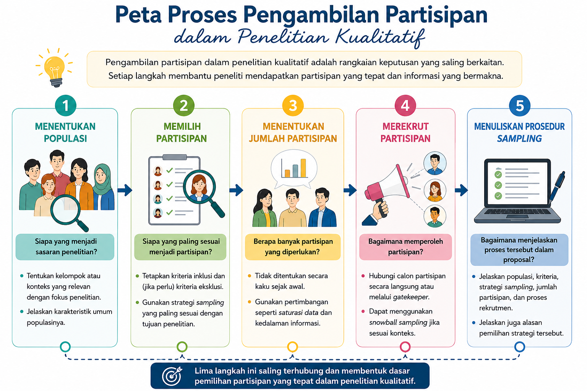

---
author:
  - name: Sunu Bagaskara
filters:
  # Run Quarto's default filters first
  - quarto
  - section-bibliographies
bibliography: references.bib
reference-section-title: Daftar Pustaka
citeproc: true
---

# Populasi dan Sampling dalam Penelitian Kualitatif

::: callout-note
## Capaian Pembelajaran

Setelah mempelajari bab ini, mahasiswa diharapkan mampu:

1.  Menjelaskan konsep populasi dan sampling dalam penelitian kualitatif.
2.  Menentukan populasi, kriteria partisipan, dan strategi sampling yang sesuai dengan tujuan penelitian.
3.  Menentukan jumlah partisipan berdasarkan kebutuhan penelitian dan prinsip saturasi data.
4.  Menjelaskan berbagai strategi rekrutmen partisipan dalam penelitian kualitatif.
5.  Menyusun prosedur sampling secara sistematis dalam proposal maupun laporan penelitian.
:::

Dalam setiap penelitian, peneliti perlu menentukan siapa yang akan menjadi sumber data penelitian. Keputusan tersebut mencakup penentuan populasi, pemilihan partisipan, penetapan jumlah partisipan, serta cara memperoleh partisipan yang sesuai dengan tujuan penelitian.

Berbeda dengan penelitian kuantitatif yang menekankan keterwakilan sampel terhadap populasi, penelitian kualitatif lebih menekankan pemilihan partisipan yang mampu memberikan informasi secara mendalam mengenai fenomena yang diteliti. Oleh karena itu, proses *sampling* dalam penelitian kualitatif tidak hanya berkaitan dengan jumlah partisipan, tetapi juga dengan pertimbangan mengenai siapa yang paling tepat untuk diwawancarai atau diamati.

Bab ini membahas konsep populasi dan *sampling* dalam penelitian kualitatif, mulai dari penentuan populasi penelitian, pemilihan partisipan, penentuan jumlah partisipan, strategi *sampling*, proses rekrutmen partisipan, hingga cara melaporkan prosedur *sampling* dalam proposal maupun laporan penelitian.

## Menentukan Populasi Penelitian

Penentuan populasi merupakan salah satu langkah awal yang penting dalam penelitian kualitatif. Meskipun penelitian kualitatif tidak bertujuan melakukan generalisasi statistik, peneliti tetap perlu menjelaskan secara jelas siapa atau apa yang menjadi sasaran penelitiannya. Kejelasan mengenai populasi akan membantu menentukan siapa yang layak menjadi partisipan, batasan temuan penelitian, serta konteks di mana hasil penelitian dapat dipahami.

Dalam literatur penelitian kualitatif, istilah *population* atau *target population* masih digunakan. Namun, beberapa penulis, seperti @Robinson2014, menggunakan istilah *sample universe* untuk menegaskan bahwa yang dimaksud bukan sekadar populasi dalam pengertian statistik, melainkan keseluruhan individu atau kasus yang secara logis dapat dipilih sebagai partisipan penelitian. Dengan kata lain, *sample universe* merupakan batas konseptual yang menunjukkan siapa saja yang memenuhi syarat untuk menjadi sumber data penelitian.

### Konsep Populasi dalam Penelitian Kualitatif

Dalam penelitian kualitatif, populasi merujuk pada keseluruhan individu, kelompok, organisasi, komunitas, atau kasus yang memiliki pengalaman atau karakteristik yang relevan dengan fenomena yang ingin dipahami. @Patton2014 menekankan bahwa penentuan populasi dalam penelitian kualitatif harus selalu didasarkan pada tujuan penelitian (*purpose of inquiry*). Artinya, populasi tidak ditentukan oleh jumlah individu yang tersedia, tetapi oleh siapa yang diperkirakan mampu memberikan informasi yang paling kaya (*information-rich cases*) mengenai fenomena yang sedang dipelajari.

@Robinson2014 menyebut populasi tersebut sebagai *sample universe*, yaitu keseluruhan individu yang secara konseptual memenuhi syarat untuk dijadikan partisipan penelitian. Penentuan *sample universe* dilakukan melalui penyusunan kriteria inklusi dan eksklusi sehingga batas populasi menjadi jelas sejak awal penelitian.

Sebagai contoh, apabila penelitian bertujuan memahami pengalaman mahasiswa yang mengalami *academic burnout*, maka populasi penelitian bukan seluruh mahasiswa, melainkan mahasiswa yang pernah mengalami *academic burnout*. Demikian pula, apabila penelitian bertujuan mengeksplorasi pengalaman keluarga yang merawat anggota keluarga dengan demensia, maka populasi penelitian adalah keluarga yang memiliki pengalaman tersebut.

Dengan demikian, populasi dalam penelitian kualitatif tidak selalu identik dengan kelompok yang besar. Yang lebih penting adalah kesesuaian antara karakteristik populasi dengan fokus penelitian.

### Menentukan Populasi Berdasarkan Fokus Penelitian

Penentuan populasi dalam penelitian kualitatif selalu berangkat dari pertanyaan penelitian (*research question*). Oleh karena itu, peneliti perlu terlebih dahulu mengidentifikasi fenomena yang ingin dipahami sebelum menentukan siapa yang menjadi populasi penelitian.

Secara umum, populasi dalam penelitian kualitatif dapat ditentukan melalui dua pendekatan:

**Pertama, berdasarkan fenomena yang dialami individu.** Dalam pendekatan ini, populasi terdiri atas orang-orang yang memiliki pengalaman tertentu sesuai dengan fokus penelitian. Contohnya, penelitian mengenai pengalaman penyintas bencana alam menggunakan populasi berupa individu yang pernah mengalami bencana tersebut. Demikian pula penelitian mengenai pengalaman menjadi korban *cyberbullying* akan melibatkan individu yang pernah mengalami perundungan di dunia maya.

**Kedua, berdasarkan kelompok atau konteks sosial tertentu.** Pada pendekatan ini, populasi ditentukan berdasarkan keanggotaan seseorang dalam suatu kelompok, organisasi, komunitas, atau lingkungan tertentu. Sebagai contoh, penelitian mengenai budaya kerja pengemudi ojek daring menjadikan seluruh pengemudi ojek daring sebagai populasi penelitian, sedangkan penelitian mengenai adaptasi mahasiswa tahun pertama menjadikan mahasiswa baru sebagai populasi penelitian.

Dalam praktiknya, kedua pendekatan tersebut sering digunakan secara bersamaan. Misalnya, penelitian mengenai pengalaman *burnout* pada perawat ruang ICU memiliki populasi yang dibatasi oleh dua aspek sekaligus, yaitu kelompok profesi (perawat ruang ICU) dan fenomena yang dialami (*burnout*).

Penentuan populasi yang spesifik akan membantu peneliti memperoleh data yang lebih relevan serta memperjelas ruang lingkup temuan penelitian.

### Menentukan Kriteria Inklusi dan Eksklusi

Setelah populasi penelitian ditetapkan, langkah berikutnya adalah menentukan kriteria siapa saja yang dapat atau tidak dapat menjadi partisipan penelitian. @Robinson2014 menyatakan bahwa penyusunan kriteria inklusi (*inclusion criteria*) dan kriteria eksklusi (*exclusion criteria*) merupakan langkah penting dalam membangun *sample universe* yang jelas.

Kriteria inklusi adalah karakteristik yang harus dimiliki seseorang agar dapat diikutsertakan sebagai partisipan penelitian. Sebaliknya, kriteria eksklusi adalah karakteristik yang menyebabkan seseorang tidak dapat menjadi partisipan meskipun termasuk dalam populasi penelitian.

Sebagai contoh, penelitian mengenai pengalaman *burnout* pada dosen dapat menetapkan kriteria sebagai berikut.

> **Kriteria inklusi**
>
> -   berstatus sebagai dosen aktif;
> -   memiliki pengalaman *burnout* dalam dua tahun terakhir;
> -   bersedia mengikuti wawancara secara mendalam.
>
> **Kriteria eksklusi**
>
> -   sedang menjalani cuti panjang;
> -   memiliki gangguan kesehatan yang menghambat proses wawancara;
> -   tidak bersedia direkam selama proses wawancara.

Penyusunan kriteria inklusi dan eksklusi memberikan beberapa manfaat. Pertama, membantu peneliti menjaga konsistensi dalam memilih partisipan. Kedua, memastikan bahwa seluruh partisipan benar-benar relevan dengan tujuan penelitian. Ketiga, meningkatkan transparansi penelitian karena pembaca dapat memahami alasan mengapa seseorang dipilih atau tidak dipilih sebagai partisipan.

Meskipun demikian, peneliti perlu berhati-hati agar kriteria yang ditetapkan tidak terlalu sempit. Kriteria yang terlalu ketat dapat menyulitkan proses rekrutmen partisipan dan membatasi variasi pengalaman yang sebenarnya penting untuk dipahami. Sebaliknya, kriteria yang terlalu longgar dapat menyebabkan data yang diperoleh menjadi kurang terfokus. Oleh karena itu, penentuan kriteria inklusi dan eksklusi harus selalu mempertimbangkan tujuan penelitian, pertanyaan penelitian, serta pendekatan kualitatif yang digunakan.

## Memilih Partisipan Penelitian

Setelah populasi penelitian ditetapkan, langkah berikutnya adalah menentukan siapa yang akan dipilih sebagai partisipan penelitian. Pada tahap inilah peneliti mulai menerapkan strategi *sampling* yang sesuai dengan tujuan penelitian. Pemilihan partisipan diarahkan untuk memperoleh individu atau kelompok yang mampu memberikan informasi secara mendalam mengenai fenomena yang diteliti.

@Patton2014 menyebut individu-individu tersebut sebagai *information-rich cases*, yaitu partisipan yang memiliki pengalaman, pengetahuan, atau keterlibatan yang memadai sehingga mampu memberikan informasi yang kaya dan bermakna bagi penelitian. Oleh karena itu, pemilihan partisipan lebih berfokus pada individu atau kelompok yang diperkirakan mampu memberikan informasi yang kaya, mendalam, dan relevan dengan fenomena yang diteliti.

::: callout-note
## Partisipan atau Responden?

Dalam penelitian kualitatif, istilah *partisipan* lebih sering digunakan daripada *responden* karena individu yang terlibat tidak hanya memberikan jawaban atas pertanyaan penelitian, tetapi juga berbagi pengalaman, pandangan, dan makna mengenai fenomena yang diteliti.
:::

### *Purposive Sampling* sebagai Strategi Utama

Sebagian besar penelitian kualitatif menggunakan *purposive sampling* (*purposeful sampling*), yaitu strategi memilih partisipan secara sengaja berdasarkan pertimbangan bahwa mereka memiliki pengalaman, pengetahuan, atau karakteristik yang relevan dengan tujuan penelitian. Dalam praktiknya, *purposive sampling* dapat diterapkan melalui berbagai strategi, bergantung pada tujuan penelitian, karakteristik fenomena yang dikaji, serta jenis informasi yang ingin diperoleh. Beberapa strategi yang paling umum digunakan dijelaskan pada bagian berikut [@Robinson2014; @Patton2014; @Creswell2018a].

1.  ***Criterion Sampling***

    *Criterion sampling* merupakan strategi memilih partisipan berdasarkan seperangkat kriteria yang telah ditentukan sebelumnya. Seluruh partisipan yang terlibat harus memenuhi kriteria tersebut sehingga benar-benar memiliki pengalaman yang relevan dengan fenomena yang sedang diteliti. Strategi ini banyak digunakan dalam penelitian fenomenologi karena seluruh partisipan diharapkan memiliki pengalaman yang sama terhadap fenomena yang dikaji.

    Sebagai contoh, penelitian mengenai pengalaman *academic burnout* dapat menetapkan bahwa partisipan harus merupakan mahasiswa aktif yang sedang menyusun skripsi dan pernah mengalami *burnout* dalam satu tahun terakhir. Dengan demikian, mahasiswa yang tidak memenuhi kriteria tersebut tidak diikutsertakan dalam penelitian.

2.  ***Homogeneous Sampling***

    *Homogeneous sampling* memilih partisipan yang memiliki karakteristik yang relatif seragam. Tujuan utamanya adalah memperoleh pemahaman yang mendalam mengenai pengalaman kelompok tertentu tanpa dipengaruhi oleh terlalu banyak variasi karakteristik. Strategi ini sering digunakan dalam penelitian fenomenologi, *interpretative phenomenological analysis* (IPA), maupun penelitian yang berfokus pada pengalaman kelompok tertentu.

    Sebagai contoh, penelitian mengenai pengalaman menjadi orang tua tunggal dapat melibatkan perempuan berusia 30–45 tahun yang membesarkan anak tanpa pasangan. Kesamaan karakteristik tersebut membantu peneliti mengidentifikasi pengalaman yang menjadi ciri khas kelompok tersebut.

3.  ***Maximum Variation Sampling***

    Berbeda dengan *homogeneous sampling*, *maximum variation sampling* bertujuan memperoleh keragaman pengalaman yang seluas mungkin. Peneliti secara sengaja memilih partisipan yang memiliki karakteristik yang berbeda sehingga dapat mengeksplorasi bagaimana suatu fenomena dialami dalam berbagai konteks.

    Sebagai contoh, penelitian mengenai pengalaman menggunakan kecerdasan artifisial dalam pembelajaran dapat melibatkan mahasiswa dari berbagai program studi, semester, jenis perguruan tinggi, dan daerah asal. Melalui variasi tersebut, peneliti dapat mengidentifikasi tema-tema yang muncul secara konsisten meskipun partisipan berasal dari latar belakang yang berbeda.

4.  ***Typical Case Sampling***

    *Typical case sampling* digunakan apabila peneliti ingin memahami kondisi yang dianggap umum atau lazim terjadi pada suatu populasi. Oleh karena itu, partisipan dipilih karena dianggap mewakili karakteristik yang paling sering ditemukan, bukan karena memiliki pengalaman yang unik atau ekstrem.

    Sebagai contoh, penelitian mengenai pengalaman belajar mahasiswa tahun pertama dapat memilih mahasiswa dengan prestasi akademik, latar belakang sosial, dan aktivitas yang mencerminkan kondisi mayoritas mahasiswa pada program studi tersebut.

5.  ***Extreme*** **atau *Deviant Case Sampling***

    Pada strategi ini, peneliti secara sengaja memilih partisipan yang memiliki karakteristik atau pengalaman yang sangat berbeda dari kondisi umum. Kasus-kasus tersebut sering kali memberikan wawasan baru mengenai faktor-faktor yang memengaruhi suatu fenomena.

    Misalnya, penelitian mengenai resiliensi dapat memilih individu yang mampu bangkit kembali setelah mengalami berbagai peristiwa traumatis yang berat. Contoh lainnya adalah penelitian mengenai prestasi akademik yang melibatkan mahasiswa dengan capaian akademik yang sangat tinggi atau sangat rendah.

6.  ***Intensity Sampling***

    *Intensity sampling* memilih partisipan yang mengalami fenomena secara kuat, tetapi masih berada dalam rentang yang dianggap normal. Strategi ini berbeda dengan *extreme case sampling* karena partisipan tidak dipilih berdasarkan kondisi yang sangat menyimpang, melainkan karena memiliki pengalaman yang cukup intens sehingga mampu memberikan informasi yang kaya.

    Sebagai contoh, penelitian mengenai stres kerja dapat memilih tenaga kesehatan yang memiliki tingkat stres tinggi, tetapi belum mengalami gangguan psikologis yang berat.

7.  ***Critical Case Sampling***

    *Critical case sampling* digunakan apabila peneliti ingin mempelajari kasus yang dipandang sangat penting atau strategis. Kasus tersebut dipilih karena diyakini mampu memberikan informasi yang memiliki implikasi luas terhadap pemahaman suatu fenomena.

    Sebagai contoh, penelitian mengenai implementasi kurikulum baru dapat memilih sekolah yang menjadi proyek percontohan nasional. Pengalaman sekolah tersebut diperkirakan dapat memberikan pelajaran penting bagi penerapan kebijakan pada sekolah lain.

8.  ***Theoretical Sampling***

    Berbeda dengan strategi sebelumnya, *theoretical sampling* merupakan strategi yang secara khusus digunakan dalam pendekatan *grounded theory*. Pada strategi ini, pemilihan partisipan tidak ditetapkan sepenuhnya sejak awal penelitian, tetapi berkembang mengikuti proses analisis data. Karena bertujuan membangun teori, *theoretical sampling* merupakan ciri khas penelitian *grounded theory* dan umumnya tidak digunakan pada pendekatan kualitatif lainnya.

    Peneliti menentukan siapa yang perlu diwawancarai berikutnya berdasarkan kategori atau konsep yang mulai muncul selama analisis berlangsung. Proses tersebut dilakukan secara berulang hingga kategori yang dikembangkan telah mencapai saturasi teoritis (*theoretical saturation*).

Berbagai strategi *purposive sampling* memiliki tujuan dan konteks penggunaan yang berbeda. Pemilihan strategi yang tepat perlu disesuaikan dengan pertanyaan penelitian, karakteristik fenomena yang dikaji, serta jenis informasi yang ingin diperoleh. Ringkasan karakteristik masing-masing strategi disajikan pada @tbl-samplingkuali.

::: {#tbl-samplingkuali}
|  |  |  |
|:--------------------|:-------------------------------|:------------------|
| **Strategi** | **Tujuan** | **Contoh Penelitian** |
| *Criterion* | Memilih partisipan yang memenuhi kriteria tertentu | Pengalaman penyintas stroke |
| *Homogeneous* | Mendalami pengalaman kelompok yang seragam | Pengalaman mahasiswa tingkat akhir menyusun skripsi |
| *Maximum variation* | Mengeksplorasi keragaman pengalaman | Penggunaan AI oleh mahasiswa dari berbagai program studi |
| *Typical case* | Menggambarkan kondisi umum | Pengalaman belajar mahasiswa tahun pertama |
| *Extreme/deviant* | Mengkaji kasus tidak biasa | Resiliensi pada penyintas bencana dengan pemulihan luar biasa |
| *Intensity* | Mengkaji fenomena yang kuat tetapi tidak ekstrem | Stres kerja pada tenaga kesehatan |
| *Critical case* | Mempelajari kasus yang strategis | Implementasi kurikulum di sekolah percontohan |
| *Theoretical* | Mengembangkan teori | Penelitian *grounded theory* |

: Perbandingan tujuan setiap metode sampling metode kualitatif
:::

### *Snowball Sampling*

Selain *purposive sampling*, strategi lain yang cukup sering digunakan dalam penelitian kualitatif adalah *snowball sampling*. Pada strategi ini, peneliti memperoleh partisipan baru melalui rekomendasi dari partisipan yang telah diwawancarai sebelumnya. Dengan kata lain, setiap partisipan membantu peneliti menemukan partisipan lain yang memenuhi kriteria penelitian sehingga jumlah partisipan bertambah secara bertahap seperti bola salju yang menggelinding.

*Snowball sampling* umumnya digunakan ketika populasi penelitian sulit diidentifikasi atau tidak memiliki daftar anggota yang jelas. Kondisi ini banyak dijumpai pada penelitian yang melibatkan kelompok tersembunyi (*hidden populations*), seperti penyintas kekerasan seksual, pengguna narkotika, individu yang hidup dengan HIV/AIDS, atau kelompok minoritas tertentu. Dalam situasi tersebut, rekomendasi dari partisipan sebelumnya sering menjadi cara yang paling efektif untuk memperoleh akses kepada calon partisipan berikutnya [@Creswell2018a; @Patton2014].

Meskipun demikian, *snowball sampling* memiliki beberapa keterbatasan. Karena partisipan direkrut melalui jaringan sosial yang saling berkaitan, terdapat kemungkinan bahwa karakteristik partisipan menjadi kurang beragam sehingga data yang diperoleh cenderung berasal dari kelompok yang memiliki pengalaman atau pandangan yang serupa. Oleh karena itu, peneliti perlu mempertimbangkan potensi bias tersebut ketika menafsirkan hasil penelitian.

Dalam banyak buku metodologi penelitian, *snowball sampling* diklasifikasikan sebagai salah satu teknik *non-probability sampling* [@Morling2024; @Neuman2014; @Bordens2018]. Namun, beberapa penulis memandang bahwa *snowball sampling* tidak hanya merupakan strategi pemilihan partisipan, tetapi juga merupakan cara untuk memperoleh akses kepada partisipan yang memenuhi kriteria penelitian. Oleh karena itu, pembahasan mengenai penerapan *snowball sampling* dalam proses rekrutmen partisipan akan dijelaskan lebih lanjut pada @sec-snowball.

## Menentukan Jumlah Partisipan

Salah satu pertanyaan yang paling sering diajukan oleh mahasiswa ketika merancang penelitian kualitatif adalah, *"Berapa jumlah partisipan yang harus saya libatkan?"* Berbeda dengan penelitian kuantitatif yang sering menggunakan rumus atau perhitungan statistik untuk menentukan ukuran sampel, penelitian kualitatif tidak memiliki aturan baku mengenai jumlah partisipan yang harus dilibatkan.

Dalam penelitian kualitatif, jumlah partisipan ditentukan berdasarkan kemampuan data yang diperoleh untuk menjawab pertanyaan penelitian secara mendalam. Oleh karena itu, keputusan mengenai jumlah partisipan tidak hanya mempertimbangkan banyaknya individu yang diwawancarai, tetapi juga kualitas informasi yang diperoleh, kompleksitas fenomena yang diteliti, serta tujuan penelitian [@Patton2014; @Creswell2018a].

### Faktor yang Memengaruhi Jumlah Partisipan

Tidak ada jumlah partisipan yang dapat diterapkan pada semua penelitian kualitatif. Penentuan jumlah partisipan dipengaruhi oleh berbagai faktor, antara lain sebagai berikut [@Robinson2014; @Strauss1998]:

-   **Tujuan penelitian.** Penelitian yang bertujuan mengeksplorasi pengalaman secara mendalam umumnya membutuhkan jumlah partisipan yang lebih sedikit dibandingkan penelitian yang ingin memperoleh variasi pengalaman dari berbagai kelompok.
-   **Pendekatan penelitian.** Setiap pendekatan kualitatif memiliki karakteristik yang berbeda. Misalnya, penelitian biografi umumnya hanya berfokus pada satu individu, sedangkan etnografi dapat melibatkan banyak informan dari suatu komunitas. Pada *grounded theory*, jumlah partisipan berkembang mengikuti proses pengembangan teori.
-   **Keragaman partisipan.** Penelitian yang melibatkan partisipan dengan latar belakang yang sangat beragam biasanya memerlukan lebih banyak partisipan dibandingkan penelitian yang menggunakan kelompok yang relatif homogen.
-   **Kompleksitas fenomena.** Fenomena yang sederhana mungkin dapat dipahami melalui sedikit partisipan, sedangkan fenomena yang kompleks sering kali memerlukan eksplorasi dari berbagai perspektif.
-   **Kualitas data.** Partisipan yang memiliki pengalaman yang kaya dan mampu menjelaskan fenomena secara rinci sering kali menghasilkan data yang lebih bermakna daripada jumlah partisipan yang banyak tetapi memberikan informasi yang terbatas.

Dengan demikian, penentuan jumlah partisipan tidak dapat dilepaskan dari konteks penelitian yang dilakukan.

### Konsep Saturasi Data

Dalam penelitian kualitatif, proses pengambilan partisipan umumnya dihentikan ketika peneliti mencapai **saturasi data** (*data saturation*). Saturasi data adalah kondisi ketika proses pengumpulan data tidak lagi menghasilkan informasi, tema, atau kategori baru yang relevan dengan tujuan penelitian [@Guest2006].

Sebagai ilustrasi, seorang peneliti melakukan wawancara mengenai pengalaman mahasiswa yang mengalami *academic burnout*. Pada beberapa wawancara pertama, peneliti menemukan berbagai tema baru, seperti tekanan akademik, tuntutan keluarga, kesulitan mengatur waktu, dan kelelahan emosional. Namun, setelah melakukan sejumlah wawancara berikutnya, tema-tema yang muncul mulai berulang dan tidak lagi memberikan informasi baru. Pada kondisi inilah peneliti dapat mempertimbangkan bahwa saturasi data telah tercapai.

Perlu dipahami bahwa saturasi bukan berarti seluruh partisipan memberikan jawaban yang sama. Sebaliknya, saturasi menunjukkan bahwa informasi yang diperoleh telah cukup untuk menjelaskan fenomena yang sedang diteliti sehingga pengumpulan data tambahan diperkirakan tidak lagi memberikan kontribusi yang bermakna terhadap analisis.

Konsep saturasi data terutama banyak digunakan pada penelitian fenomenologi, studi kasus, dan *grounded theory*. Pada *grounded theory*, istilah yang sering digunakan adalah **saturasi teoritis** (*theoretical saturation*), yaitu kondisi ketika pengumpulan data tidak lagi menghasilkan kategori atau hubungan konseptual baru yang diperlukan untuk membangun teori [@Strauss1998; @Charmaz2014].

Kecepatan tercapainya saturasi data dipengaruhi oleh berbagai faktor, seperti tingkat homogenitas partisipan, kompleksitas fenomena yang diteliti, kualitas wawancara, serta tujuan penelitian. Penelitian yang melibatkan partisipan dengan karakteristik relatif homogen sering kali mencapai saturasi lebih cepat dibandingkan penelitian yang melibatkan partisipan dengan latar belakang yang sangat beragam [@Hennink2017].

### Apakah Penelitian Kualitatif Dapat Menggunakan Satu Partisipan?

Salah satu anggapan yang masih sering dijumpai adalah bahwa penelitian yang baik harus melibatkan banyak partisipan. Anggapan tersebut tidak selalu berlaku dalam penelitian kualitatif.

Pada pendekatan tertentu, penggunaan satu partisipan atau satu kasus justru dapat dibenarkan apabila kasus tersebut memiliki nilai ilmiah yang tinggi dan mampu memberikan pemahaman yang mendalam mengenai fenomena yang diteliti. Sebagai contoh, penelitian biografi secara khusus berfokus pada kehidupan satu individu, sedangkan studi kasus dapat menelaah secara mendalam satu organisasi, satu keluarga, satu sekolah, atau satu peristiwa tertentu [@Yin2018].

Demikian pula, penelitian *interpretative phenomenological analysis* (IPA) sering menggunakan jumlah partisipan yang relatif sedikit agar setiap pengalaman dapat dianalisis secara mendalam [@Smith2021]. Oleh karena itu, penggunaan satu partisipan tidak dapat dinilai hanya berdasarkan jumlahnya, tetapi harus dipahami dalam konteks pendekatan penelitian dan tujuan analisis yang dilakukan.

## Merekrut Partisipan Penelitian

Setelah menentukan strategi *sampling* dan jumlah partisipan, langkah berikutnya adalah merekrut partisipan yang sesuai dengan kriteria penelitian. Tujuan utama proses rekrutmen adalah memperoleh partisipan yang benar-benar memenuhi karakteristik yang telah ditetapkan sehingga mampu memberikan informasi yang relevan dengan fokus penelitian.

Cara merekrut partisipan bergantung pada karakteristik populasi, kemudahan akses, serta konteks penelitian. Pada beberapa penelitian, partisipan dapat dihubungi secara langsung, sedangkan pada penelitian lain peneliti perlu bekerja sama dengan pihak tertentu atau menggunakan jaringan partisipan yang telah direkrut sebelumnya.

### Rekrutmen Secara Langsung

Apabila populasi penelitian mudah diidentifikasi, peneliti dapat menghubungi calon partisipan secara langsung, misalnya melalui surat elektronik, telepon, media sosial, atau komunikasi tatap muka. Pada tahap awal, peneliti perlu menjelaskan tujuan penelitian, bentuk partisipasi yang diharapkan, serta hak calon partisipan untuk menerima atau menolak keikutsertaan dalam penelitian.

### Rekrutmen Melalui *Gatekeeper*

Pada beberapa penelitian, akses terhadap partisipan memerlukan bantuan pihak yang memiliki kewenangan atau hubungan dengan kelompok sasaran. Pihak tersebut dikenal sebagai *gatekeeper*, misalnya kepala sekolah, pimpinan organisasi, ketua komunitas, atau tenaga kesehatan.

Peran *gatekeeper* adalah membantu peneliti memperoleh akses kepada calon partisipan. Namun demikian, keputusan untuk berpartisipasi tetap harus berasal dari masing-masing individu tanpa adanya unsur paksaan.

### *Snowball Sampling* {#sec-snowball}

Apabila populasi penelitian sulit dijangkau atau tidak memiliki daftar anggota yang jelas, peneliti dapat menggunakan *snowball sampling*. Pada teknik ini, peneliti meminta partisipan yang telah diwawancarai untuk merekomendasikan individu lain yang memenuhi kriteria penelitian.

*Snowball sampling* banyak digunakan pada penelitian yang melibatkan populasi tersembunyi (*hidden populations*), seperti penyintas kekerasan, pengguna narkotika, atau kelompok minoritas tertentu. Meskipun efektif untuk menemukan partisipan, teknik ini berpotensi menghasilkan partisipan yang berasal dari jaringan sosial yang sama sehingga peneliti perlu mempertimbangkan kemungkinan bias yang muncul.

### Tantangan dalam Rekrutmen Partisipan

Proses rekrutmen tidak selalu berjalan sesuai rencana. Peneliti dapat menghadapi berbagai kendala, seperti kesulitan menemukan partisipan yang memenuhi kriteria, rendahnya kesediaan calon partisipan, atau terbatasnya akses terhadap kelompok sasaran. Oleh karena itu, peneliti perlu menyiapkan strategi rekrutmen yang fleksibel dan mendokumentasikan proses rekrutmen sebagai bagian dari transparansi metodologi penelitian.

## Menuliskan Prosedur *Sampling* dalam Proposal dan Laporan Penelitian

Selain melaksanakan proses *sampling* dengan benar, peneliti juga perlu menjelaskan prosedur tersebut secara jelas dalam proposal maupun laporan penelitian. Uraian mengenai *sampling* membantu pembaca memahami siapa yang menjadi partisipan penelitian, bagaimana mereka dipilih, serta alasan penggunaan strategi *sampling* tertentu. Penjelasan yang lengkap juga meningkatkan transparansi dan kredibilitas penelitian.

Secara umum, bagian metode penelitian perlu memuat beberapa informasi berikut.

1.  **Populasi Penelitian**

    Peneliti perlu menjelaskan siapa yang menjadi populasi atau kelompok sasaran penelitian. Penjelasan tersebut sebaiknya disesuaikan dengan fokus penelitian sehingga pembaca memahami konteks penelitian yang dilakukan.

    **Contoh:**

    > Populasi penelitian ini adalah mahasiswa program sarjana yang sedang menyusun skripsi pada sebuah perguruan tinggi di Jakarta.

2.  **Kriteria Partisipan**

    Setelah menjelaskan populasi penelitian, peneliti perlu menguraikan kriteria inklusi dan, apabila diperlukan, kriteria eksklusi yang digunakan dalam memilih partisipan.

    **Contoh:**

    > Partisipan penelitian dipilih dengan kriteria sebagai berikut: (1) berstatus sebagai mahasiswa aktif, (2) sedang menyusun skripsi, dan (3) pernah mengalami *academic burnout*.

    Penjelasan mengenai kriteria partisipan menunjukkan bahwa pemilihan partisipan dilakukan secara sistematis dan sesuai dengan tujuan penelitian.

3.  **Strategi *Sampling***

    Peneliti perlu menjelaskan strategi *sampling* yang digunakan beserta alasan pemilihannya.

    **Contoh:**

    > Penelitian ini menggunakan *purposive sampling* karena bertujuan memperoleh partisipan yang memiliki pengalaman secara langsung terhadap fenomena *academic burnout*.

    Apabila menggunakan *snowball sampling*, peneliti juga perlu menjelaskan alasan penggunaan strategi tersebut, misalnya karena populasi penelitian sulit dijangkau atau tidak memiliki daftar anggota yang jelas.

4.  **Jumlah Partisipan**

    Pada penelitian kualitatif, peneliti tidak selalu menetapkan jumlah partisipan secara pasti sejak awal. Oleh karena itu, selain menyebutkan jumlah partisipan yang direncanakan, peneliti juga perlu menjelaskan dasar pertimbangannya.

    **Contoh:**

    > Pengumpulan data dilakukan hingga mencapai saturasi data, yaitu ketika wawancara tambahan tidak lagi menghasilkan tema atau informasi baru yang relevan dengan tujuan penelitian.

    Pernyataan tersebut lebih mencerminkan karakteristik penelitian kualitatif dibandingkan hanya menyebutkan target jumlah partisipan.

5.  **Proses Rekrutmen Partisipan**

    Bagian metode penelitian juga perlu menjelaskan secara singkat bagaimana partisipan direkrut.

    Sebagai contoh:

    > Calon partisipan dihubungi melalui koordinator program studi dan selanjutnya dihubungi secara langsung oleh peneliti untuk memperoleh persetujuan mengikuti penelitian.

    Apabila menggunakan *snowball sampling*, peneliti dapat menjelaskan bahwa partisipan berikutnya diperoleh melalui rekomendasi dari partisipan yang telah diwawancarai sebelumnya.

**Contoh Penulisan Lengkap**

Berikut contoh penulisan prosedur *sampling* dalam proposal penelitian.

> Penelitian ini menggunakan *purposive sampling* untuk memilih mahasiswa yang memiliki pengalaman *academic burnout* selama menyusun skripsi. Partisipan dipilih berdasarkan tiga kriteria, yaitu berstatus sebagai mahasiswa aktif, sedang menyusun skripsi, dan pernah mengalami *academic burnout*. Rekrutmen partisipan dilakukan melalui pengumuman pada media sosial fakultas dan komunikasi langsung dengan calon partisipan. Pengumpulan data dilakukan hingga mencapai saturasi data.

Penentuan populasi dan *sampling* dalam penelitian kualitatif bukanlah sekadar memilih sejumlah partisipan, melainkan merupakan rangkaian keputusan metodologis yang saling berkaitan. Peneliti perlu menentukan siapa yang menjadi populasi penelitian, memilih partisipan yang paling sesuai dengan tujuan penelitian, menetapkan jumlah partisipan yang memadai, merancang strategi rekrutmen yang tepat, serta menjelaskan seluruh proses tersebut secara transparan dalam proposal maupun laporan penelitian.

Hubungan antartahapan tersebut dirangkum pada @fig-proseskuali, yang menunjukkan bahwa proses pengambilan partisipan dalam penelitian kualitatif merupakan suatu alur yang sistematis dan terintegrasi. Pemahaman terhadap keseluruhan proses ini akan membantu peneliti memperoleh data yang kaya, relevan, dan kredibel sehingga mampu menghasilkan temuan penelitian yang bermakna.

::: {#fig-proseskuali}

:::

::: callout-tip
## Rangkuman

1.  Penelitian kualitatif menggunakan sampling untuk memperoleh partisipan yang mampu memberikan informasi secara mendalam mengenai fenomena yang diteliti.
2.  Penentuan populasi diawali dengan menetapkan fokus penelitian serta kriteria inklusi dan eksklusi partisipan.
3.  *Purposive sampling* merupakan strategi sampling yang paling umum digunakan, dengan berbagai variasi yang disesuaikan dengan tujuan penelitian.
4.  *Snowball sampling* digunakan ketika populasi penelitian sulit dijangkau atau tidak memiliki daftar anggota yang jelas.
5.  Jumlah partisipan ditentukan berdasarkan tujuan penelitian dan prinsip saturasi data, bukan berdasarkan rumus statistik.
6.  Rekrutmen partisipan dapat dilakukan melalui berbagai cara sesuai dengan karakteristik populasi dan konteks penelitian.
7.  Prosedur sampling perlu dilaporkan secara jelas agar proses penelitian dapat dipahami dan dipertanggungjawabkan.
:::

::: callout-important
## Refleksi & Diskusi

-   Mengapa penelitian kualitatif lebih menekankan pemilihan partisipan yang mampu memberikan informasi secara mendalam daripada keterwakilan populasi secara statistik?
-   Bayangkan Anda akan melakukan penelitian fenomenologi mengenai pengalaman mahasiswa yang mengalami *academic burnout*. Siapa yang menjadi populasi penelitian? Kriteria inklusi dan eksklusi apa yang akan Anda tetapkan?
-   Suatu penelitian bertujuan mengeksplorasi pengalaman penggunaan kecerdasan artifisial (*artificial intelligence*) dalam proses pembelajaran oleh mahasiswa dari berbagai program studi. Strategi *purposive sampling* apa yang paling tepat digunakan? Jelaskan alasan Anda.
-   Dalam kondisi seperti apa *snowball sampling* lebih tepat digunakan dibandingkan *purposive sampling* biasa? Berikan contoh topik penelitian yang sesuai.
-   Seorang mahasiswa menyatakan bahwa penelitian kualitatif minimal harus melibatkan 30 partisipan agar hasilnya valid. Apakah Anda setuju dengan pernyataan tersebut? Jelaskan jawaban Anda berdasarkan konsep saturasi data.
:::

::: sectionrefs
:::
