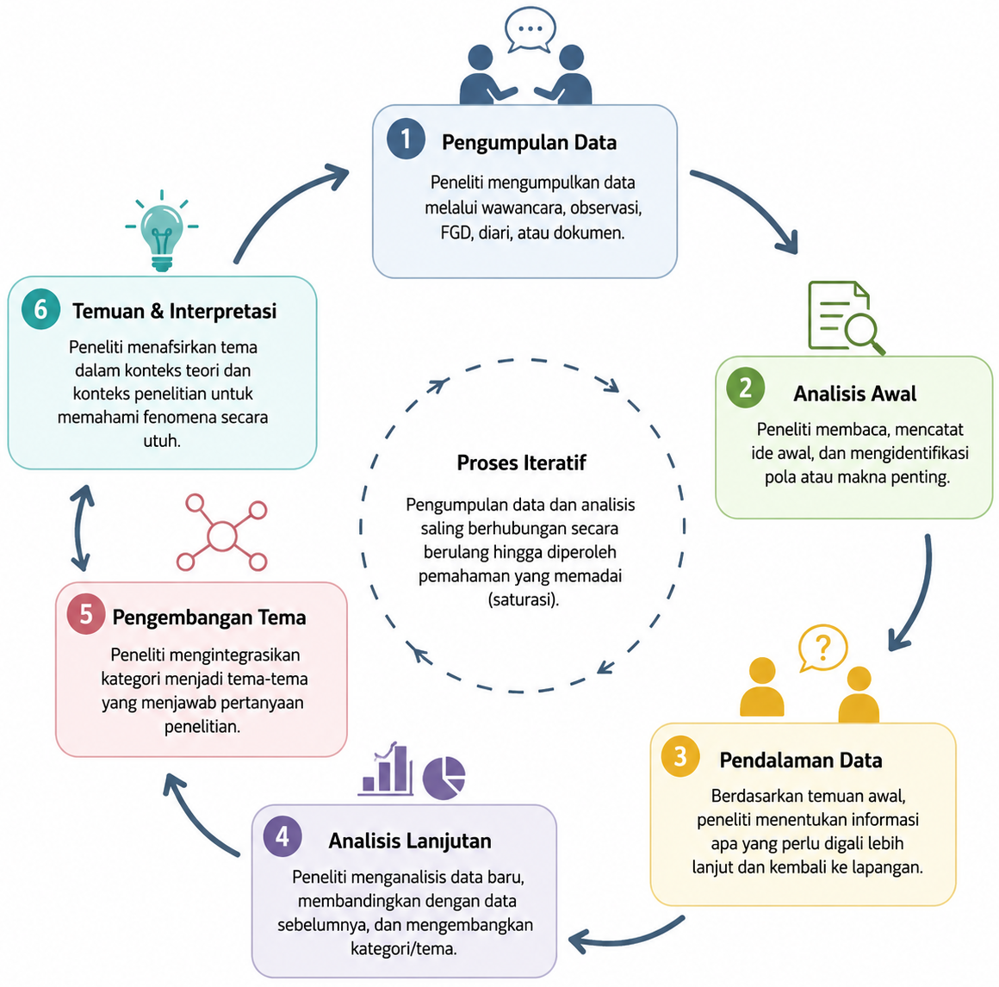
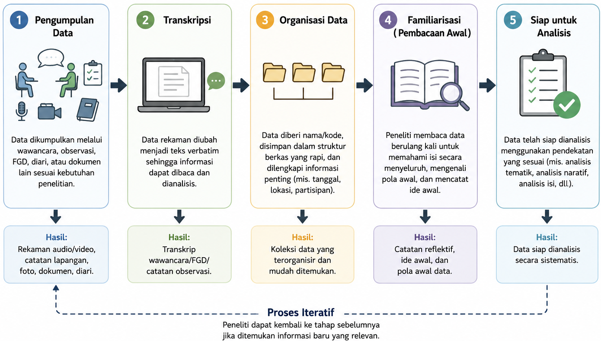
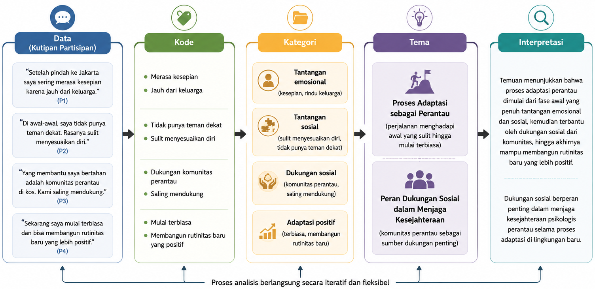

---
author:
  - name: Sunu Bagaskara
filters:
  # Run Quarto's default filters first
  - quarto
  - section-bibliographies
bibliography: references.bib
reference-section-title: Daftar Pustaka
citeproc: true
---

# Desain Penelitian Kualitatif {#sec-desainkuali}

::: callout-note
## Capaian Pembelajaran

Setelah mempelajari bab ini, mahasiswa diharapkan mampu:

1.  Menjelaskan karakteristik berbagai teknik pengumpulan data dalam penelitian kualitatif sesuai dengan tujuan penelitian.
2.  Memilih teknik pengumpulan data yang paling sesuai dengan pertanyaan penelitian dan konteks lapangan.
3.  Menjelaskan tahapan umum analisis data kualitatif, mulai dari penyiapan data hingga pembentukan tema.
4.  Memahami proses analisis tematik sebagai salah satu pendekatan yang umum digunakan dalam penelitian kualitatif.
5.  Menjelaskan hubungan antara data, kode, kategori, tema, dan interpretasi dalam menghasilkan temuan penelitian.
:::

Penelitian kualitatif bertujuan memahami makna di balik pengalaman, perilaku, dan interaksi manusia dalam konteks tertentu. Oleh karena itu, data yang dikumpulkan umumnya berupa narasi, percakapan, hasil observasi, maupun dokumen yang memberikan gambaran mendalam mengenai fenomena yang diteliti. Berbeda dengan penelitian kuantitatif yang berfokus pada pengukuran, penelitian kualitatif menekankan pemahaman terhadap perspektif dan pengalaman partisipan.

Bab ini membahas teknik-teknik pengumpulan data yang umum digunakan dalam penelitian kualitatif serta gambaran umum proses analisis data, khususnya analisis tematik. Pembahasan difokuskan pada konsep-konsep dasar agar pembaca memahami alur pengumpulan, pengolahan, dan interpretasi data kualitatif secara sistematis.

## Pengumpulan Data dalam Penelitian Kualitatif

Pengumpulan data merupakan proses memperoleh informasi yang diperlukan untuk memahami suatu fenomena dari perspektif partisipan. Berbeda dengan penelitian kuantitatif yang umumnya menggunakan instrumen terstandar, penelitian kualitatif mengandalkan interaksi langsung antara peneliti dan sumber data. Oleh karena itu, peneliti berperan sebagai instrumen utama yang menentukan kualitas data melalui kemampuan membangun hubungan dengan partisipan, mengajukan pertanyaan yang relevan, serta mengamati situasi penelitian secara cermat [@Creswell2023; @Merriam2016].

Dalam penelitian kualitatif, proses pengumpulan data bersifat fleksibel dan berkembang seiring dengan berlangsungnya penelitian. Informasi yang diperoleh pada tahap awal dapat memunculkan pertanyaan baru sehingga peneliti perlu menyesuaikan fokus pengumpulan data. Dengan demikian, pengumpulan dan analisis data berlangsung secara berulang (*iterative process*) hingga diperoleh pemahaman yang memadai mengenai fenomena yang diteliti [@Miles2020; @Saldana2025] (lihat @fig-sikluskualitatif).

::: {#fig-sikluskualitatif}

:::

## Teknik Pengumpulan Data Kualitatif

Berbagai teknik dapat digunakan untuk memperoleh data dalam penelitian kualitatif. Pemilihan teknik bergantung pada tujuan penelitian, karakteristik fenomena yang diteliti, serta jenis informasi yang ingin diperoleh. Dalam praktiknya, peneliti sering mengombinasikan beberapa teknik pengumpulan data untuk memperoleh pemahaman yang lebih komprehensif mengenai suatu fenomena [@Creswell2023; @Patton2014].

### Wawancara Mendalam

Wawancara mendalam (*in-depth interview*) merupakan teknik pengumpulan data melalui percakapan antara peneliti dan partisipan untuk menggali pengalaman, pandangan, maupun makna yang mereka berikan terhadap suatu fenomena. Teknik ini memungkinkan peneliti mengeksplorasi perspektif partisipan secara lebih mendalam melalui pertanyaan yang bersifat terbuka dan fleksibel [@Brinkmann2018].

### Observasi

Observasi dilakukan dengan mengamati perilaku, aktivitas, interaksi, maupun kondisi lingkungan tempat fenomena berlangsung. Teknik ini membantu peneliti memahami fenomena dalam konteks alaminya sehingga dapat melengkapi informasi yang diperoleh melalui wawancara. Observasi dapat dilakukan dengan berbagai tingkat keterlibatan peneliti, mulai dari pengamat hingga partisipan [@Creswell2023; @Patton2014].

### *Focus Group Discussion* (FGD)

*Focus Group Discussion* (FGD) merupakan teknik pengumpulan data melalui diskusi kelompok yang dipandu oleh seorang moderator. Selain memperoleh berbagai sudut pandang dalam waktu yang relatif singkat, FGD memungkinkan peneliti mengamati bagaimana peserta saling menanggapi, menyepakati, atau mempertentangkan suatu isu sehingga dinamika sosial menjadi bagian penting dari data penelitian [@Krueger2015].

### Diari dan Dokumen Pribadi

Diari dan dokumen pribadi dapat menjadi sumber data yang kaya mengenai pengalaman sehari-hari partisipan. Catatan yang dibuat secara berkala memungkinkan peneliti memahami perubahan pengalaman, emosi, maupun aktivitas dalam konteks kehidupan nyata. Selain diari tertulis, perkembangan teknologi juga memungkinkan penggunaan diari digital, rekaman suara, maupun dokumentasi visual sebagai sumber data penelitian [@Alaszewski2006; @Flick2022].

::: {#tbl-teknikkuali}
|  |  |  |  |  |
|:--------------|:--------------|:--------------|:--------------|:--------------|
| **Teknik** | **Tujuan Utama** | **Jenis Data yang Dihasilkan** | **Kelebihan** | **Keterbatasan** |
| **Wawancara mendalam** | Menggali pengalaman, persepsi, dan makna yang dimiliki partisipan | Narasi hasil percakapan individual | Menghasilkan data yang mendalam dan kaya makna; memungkinkan eksplorasi lebih lanjut melalui pertanyaan lanjutan | Membutuhkan waktu yang relatif lama dan sangat bergantung pada kemampuan pewawancara |
| **Observasi** | Memahami perilaku, interaksi, dan konteks secara langsung | Catatan lapangan, foto, atau dokumentasi visual | Menangkap perilaku dalam konteks alami; melengkapi data hasil wawancara | Tidak semua fenomena dapat diamati secara langsung; interpretasi peneliti dapat memengaruhi hasil observasi |
| ***Focus Group Discussion*** **(FGD)** | Menggali pandangan dan pengalaman melalui diskusi kelompok | Transkrip diskusi kelompok dan dinamika interaksi peserta | Menghasilkan beragam perspektif dalam waktu relatif singkat; memungkinkan munculnya ide melalui interaksi antarpeserta | Diskusi dapat didominasi oleh peserta tertentu; kurang sesuai untuk topik yang sangat sensitif atau personal |
| **Diari atau dokumen pribadi** | Mendokumentasikan pengalaman dan aktivitas secara berkelanjutan | Catatan harian, jurnal, rekaman suara, foto, atau dokumen pribadi | Memberikan gambaran pengalaman secara kronologis dan dalam konteks kehidupan sehari-hari | Bergantung pada komitmen partisipan; kualitas data dapat bervariasi antarpartisipan |

: Perbandingan teknik pengumpulan data kualitatif
:::

## Memilih Teknik Pengumpulan Data

Tidak ada satu teknik pengumpulan data yang paling tepat untuk semua penelitian kualitatif. Pemilihan teknik harus disesuaikan dengan pertanyaan penelitian, karakteristik partisipan, serta konteks penelitian. Sebagai contoh, wawancara mendalam lebih sesuai untuk memahami pengalaman individual, sedangkan FGD lebih tepat digunakan ketika peneliti ingin mengeksplorasi persepsi atau pengalaman yang berkembang dalam suatu kelompok. Observasi lebih bermanfaat ketika perilaku dan interaksi sosial menjadi fokus penelitian, sedangkan diari cocok digunakan untuk memahami pengalaman yang berlangsung secara berkelanjutan [@Patton2014; @Creswell2023].

Dalam banyak penelitian, penggunaan lebih dari satu teknik pengumpulan data dapat menghasilkan pemahaman yang lebih utuh mengenai fenomena yang diteliti. Kombinasi wawancara, observasi, maupun analisis dokumen memungkinkan peneliti memperoleh informasi yang saling melengkapi sehingga interpretasi terhadap data menjadi lebih kaya dan kredibel [@Miles2020; @Lincoln1990].

## Menyiapkan Data untuk Analisis

Data yang diperoleh melalui wawancara, observasi, FGD, maupun dokumen belum dapat langsung dianalisis. Peneliti perlu menyiapkan data agar tersusun secara sistematis dan mudah ditelusuri selama proses analisis. Tahap ini umumnya meliputi transkripsi rekaman, pengorganisasian berkas, pemberian identitas atau kode pada partisipan, serta penyusunan catatan lapangan. Pengelolaan data yang baik akan membantu menjaga ketertelusuran proses analisis sekaligus meningkatkan transparansi penelitian [@Miles2020; @Creswell2023].

Sebelum melakukan analisis yang lebih mendalam, peneliti juga perlu membiasakan diri (*familiarization*) dengan data melalui pembacaan atau penelaahan berulang. Proses ini bertujuan memperoleh pemahaman menyeluruh mengenai isi data, mengenali pola awal, serta mencatat ide atau refleksi yang muncul selama membaca. Familiarisasi merupakan tahap penting karena menjadi dasar dalam proses pengodean dan pengembangan tema [@Braun2006]. @fig-penyiapandata mengIlustrasikan tahapan penyiapan data untuk analisis.

::: {#fig-penyiapandata}

:::

## Analisis Tematik

Analisis tematik (*thematic analysis*) merupakan salah satu pendekatan analisis data kualitatif yang paling banyak digunakan karena bersifat fleksibel dan dapat diterapkan pada berbagai desain penelitian. Tujuan analisis tematik adalah mengidentifikasi, mengorganisasi, dan menginterpretasikan pola makna (*themes*) yang muncul dari data sehingga peneliti dapat menjawab pertanyaan penelitian secara sistematis [@Braun2006].

Meskipun terdapat berbagai pendekatan analisis kualitatif, secara umum analisis tematik dilakukan melalui empat tahapan utama: memahami data, memberikan kode, mengembangkan kategori dan tema, serta menginterpretasikan hasil analisis. Keempat tahapan tersebut tidak selalu berlangsung secara linier, tetapi sering kali dilakukan secara berulang hingga diperoleh tema yang benar-benar mencerminkan data.

### Memberikan Kode (*Coding*)

Tahap pertama dalam analisis tematik adalah memberikan kode (*coding*) pada data. Kode merupakan label singkat yang diberikan pada bagian-bagian data yang dianggap relevan dengan pertanyaan penelitian. Melalui proses ini, data yang semula berupa narasi panjang dipecah menjadi unit-unit makna yang lebih kecil sehingga lebih mudah dikelompokkan dan dianalisis [@Saldana2025].

Pemberian kode bukan sekadar menandai kata atau kalimat tertentu, tetapi merupakan proses mengidentifikasi informasi yang bermakna dalam data. Satu kutipan dapat menghasilkan lebih dari satu kode apabila memuat beberapa gagasan yang berbeda. Sebaliknya, beberapa kutipan dari partisipan yang berbeda dapat memperoleh kode yang sama apabila menggambarkan makna yang serupa. Oleh karena itu, proses coding menuntut peneliti membaca data secara cermat, memahami konteks setiap pernyataan, dan menghubungkannya dengan fokus penelitian [@Braun2006].

Sebagai contoh, pernyataan partisipan "Sejak merantau saya sering merasa kesepian karena jauh dari keluarga" dapat diberi kode **merasa kesepian** dan **jauh dari keluarga**. Kedua kode tersebut masih merupakan representasi awal dari data dan belum menjadi kesimpulan penelitian.

### Mengembangkan Kategori dan Tema

**Menyusun Kategori**

Setelah seluruh data diberi kode, langkah berikutnya adalah mengelompokkan kode-kode yang memiliki kesamaan makna ke dalam kategori. Kategori merupakan kumpulan kode yang menggambarkan aspek atau karakteristik tertentu dari fenomena yang sedang diteliti. Tujuan kategorisasi adalah menyederhanakan sejumlah besar kode menjadi kelompok-kelompok yang lebih terstruktur sehingga pola dalam data mulai terlihat [@Miles2020].

Sebagai contoh, kode **merasa kesepian**, **tidak memiliki teman dekat**, dan **sulit menyesuaikan diri** dapat dikelompokkan ke dalam kategori **tantangan adaptasi sosial**. Demikian pula, kode **mendapat dukungan teman**, **bergabung dengan organisasi**, dan **memiliki lingkungan yang suportif** dapat membentuk kategori **dukungan sosial**.

**Mengembangkan Tema**

Langkah berikutnya adalah mengembangkan tema (*theme*), yaitu pola makna yang lebih luas yang terbentuk dari hubungan antarkategori. Jika kategori menggambarkan aspek-aspek tertentu dari suatu fenomena, maka tema menjelaskan bagaimana aspek-aspek tersebut saling berkaitan untuk menjawab pertanyaan penelitian. Dengan demikian, tema tidak hanya merangkum data, tetapi juga memberikan penjelasan mengenai makna yang terkandung di dalamnya [@Braun2006].

Sebagai ilustrasi, kategori **tantangan adaptasi sosial**, **dukungan sosial**, dan **penyesuaian diri** dapat diintegrasikan menjadi tema **proses adaptasi mahasiswa perantau**. Tema inilah yang kemudian menjadi dasar bagi peneliti dalam menyusun narasi hasil penelitian. Hubungan antara data, kode, kategori, dan tema ditunjukkan pada @fig-datakuali.

::: {#fig-datakuali}

:::

## Interpretasi Data Kualitatif

Interpretasi merupakan tahap akhir dalam analisis data kualitatif, yaitu proses memberikan makna terhadap tema-tema yang telah diperoleh. Pada tahap ini, peneliti tidak hanya mendeskripsikan apa yang disampaikan oleh partisipan, tetapi juga menjelaskan bagaimana temuan tersebut menjawab pertanyaan penelitian serta apa implikasinya dalam konteks teori maupun penelitian terdahulu [@Creswell2023; @Merriam2016].

Interpretasi harus didasarkan pada bukti yang memadai dari data. Oleh karena itu, setiap tema umumnya didukung oleh kutipan partisipan, hasil observasi, maupun dokumen yang relevan. Kutipan tersebut berfungsi sebagai bukti empiris yang menunjukkan bahwa interpretasi yang dibuat benar-benar berakar pada data, bukan semata-mata merupakan asumsi peneliti [@Patton2014].

Interpretasi juga tidak berhenti pada tahap mendeskripsikan tema. Peneliti perlu menjelaskan hubungan antartema, mengaitkannya dengan konteks penelitian, serta menunjukkan bagaimana temuan tersebut berkontribusi terhadap pemahaman mengenai fenomena yang diteliti. Dengan demikian, hasil penelitian tidak hanya menjawab pertanyaan penelitian, tetapi juga menghasilkan pengetahuan baru atau memperkaya pengetahuan yang telah ada.

Karena interpretasi sangat dipengaruhi oleh cara peneliti memahami dan memaknai data, proses ini perlu dilakukan secara sistematis, transparan, dan reflektif. Berbagai strategi untuk menjaga kredibilitas interpretasi akan dibahas lebih lanjut pada @sec-keabsahan.

::: callout-tip
## Rangkuman

1.  Penelitian kualitatif mengumpulkan data yang kaya makna melalui berbagai teknik, seperti wawancara mendalam, observasi, *focus group discussion* (FGD), dan diari atau dokumen pribadi.
2.  Pemilihan teknik pengumpulan data harus disesuaikan dengan tujuan penelitian, karakteristik partisipan, serta jenis informasi yang ingin diperoleh.
3.  Sebelum dianalisis, data perlu dipersiapkan melalui proses transkripsi, pengorganisasian, dan familiarisasi agar peneliti memahami konteks serta isi data secara menyeluruh.
4.  Analisis tematik dilakukan dengan mengidentifikasi kode, mengelompokkannya ke dalam kategori, kemudian mengembangkan tema yang menjelaskan pola makna dalam data.
5.  Interpretasi merupakan proses memberi makna terhadap tema-tema yang ditemukan dengan mengaitkannya pada pertanyaan penelitian, teori, dan hasil penelitian sebelumnya.
6.  Pengumpulan dan analisis data dalam penelitian kualitatif merupakan proses yang bersifat iteratif, sehingga keduanya saling memengaruhi selama penelitian berlangsung.
:::

::: callout-important
## Refleksi & Diskusi

- Mengapa proses pengumpulan dan analisis data dalam penelitian kualitatif bersifat iteratif? Jelaskan implikasinya terhadap pelaksanaan penelitian.
- Jika Anda ingin memahami pengalaman mahasiswa baru dalam beradaptasi dengan kehidupan kampus, teknik pengumpulan data apa yang paling sesuai? Jelaskan alasan pemilihan Anda.
- Mengapa proses *coding* tidak dapat disamakan dengan sekadar memberi label pada data? Diskusikan peran *coding* dalam membangun tema penelitian.
- Apa perbedaan antara **kode**, **kategori**, dan **tema** dalam analisis tematik? Berikan ilustrasi sederhana untuk menjelaskan hubungan ketiganya.
- Menurut Anda, mengapa interpretasi dalam penelitian kualitatif harus selalu didukung oleh bukti yang berasal dari data?
:::

::: sectionrefs
:::
