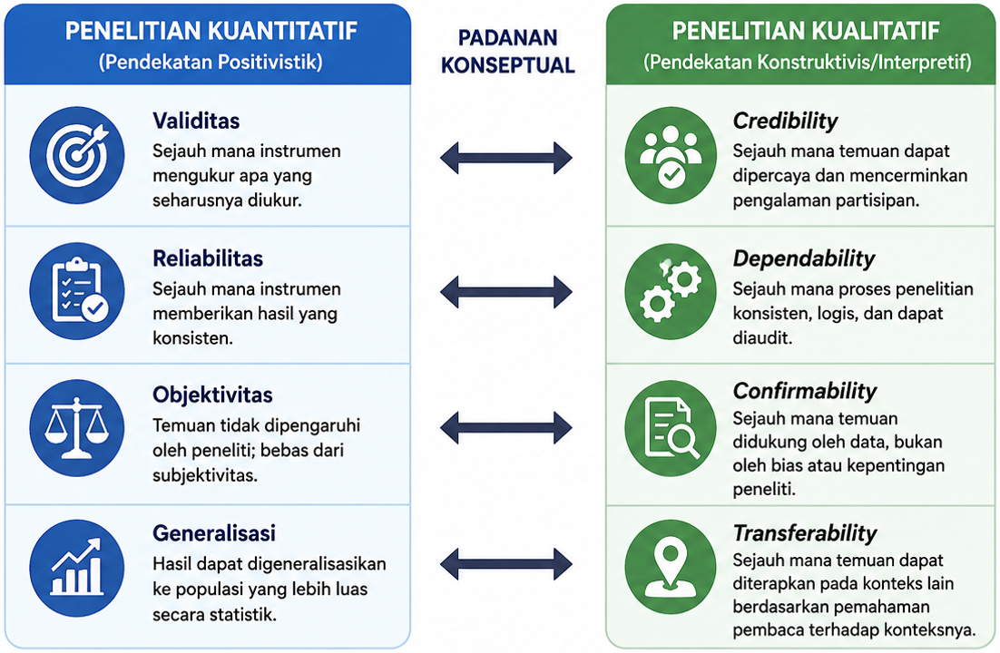
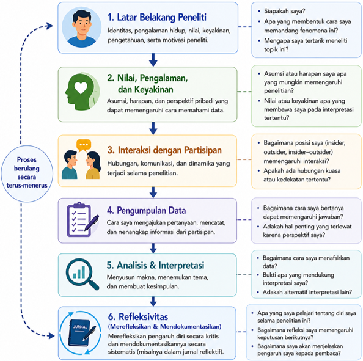

---
author:
  - name: Sunu Bagaskara
filters:
  # Run Quarto's default filters first
  - quarto
  - section-bibliographies
bibliography: references.bib
reference-section-title: Daftar Pustaka
citeproc: true
---

# Keabsahan & Refleksivitas Penelitian Kualitatif

::: callout-note
## Capaian Pembelajaran

Setelah mempelajari bab ini, mahasiswa diharapkan mampu:

1.  Menjelaskan konsep keabsahan (*trustworthiness*) dan refleksivitas (*reflexivity*) dalam penelitian kualitatif.
2.  Membedakan empat kriteria *trustworthiness* (*credibility, transferability, dependability,* dan *confirmability*) beserta strategi yang digunakan untuk meningkatkannya.
3.  Menjelaskan pentingnya refleksivitas serta pengaruh posisi (*positionality*) peneliti terhadap proses dan hasil penelitian kualitatif.
4.  Menerapkan strategi untuk menjaga keabsahan dan refleksivitas serta melaporkannya dalam proposal atau laporan penelitian kualitatif.
:::

Penelitian kualitatif bertujuan memahami makna, pengalaman, dan fenomena sosial dalam konteks tertentu. Oleh karena itu, kualitas penelitian kualitatif tidak dapat dinilai hanya menggunakan konsep validitas dan reliabilitas sebagaimana dalam penelitian kuantitatif. Sebagai gantinya, penelitian kualitatif menggunakan konsep *trustworthiness* (keabsahan) untuk menilai sejauh mana proses dan temuan penelitian dapat dipercaya, dilakukan secara sistematis, serta didukung oleh bukti yang memadai.

Selain menjaga keabsahan, peneliti juga perlu menerapkan refleksivitas (*reflexivity*), yaitu kesadaran untuk merefleksikan bagaimana latar belakang, pengalaman, nilai, dan posisi peneliti dapat memengaruhi proses maupun hasil penelitian. Bab ini membahas konsep *trustworthiness* beserta strategi untuk meningkatkannya, pentingnya refleksivitas dalam penelitian kualitatif, serta cara melaporkan upaya menjaga keabsahan dan refleksivitas dalam proposal maupun laporan penelitian.

## Keabsahan (*Trustworthiness*) dalam Penelitian Kualitatif {#sec-trustworthiness}

Penelitian kualitatif bertujuan memahami makna, pengalaman, dan realitas sosial berdasarkan perspektif partisipan dalam konteks tertentu. Oleh karena itu, kualitas penelitian kualitatif tidak dapat dinilai hanya menggunakan konsep validitas dan reliabilitas yang lazim digunakan dalam penelitian kuantitatif. Meskipun kedua pendekatan sama-sama mengutamakan penelitian yang berkualitas, cara menilai kualitas tersebut disesuaikan dengan karakteristik, tujuan, dan paradigma masing-masing pendekatan.

Dalam penelitian kualitatif, kualitas penelitian umumnya dinilai menggunakan konsep *trustworthiness*, yaitu sejauh mana proses dan temuan penelitian dapat dipercaya (*trustworthy*) serta didukung oleh prosedur penelitian yang sistematis dan transparan. Konsep ini diperkenalkan oleh @Lincoln1990 sebagai alternatif terhadap konsep validitas dan reliabilitas dalam penelitian kuantitatif. *Trustworthiness* menekankan bahwa kualitas penelitian tidak hanya ditentukan oleh hasil akhir, tetapi juga oleh bagaimana data dikumpulkan, dianalisis, diinterpretasikan, dan didokumentasikan selama proses penelitian. @fig-trustworthiness menyajikan perbandingan konseptual antara standar keabsahan yang digunakan dalam penelitian kuantitatif dan penelitian kualitatif.

::: {#fig-trustworthiness}

:::

### Kriteria *Trustworthiness* {#sec-kriteria}

@Lincoln1990 mengemukakan bahwa keabsahan (*trustworthiness*) dalam penelitian kualitatif terdiri atas empat kriteria utama, yaitu *credibility, transferability, dependability*, dan *confirmability*. Keempat kriteria tersebut saling melengkapi dalam memastikan bahwa temuan penelitian benar-benar mencerminkan pengalaman partisipan, didukung oleh proses penelitian yang konsisten, serta dapat dipertanggungjawabkan secara ilmiah. Ringkasan keempat kriteria tersebut disajikan pada @tbl-trustworthiness.

::: {#tbl-trustworthiness}
|  |  |  |  |
|:-----------------|:-----------------|:------------------|:-----------------|
| **Kriteria** | **Fokus Penilaian** | **Pertanyaan yang Dijawab** | **Contoh Strategi** |
| *Credibility* | Keterpercayaan temuan | Apakah temuan benar-benar mencerminkan pengalaman atau perspektif partisipan? | Triangulasi, *member checking*, *peer debriefing*, *prolonged engagement* |
| *Transferability* | Keteralihan hasil penelitian | Apakah pembaca memiliki informasi yang cukup untuk menilai apakah temuan relevan dengan konteks lain? | *Thick description* |
| *Dependability* | Konsistensi proses penelitian | Apakah proses penelitian dilakukan secara sistematis, logis, dan dapat ditelusuri? | *Audit trail*, dokumentasi proses |
| *Confirmability* | Objektivitas interpretasi | Apakah temuan didasarkan pada data, bukan semata-mata pada asumsi atau bias peneliti? | *Audit trail*, jurnal reflektif, triangulasi |

: Kriteria *trustworthiness*
:::

#### *Credibility*

*Credibility* mengacu pada tingkat keterpercayaan temuan penelitian dalam merepresentasikan pengalaman, perspektif, atau realitas yang disampaikan oleh partisipan. Dengan kata lain, kriteria ini menilai sejauh mana interpretasi peneliti sesuai dengan makna yang dimaksud oleh partisipan, sehingga temuan yang dihasilkan dipandang masuk akal dan dapat dipercaya [@Lincoln1990]. Dalam penelitian kualitatif, *credibility* sering dipandang sebagai kriteria yang paling penting karena berkaitan langsung dengan kualitas interpretasi data.

Untuk meningkatkan *credibility*, peneliti dapat menerapkan berbagai strategi, seperti triangulasi, *member checking*, *peer debriefing*, dan *prolonged engagement*. Strategi-strategi tersebut bertujuan memastikan bahwa interpretasi peneliti didasarkan pada data yang memadai dan memperoleh konfirmasi dari berbagai sumber maupun pihak yang terlibat [@Creswell2023]. Pembahasan lebih rinci mengenai strategi tersebut akan disajikan pada @sec-strategi.

#### *Transferability*

*Transferability* merujuk pada sejauh mana temuan penelitian dapat dipahami dan dipertimbangkan relevansinya oleh pembaca untuk diterapkan pada konteks lain yang memiliki karakteristik serupa. Berbeda dengan penelitian kuantitatif yang menekankan generalisasi statistik, penelitian kualitatif tidak bertujuan menggeneralisasikan hasil penelitian kepada populasi yang lebih luas. Sebaliknya, penelitian kualitatif menguraikan deskripsi konteks yang kaya sehingga pembaca dapat menilai sendiri apakah temuan tersebut sesuai dengan situasi yang dihadapinya [@Lincoln1990].

Oleh karena itu, tanggung jawab peneliti bukanlah membuktikan bahwa hasil penelitiannya berlaku untuk semua konteks, melainkan menyajikan informasi yang cukup mengenai karakteristik partisipan, latar penelitian, serta proses penelitian. Salah satu strategi yang umum digunakan untuk mendukung *transferability* adalah *thick description*, yaitu penyajian deskripsi yang rinci mengenai konteks penelitian [@Creswell2023].

#### *Dependability*

*Dependability* berkaitan dengan konsistensi dan keterlacakan proses penelitian. Kriteria ini menekankan bahwa setiap tahapan penelitian, mulai dari perumusan pertanyaan penelitian, pengumpulan data, analisis data, hingga penarikan kesimpulan, dilakukan secara sistematis, logis, dan terdokumentasi dengan baik. Dengan demikian, pembaca atau peneliti lain dapat memahami bagaimana suatu temuan dihasilkan, meskipun hasil penelitian kualitatif tidak dimaksudkan untuk direplikasi secara identik seperti pada penelitian kuantitatif [@Lincoln1990].

Untuk mendukung *dependability*, peneliti perlu mendokumentasikan seluruh proses penelitian secara jelas, misalnya melalui *audit trail* atau dokumentasi keputusan metodologis yang diambil selama penelitian berlangsung [@Shenton2004]. Dokumentasi tersebut menunjukkan bahwa perubahan yang terjadi selama penelitian dilakukan secara sadar, dapat dijelaskan, dan sesuai dengan perkembangan data di lapangan.

#### *Confirmability*

*Confirmability* menunjukkan bahwa temuan penelitian didasarkan pada data yang diperoleh dari partisipan, bukan semata-mata pada asumsi, preferensi, atau bias peneliti. Dalam penelitian kualitatif, peneliti memang menjadi instrumen utama penelitian sehingga subjektivitas tidak dapat dihilangkan sepenuhnya. Namun, peneliti perlu menunjukkan bahwa interpretasi yang dihasilkan memiliki dasar yang jelas dan dapat ditelusuri kembali kepada data penelitian [@Lincoln1990].

Upaya untuk meningkatkan *confirmability* dapat dilakukan melalui dokumentasi proses penelitian, penyimpanan jejak analisis (*audit trail*), serta penerapan refleksivitas untuk menyadari bagaimana posisi dan pengalaman peneliti dapat memengaruhi proses penelitian [@Olmos-Vega2023; @Shenton2004]. Dengan demikian, pembaca dapat menilai bahwa kesimpulan penelitian dibangun berdasarkan bukti empiris yang memadai dan bukan semata-mata merupakan pendapat peneliti.

### Strategi Meningkatkan *Trustworthiness* {#sec-strategi}

Keempat kriteria *trustworthiness* tidak dapat dicapai hanya dengan memahami konsepnya, tetapi perlu didukung oleh berbagai strategi selama proses penelitian. Strategi-strategi ini membantu peneliti memastikan bahwa data dikumpulkan secara memadai, dianalisis secara sistematis, dan diinterpretasikan secara bertanggung jawab. Pemilihan strategi yang digunakan perlu disesuaikan dengan tujuan, desain, dan konteks penelitian. Beberapa strategi yang paling umum diterapkan dalam penelitian kualitatif dijelaskan sebagai berikut.

#### Triangulasi (*Triangulation*)

Triangulasi merupakan strategi untuk meningkatkan kepercayaan terhadap temuan penelitian dengan membandingkan informasi yang diperoleh dari berbagai sudut pandang. Kesesuaian informasi dari berbagai sumber atau metode memberikan keyakinan yang lebih besar bahwa temuan tidak bergantung pada satu sumber data saja @Patton2014.

Beberapa bentuk triangulasi yang umum digunakan meliputi:

-   **Triangulasi sumber**, yaitu membandingkan informasi yang diperoleh dari partisipan atau sumber data yang berbeda.
-   **Triangulasi metode**, yaitu menggunakan lebih dari satu teknik pengumpulan data, misalnya wawancara, observasi, dan analisis dokumen.
-   **Triangulasi peneliti**, yaitu melibatkan lebih dari satu peneliti dalam proses pengumpulan atau analisis data.
-   **Triangulasi teori**, yaitu menggunakan lebih dari satu perspektif teoretis untuk menafsirkan data.

> **Contoh:** Peneliti yang mengkaji pengalaman mahasiswa baru dapat menggabungkan wawancara mendalam, observasi kegiatan orientasi, dan analisis buku panduan akademik untuk memperoleh pemahaman yang lebih komprehensif.

#### *Member Checking*

*Member checking* merupakan proses meminta partisipan untuk meninjau kembali hasil wawancara, ringkasan data, atau interpretasi peneliti guna memastikan bahwa temuan telah menggambarkan pengalaman mereka secara akurat [@Creswell2023]. Strategi ini membantu mengurangi kesalahan interpretasi dan meningkatkan *credibility*.

*Member checking* tidak selalu berarti meminta partisipan membaca seluruh laporan penelitian. Peneliti dapat meminta tanggapan terhadap ringkasan hasil wawancara, tema-tema awal, atau interpretasi tertentu yang dianggap penting.

#### *Audit Trail*

*Audit trail* adalah dokumentasi sistematis mengenai seluruh proses penelitian, mulai dari perencanaan, pengumpulan data, analisis, hingga penarikan kesimpulan [@Lincoln1990]. Dokumentasi ini memungkinkan pembaca atau peneliti lain memahami bagaimana keputusan metodologis dibuat selama penelitian berlangsung.

Dokumen yang dapat menjadi bagian dari *audit trail* antara lain catatan lapangan, transkrip wawancara, kode dan kategori hasil analisis, memo analitis, jurnal penelitian, serta catatan perubahan desain penelitian. Keberadaan *audit trail* terutama mendukung *dependability* dan *confirmability*.

#### *Peer Debriefing*

*Peer debriefing* adalah proses mendiskusikan proses maupun hasil penelitian dengan rekan sejawat yang memahami metodologi penelitian kualitatif, tetapi tidak terlibat langsung dalam penelitian [@Lincoln1990]. Melalui diskusi ini, peneliti memperoleh masukan kritis mengenai proses analisis, interpretasi data, maupun kemungkinan bias yang belum disadari.

Sebagai contoh, seorang mahasiswa dapat mendiskusikan hasil pengkodean (*coding*) dengan dosen pembimbing atau teman peneliti yang memiliki pemahaman tentang analisis data kualitatif. Diskusi tersebut bukan bertujuan mencari persetujuan, melainkan menguji konsistensi dan kelogisan interpretasi yang telah dibuat.

#### *Thick Description*

*Thick description* adalah penyajian deskripsi yang rinci mengenai konteks penelitian, karakteristik partisipan, situasi penelitian, serta proses pengumpulan dan analisis data [@Geertz1973; @Lincoln1990]. Deskripsi yang kaya membantu pembaca memahami konteks penelitian secara lebih mendalam sehingga dapat menilai sendiri apakah temuan tersebut relevan untuk konteks lain.

Sebagai contoh, apabila penelitian dilakukan pada mahasiswa tingkat pertama di sebuah universitas, peneliti tidak cukup hanya menyebutkan status partisipan sebagai mahasiswa. Peneliti juga perlu menjelaskan karakteristik institusi, latar sosial partisipan, situasi penelitian, dan kondisi yang memengaruhi pengalaman mereka selama penelitian berlangsung.

## Refleksivitas (*Reflexivity*) dalam Penelitian Kualitatif

Dalam penelitian kualitatif, peneliti merupakan instrumen utama yang berperan dalam merancang penelitian, mengumpulkan data, menganalisis data, hingga menginterpretasikan temuan. Berbeda dengan instrumen penelitian kuantitatif yang dirancang untuk meminimalkan pengaruh peneliti, penelitian kualitatif mengakui bahwa latar belakang, pengalaman, nilai, keyakinan, dan interaksi peneliti dengan partisipan dapat memengaruhi seluruh proses penelitian. Oleh karena itu, peneliti perlu menerapkan refleksivitas, yaitu proses merefleksikan secara kritis bagaimana karakteristik dan pengalaman pribadi dapat memengaruhi proses maupun hasil penelitian [@Dodgson2019; @Palaganas2017].

Refleksivitas bukan berarti peneliti harus menghilangkan subjektivitas sepenuhnya. Sebaliknya, refleksivitas menekankan pentingnya menyadari, mendokumentasikan, dan mengelola pengaruh tersebut secara terbuka sehingga pembaca dapat memahami bagaimana suatu interpretasi dihasilkan [@Olmos-Vega2023]. Dengan demikian, refleksivitas merupakan bagian dari praktik penelitian yang transparan dan bertanggung jawab, sekaligus berkontribusi terhadap peningkatan *trustworthiness* penelitian.

### *Positionality* Peneliti

*Positionality* mengacu pada posisi atau karakteristik peneliti yang dapat memengaruhi hubungan dengan partisipan dan interpretasi data. Posisi tersebut dapat mencakup latar belakang pendidikan, profesi, jenis kelamin, budaya, pengalaman hidup, maupun hubungan peneliti dengan konteks penelitian [@Berger2015].

Secara umum, posisi peneliti dapat digambarkan sebagai berikut.

-   ***Insider***, yaitu peneliti merupakan bagian dari kelompok atau komunitas yang diteliti.
-   ***Outsider***, yaitu peneliti berasal dari luar kelompok atau komunitas yang diteliti.
-   ***Insider*****–*outsider***, yaitu peneliti memiliki kedekatan pada aspek tertentu, tetapi tetap berada di luar pada aspek lainnya.

Tidak ada posisi yang selalu lebih baik dibandingkan posisi lainnya. Peneliti yang berperan sebagai *insider* umumnya lebih mudah memperoleh akses dan memahami konteks penelitian, tetapi berisiko menganggap sesuatu sebagai hal yang "sudah diketahui". Sebaliknya, peneliti *outsider* mungkin menghadapi tantangan dalam membangun kepercayaan dengan partisipan, tetapi dapat memberikan sudut pandang yang lebih kritis terhadap fenomena yang diteliti [@Berger2015].

### Menerapkan Refleksivitas

Refleksivitas sebaiknya dilakukan secara berkesinambungan sejak perencanaan penelitian hingga penulisan laporan. Peneliti dapat secara berkala mengevaluasi bagaimana asumsi, pengalaman, keputusan metodologis, maupun interaksi dengan partisipan memengaruhi proses penelitian [@Olmos-Vega2023].

Salah satu cara yang umum digunakan adalah menyusun **jurnal reflektif** (*reflexive journal*), yaitu catatan yang berisi pemikiran, pertanyaan, pengalaman, serta keputusan penting yang muncul selama penelitian berlangsung. Jurnal ini membantu peneliti menyadari potensi bias, mendokumentasikan perkembangan pemikiran, dan memberikan dasar yang lebih transparan terhadap interpretasi yang dihasilkan [@Palaganas2017].

Beberapa pertanyaan reflektif yang dapat diajukan peneliti selama proses penelitian antara lain:

-   Mengapa saya tertarik meneliti topik ini?
-   Pengalaman atau keyakinan apa yang saya miliki terkait fenomena yang diteliti?
-   Bagaimana hubungan saya dengan partisipan dapat memengaruhi proses pengumpulan data?
-   Bagaimana keputusan yang saya ambil selama analisis data memengaruhi interpretasi yang dihasilkan?
-   Bukti apa yang mendukung interpretasi yang saya buat?

Dengan melakukan refleksivitas secara berkelanjutan, peneliti tidak berupaya menghilangkan subjektivitas, melainkan mengelolanya secara sadar dan transparan sehingga pembaca dapat menilai kualitas proses penelitian secara lebih komprehensif.

::: {#fig-refleksivitas}

:::

@fig-refleksivitas menunjukkan bahwa refleksivitas merupakan proses yang berlangsung secara berkesinambungan pada setiap tahap penelitian. Pada setiap tahap tersebut, peneliti perlu mengajukan pertanyaan reflektif yang berbeda, mulai dari menyadari motivasi memilih topik penelitian, mengevaluasi hubungan dengan partisipan, hingga menilai apakah interpretasi yang dihasilkan benar-benar didukung oleh data. Dengan demikian, refleksivitas menjadi bagian yang tidak terpisahkan dari seluruh proses penelitian kualitatif.

### Jurnal Reflektif (*Reflexive Journal*)

Salah satu cara untuk menerapkan refleksivitas adalah dengan menyusun **jurnal reflektif**, yaitu catatan yang dibuat secara berkala selama penelitian untuk mendokumentasikan pemikiran, pengalaman, keputusan metodologis, serta refleksi peneliti terhadap proses penelitian. Berbeda dengan *field notes* yang berfokus pada hasil observasi atau wawancara, jurnal reflektif berisi evaluasi diri mengenai bagaimana latar belakang, asumsi, maupun interaksi peneliti dapat memengaruhi proses dan interpretasi penelitian [@Olmos-Vega2023; @Palaganas2017].

Jurnal reflektif tidak memiliki format yang baku. Peneliti dapat menyesuaikan bentuknya dengan kebutuhan penelitian, tetapi umumnya memuat peristiwa yang terjadi, refleksi peneliti, dan tindak lanjut yang akan dilakukan. Contoh jurnal reflektif disajikan pada Tabel 23.3.

::: {#tbl-jurnal}
|  |  |  |  |
|:-----------------|:------------------|:-----------------|:-----------------|
| **Tahap Penelitian** | **Peristiwa** | **Refleksi Peneliti** | **Tindak Lanjut** |
| Pengumpulan data | Wawancara pertama dengan mahasiswa tahun pertama mengenai pengalaman beradaptasi di perguruan tinggi. | Saya adalah dosen di fakultas yang sama sehingga beberapa partisipan tampak berhati-hati ketika menyampaikan pengalaman negatif. Posisi saya sebagai dosen mungkin memengaruhi keterbukaan mereka dalam menjawab pertanyaan. | Pada wawancara berikutnya saya akan kembali menegaskan bahwa seluruh jawaban bersifat rahasia, tidak memengaruhi penilaian akademik, dan partisipan bebas menghentikan wawancara kapan saja. |
| Analisis data | Melakukan pengkodean (*coding*) terhadap transkrip wawancara. | Saya menyadari lebih mudah mengenali kutipan yang sesuai dengan dugaan awal penelitian dibandingkan kutipan yang bertentangan. Hal ini berpotensi menyebabkan saya mengabaikan informasi yang sama pentingnya. | Meninjau kembali seluruh transkrip secara sistematis dan mendiskusikan hasil pengkodean dengan dosen pembimbing untuk memperoleh sudut pandang lain. |
| Penyusunan laporan | Menyusun hasil dan pembahasan penelitian. | Saya perlu memastikan bahwa setiap tema didukung oleh kutipan partisipan yang memadai, bukan hanya berdasarkan interpretasi pribadi. Saya juga perlu menjelaskan posisi saya sebagai dosen agar pembaca memahami konteks penelitian. | Menambahkan kutipan langsung yang mewakili setiap tema serta menjelaskan *positionality* peneliti pada bagian metode penelitian. |

: Contoh jurnal reflektif
:::

Contoh pada @tbl-jurnal menunjukkan bahwa jurnal reflektif bukan sekadar catatan harian, melainkan sarana untuk mendokumentasikan bagaimana peneliti mengenali dan mengelola pengaruh dirinya selama penelitian berlangsung. Dengan melakukan refleksi secara berkelanjutan, peneliti dapat meningkatkan transparansi proses penelitian sekaligus memperkuat kepercayaan terhadap temuan yang dihasilkan.

::: callout-tip
## Rangkuman

1.  Penelitian kualitatif menggunakan konsep *trustworthiness* untuk menilai kualitas proses dan temuan penelitian, yang mencakup empat kriteria utama: *credibility, transferability, dependability*, dan *confirmability*.
2.  Keempat kriteria *trustworthiness* dapat ditingkatkan melalui berbagai strategi, seperti triangulasi, *member checking*, *audit trail*, *peer debriefing*, dan *thick description*, sesuai dengan tujuan dan konteks penelitian.
3.  Refleksivitas (*reflexivity*) merupakan proses mengevaluasi secara kritis bagaimana latar belakang, pengalaman, nilai, dan posisi (*positionality*) peneliti dapat memengaruhi proses maupun hasil penelitian.
4.  Jurnal reflektif (*reflexive journal*) merupakan salah satu cara untuk mendokumentasikan proses refleksi peneliti sehingga keputusan metodologis dan interpretasi data menjadi lebih transparan.
5.  Penerapan *trustworthiness* dan refleksivitas secara konsisten akan meningkatkan kredibilitas, transparansi, dan akuntabilitas penelitian kualitatif.
:::

::: callout-important
## Refleksi & Diskusi

-   Dari empat kriteria *trustworthiness* (*credibility, transferability, dependability*, dan *confirmability*), menurut Anda manakah yang paling menantang untuk diterapkan dalam penelitian kualitatif? Berikan alasannya.
-   Bayangkan Anda akan melakukan penelitian kualitatif untuk skripsi. Strategi apa saja yang akan Anda gunakan untuk meningkatkan *trustworthiness* penelitian tersebut? Jelaskan alasan pemilihannya.
-   Identifikasi *positionality* Anda sebagai peneliti pada topik penelitian yang ingin Anda lakukan. Apakah Anda lebih berperan sebagai *insider*, *outsider*, atau berada di antara keduanya? Bagaimana posisi tersebut dapat memengaruhi proses penelitian?
-   Tuliskan satu contoh entri jurnal reflektif berdasarkan topik penelitian yang Anda rencanakan. Uraikan peristiwa yang dialami, refleksi yang muncul, serta tindak lanjut yang akan Anda lakukan untuk menjaga kualitas penelitian.
:::

::: sectionrefs
:::
